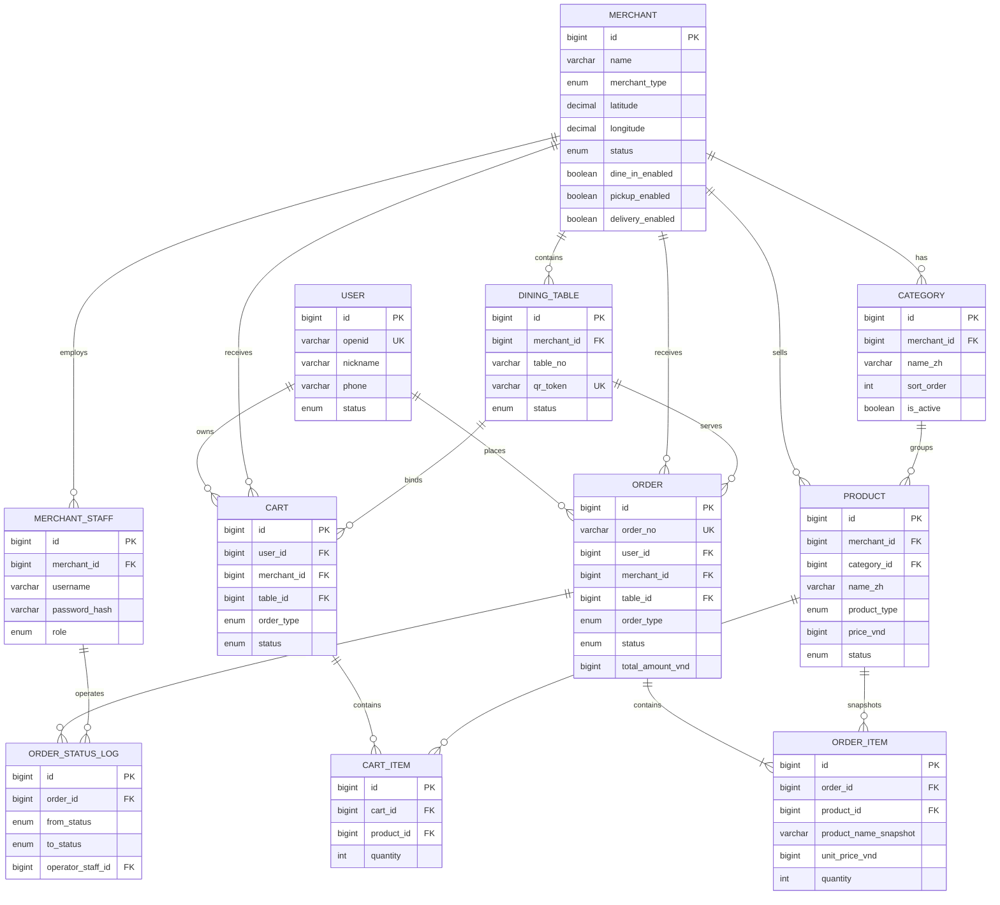
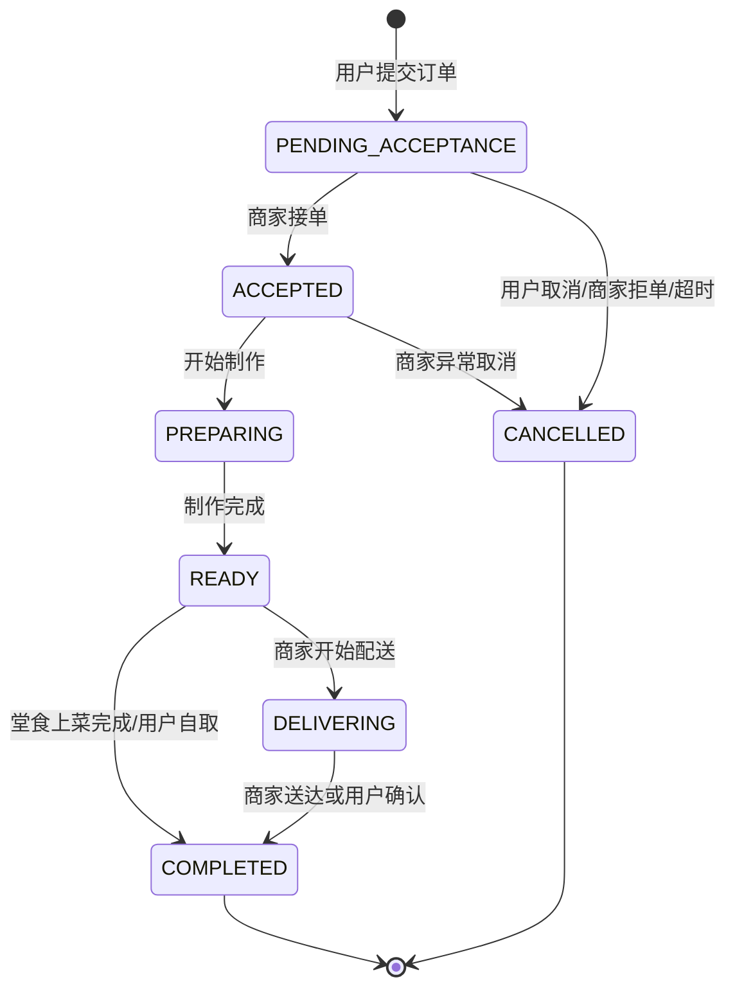
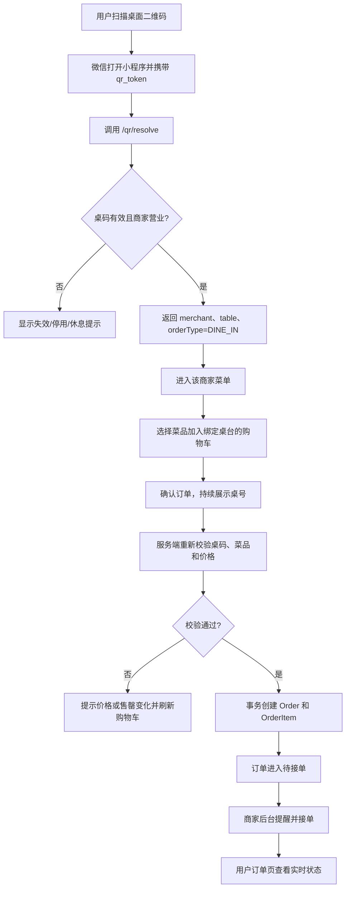

# HuayueLife-MVP V1.0 设计方案

## 0. 范围与技术基线

项目只服务北宁、北江华人餐厅，提供附近商家、扫码点餐、堂食、到店自取和商家配送。

建议沿用旧项目已验证的技术栈，但代码与数据库完全独立：

- Monorepo：pnpm workspace
- 用户端：UniApp + Vue 3 + TypeScript，首发微信小程序
- 商家后台：Vue 3 + Vite + TypeScript
- API：NestJS + Prisma
- 数据库：MySQL 8
- 缓存/实时通知：Redis，可在 MVP 后半程接入
- 图片存储：S3 兼容对象存储或云厂商对象存储
- 金额：统一使用越南盾整数 `VND`，禁止浮点金额
- 时间：数据库存 UTC，界面按越南时区 `Asia/Ho_Chi_Minh` 展示
- 语言：V1 默认中文，商家地址和菜名预留越南语字段

不包含在线支付、骑手、优惠券、积分和其他行业模块。

---

## A. 项目目录结构

第一阶段只创建文档目录；确认方案后再初始化应用代码。

```text
HuayueLife-MVP/
├── README.md
├── docs/
│   ├── MVP-DESIGN.md
│   ├── API.md
│   └── DEPLOYMENT.md
├── apps/
│   ├── api/                         # NestJS API
│   │   ├── prisma/
│   │   │   ├── schema.prisma
│   │   │   ├── migrations/
│   │   │   └── seed.ts
│   │   ├── src/
│   │   │   ├── common/             # 鉴权、异常、响应、守卫
│   │   │   ├── database/
│   │   │   └── modules/
│   │   │       ├── auth/
│   │   │       ├── users/
│   │   │       ├── merchants/
│   │   │       ├── merchant-staff/
│   │   │       ├── categories/
│   │   │       ├── products/
│   │   │       ├── dining-tables/
│   │   │       ├── carts/
│   │   │       ├── orders/
│   │   │       ├── nearby/
│   │   │       └── uploads/
│   │   └── test/
│   ├── miniapp/                     # UniApp 微信小程序
│   │   └── src/
│   │       ├── api/
│   │       ├── components/
│   │       ├── pages/
│   │       ├── stores/
│   │       ├── types/
│   │       └── utils/
│   └── merchant-admin/              # 商家后台
│       └── src/
│           ├── api/
│           ├── components/
│           ├── layouts/
│           ├── pages/
│           ├── router/
│           ├── stores/
│           └── types/
├── packages/
│   └── shared/                      # DTO 类型、枚举、常量
├── docker-compose.yml
├── pnpm-workspace.yaml
└── package.json
```

---

## B. 数据库 ER 图



---

## C. 数据表设计

所有业务表包含 `created_at`、`updated_at`；可运营数据采用软删除或停用状态，不物理删除历史订单引用。

### 1. `users`

| 字段 | 类型 | 说明 |
|---|---|---|
| id | BIGINT PK | 用户 ID |
| openid | VARCHAR(64) UNIQUE | 微信小程序身份 |
| unionid | VARCHAR(64) NULL | 预留微信统一身份 |
| nickname | VARCHAR(64) NULL | 昵称 |
| avatar_url | VARCHAR(500) NULL | 头像 |
| phone | VARCHAR(32) NULL | 联系电话 |
| status | ENUM | ACTIVE / DISABLED |
| last_login_at | DATETIME NULL | 最近登录 |

### 2. `merchants`

| 字段 | 类型 | 说明 |
|---|---|---|
| id | BIGINT PK | 商家 ID |
| name_zh / name_vi | VARCHAR(120) | 中文名、越南语名 |
| merchant_type | ENUM | RESTAURANT / MILK_TEA / FRUIT / FLOWER / CAKE；V1 默认且仅启用 RESTAURANT |
| logo_url / cover_url | VARCHAR(500) NULL | Logo、封面 |
| contact_name / contact_phone | VARCHAR | 联系人、电话 |
| province / city / district | VARCHAR | 省市区，首版限制北宁/北江 |
| address_detail | VARCHAR(255) | 详细地址 |
| latitude / longitude | DECIMAL(10,7) | WGS84 坐标 |
| business_hours | JSON | 每周营业时段 |
| notice | TEXT NULL | 商家公告 |
| minimum_delivery_amount_vnd | BIGINT | 商家配送起送价 |
| delivery_fee_vnd | BIGINT | 配送费 |
| delivery_radius_km | DECIMAL(5,2) | 配送半径 |
| dine_in_enabled | BOOLEAN | 是否支持堂食 |
| pickup_enabled | BOOLEAN | 是否支持自取 |
| delivery_enabled | BOOLEAN | 是否支持商家配送 |
| status | ENUM | DRAFT / ACTIVE / CLOSED / DISABLED |

索引：`status`、`province + city + status`、`latitude + longitude`。

### 3. `merchant_staff`

| 字段 | 类型 | 说明 |
|---|---|---|
| id | BIGINT PK | 员工 ID |
| merchant_id | BIGINT FK | 所属商家 |
| username | VARCHAR(64) | 登录名，商家内唯一 |
| password_hash | VARCHAR(255) | 密码哈希 |
| display_name | VARCHAR(64) | 显示名 |
| role | ENUM | OWNER / MANAGER / STAFF |
| status | ENUM | ACTIVE / DISABLED |
| last_login_at | DATETIME NULL | 最近登录 |

唯一索引：`merchant_id + username`。

### 4. `categories`

| 字段 | 类型 | 说明 |
|---|---|---|
| id | BIGINT PK | 分类 ID |
| merchant_id | BIGINT FK | 商家 |
| name_zh / name_vi | VARCHAR(80) | 分类名称 |
| sort_order | INT | 排序 |
| is_active | BOOLEAN | 是否展示 |

索引：`merchant_id + is_active + sort_order`。

### 5. `products`

| 字段 | 类型 | 说明 |
|---|---|---|
| id | BIGINT PK | 菜品 ID |
| merchant_id | BIGINT FK | 商家 |
| category_id | BIGINT FK | 分类 |
| name_zh / name_vi | VARCHAR(120) | 菜名 |
| product_type | ENUM | FOOD / DRINK / FRUIT / FLOWER / CAKE；V1 默认 FOOD |
| description | TEXT NULL | 描述 |
| image_url | VARCHAR(500) NULL | 主图 |
| price_vnd | BIGINT | 当前售价 |
| sort_order | INT | 排序 |
| status | ENUM | DRAFT / ON_SALE / SOLD_OUT / OFF_SALE |

索引：`merchant_id + category_id + status + sort_order`。

`merchant_type` 和 `product_type` 仅为后期扩展预留，不代表 V1 开发多行业功能。V1 只提供餐厅点餐，商家仅启用 `RESTAURANT`；商品以 `FOOD` 为默认类型。

V1 不做 SKU、规格、加料和库存扣减；售罄通过 `SOLD_OUT` 控制。

### 6. `dining_tables`

| 字段 | 类型 | 说明 |
|---|---|---|
| id | BIGINT PK | 桌台 ID |
| merchant_id | BIGINT FK | 商家 |
| table_no | VARCHAR(32) | 展示桌号 |
| table_name | VARCHAR(64) NULL | 如“一楼 A01” |
| qr_token | VARCHAR(64) UNIQUE | 随机桌码令牌，不暴露数据库 ID |
| qr_version | INT | 换码版本 |
| status | ENUM | ACTIVE / DISABLED |

唯一索引：`merchant_id + table_no`。

### 7. `carts`

| 字段 | 类型 | 说明 |
|---|---|---|
| id | BIGINT PK | 购物车 ID |
| user_id | BIGINT FK | 用户 |
| merchant_id | BIGINT FK | 商家 |
| table_id | BIGINT FK NULL | 堂食桌台 |
| order_type | ENUM | DINE_IN / PICKUP / DELIVERY |
| status | ENUM | ACTIVE / CHECKED_OUT / ABANDONED |
| expires_at | DATETIME | 失效时间 |

约束：一个用户在同一商家、订单类型和桌台上下文中仅有一个有效购物车。

### 8. `cart_items`

| 字段 | 类型 | 说明 |
|---|---|---|
| id | BIGINT PK | 明细 ID |
| cart_id | BIGINT FK | 购物车 |
| product_id | BIGINT FK | 菜品 |
| quantity | INT | 1-99 |
| remark | VARCHAR(200) NULL | 单品备注 |

唯一索引：`cart_id + product_id + remark`。

购物车只保存选择，不锁价；提交订单时重新校验菜品状态和价格。

### 9. `orders`

| 字段 | 类型 | 说明 |
|---|---|---|
| id | BIGINT PK | 订单 ID |
| order_no | VARCHAR(32) UNIQUE | 可读订单号 |
| user_id | BIGINT FK | 下单用户 |
| merchant_id | BIGINT FK | 商家 |
| table_id | BIGINT FK NULL | 堂食桌台 |
| table_no_snapshot | VARCHAR(32) NULL | 桌号快照 |
| order_type | ENUM | DINE_IN / PICKUP / DELIVERY |
| status | ENUM | 订单状态 |
| contact_name / contact_phone | VARCHAR NULL | 自取、配送联系人 |
| delivery_address | VARCHAR(255) NULL | 配送地址快照 |
| delivery_latitude / longitude | DECIMAL NULL | 配送坐标 |
| customer_remark | VARCHAR(500) NULL | 整单备注 |
| item_amount_vnd | BIGINT | 菜品金额 |
| delivery_fee_vnd | BIGINT | 配送费 |
| total_amount_vnd | BIGINT | 应收总额 |
| settlement_status | ENUM | UNSETTLED / SETTLED；表示线下未收款/已收款，不代表平台结算 |
| accepted_at / ready_at / completed_at / cancelled_at | DATETIME NULL | 状态节点 |
| cancel_reason | VARCHAR(255) NULL | 取消原因 |

索引：`merchant_id + status + created_at`、`user_id + created_at`、`order_no`。

### 10. `order_items`

| 字段 | 类型 | 说明 |
|---|---|---|
| id | BIGINT PK | 明细 ID |
| order_id | BIGINT FK | 订单 |
| product_id | BIGINT FK NULL | 原菜品，可停用但不影响订单 |
| product_name_zh_snapshot | VARCHAR(120) | 菜名快照 |
| image_url_snapshot | VARCHAR(500) NULL | 图片快照 |
| unit_price_vnd | BIGINT | 下单单价 |
| quantity | INT | 数量 |
| subtotal_vnd | BIGINT | 单价乘数量 |
| remark | VARCHAR(200) NULL | 单品备注 |

### 11. `order_status_logs`

| 字段 | 类型 | 说明 |
|---|---|---|
| id | BIGINT PK | 日志 ID |
| order_id | BIGINT FK | 订单 |
| from_status | ENUM NULL | 原状态 |
| to_status | ENUM | 新状态 |
| operator_type | ENUM | USER / MERCHANT_STAFF / SYSTEM |
| operator_user_id | BIGINT NULL | 用户操作人 |
| operator_staff_id | BIGINT NULL | 商家操作人 |
| remark | VARCHAR(255) NULL | 操作说明 |

索引：`order_id + created_at`。

---

## D. API 设计

统一前缀：`/api/v1`。响应格式：`{ code, message, data, requestId }`。

### 1. 用户认证与资料

| 方法 | 路径 | 说明 |
|---|---|---|
| POST | `/auth/wechat/login` | 微信 code 登录，返回 JWT |
| GET | `/me` | 当前用户 |
| PATCH | `/me` | 更新昵称、电话 |

### 2. 附近商家与菜单

| 方法 | 路径 | 说明 |
|---|---|---|
| GET | `/merchants/nearby?lat=&lng=&radiusKm=&page=` | 附近商家 |
| GET | `/merchants/:id` | 商家详情、营业状态、配送规则 |
| GET | `/merchants/:id/menu` | 分类和在售菜品 |
| GET | `/products/:id` | 菜品详情 |

### 3. 扫码与桌台

| 方法 | 路径 | 说明 |
|---|---|---|
| GET | `/qr/resolve?token=` | 解析桌码，返回商家、桌号和菜单入口 |

无效、停用或已轮换的 token 返回明确错误，不根据客户端传入的商家 ID 绑定桌台。

### 4. 购物车

| 方法 | 路径 | 说明 |
|---|---|---|
| GET | `/cart?merchantId=&orderType=&tableToken=` | 获取当前上下文购物车 |
| POST | `/cart/items` | 添加菜品 |
| PATCH | `/cart/items/:itemId` | 修改数量或备注 |
| DELETE | `/cart/items/:itemId` | 删除菜品 |
| DELETE | `/cart` | 清空购物车 |

### 5. 用户订单

| 方法 | 路径 | 说明 |
|---|---|---|
| POST | `/orders/preview` | 校验价格、营业状态、配送范围 |
| POST | `/orders` | 幂等创建订单并清空购物车 |
| GET | `/orders` | 用户订单记录 |
| GET | `/orders/:id` | 用户订单详情和状态日志 |
| POST | `/orders/:id/cancel` | 在允许状态下取消 |
| POST | `/orders/:id/confirm-received` | 配送订单确认收货，仅适用于 DELIVERY；堂食和自取不要求用户确认 |

创建订单请求带 `Idempotency-Key`，防止重复点击生成重复订单。

### 6. 商家后台认证

| 方法 | 路径 | 说明 |
|---|---|---|
| POST | `/merchant/auth/login` | 员工账号密码登录 |
| GET | `/merchant/me` | 当前员工及商家 |

### 7. 商家资料、菜单和桌台

| 方法 | 路径 | 说明 |
|---|---|---|
| GET/PATCH | `/merchant/profile` | 商家资料、营业设置、配送规则 |
| GET/POST | `/merchant/categories` | 分类列表、新增 |
| PATCH/DELETE | `/merchant/categories/:id` | 编辑、停用分类 |
| GET/POST | `/merchant/products` | 菜品列表、新增 |
| GET/PATCH/DELETE | `/merchant/products/:id` | 菜品详情、编辑、下架 |
| PATCH | `/merchant/products/:id/status` | 上架、售罄、下架 |
| GET/POST | `/merchant/tables` | 桌台列表、新增 |
| PATCH/DELETE | `/merchant/tables/:id` | 编辑、停用 |
| POST | `/merchant/tables/:id/rotate-qr` | 旧码失效并换码 |
| GET | `/merchant/tables/:id/qr-image` | 下载桌码图片 |

### 8. 商家订单

| 方法 | 路径 | 说明 |
|---|---|---|
| GET | `/merchant/orders?status=&orderType=&date=` | 订单列表 |
| GET | `/merchant/orders/:id` | 订单详情 |
| POST | `/merchant/orders/:id/accept` | 接单 |
| POST | `/merchant/orders/:id/reject` | 拒单并取消 |
| POST | `/merchant/orders/:id/start-preparing` | 开始制作 |
| POST | `/merchant/orders/:id/ready` | 制作完成 |
| POST | `/merchant/orders/:id/start-delivery` | 商家开始配送 |
| POST | `/merchant/orders/:id/complete` | 完成订单 |
| POST | `/merchant/orders/:id/settle` | 标记已收款，仅记录线下收款结果，不属于平台结算系统 |

商家 API 必须从 JWT 获取 `merchant_id`，禁止信任请求体中的商家 ID。

---

## E. 微信小程序页面结构

```text
TabBar
├── 首页 /pages/home/index
│   ├── 定位与城市切换（北宁/北江）
│   ├── 扫码点餐主入口
│   └── 附近商家列表
├── 订单 /pages/orders/index
│   ├── 全部
│   ├── 进行中
│   └── 已完成/已取消
└── 我的 /pages/profile/index
    ├── 用户资料
    ├── 联系电话
    └── 关于平台

业务页面
├── /pages/merchant/detail         商家详情
├── /pages/menu/index              菜单、分类、购物车浮层
├── /pages/product/detail          菜品详情
├── /pages/cart/index              购物车
├── /pages/checkout/index          确认订单
│   ├── 堂食：展示桌号
│   ├── 自取：联系人、电话
│   └── 配送：联系人、电话、地址
├── /pages/order/detail            订单详情和状态
├── /pages/scan/resolve            桌码解析中转页
├── /pages/location/authorize      定位授权说明
└── /pages/webview/help            帮助页（可选）
```

扫码进入后，页面顶部持续显示“商家名称 + 桌号”，避免用户误在错误桌台下单。

---

## F. 商家后台页面结构

```text
/login
/
├── /dashboard
│   ├── 今日订单数
│   ├── 今日营业额（未收款/已收款）
│   └── 待接单提醒
├── /orders
│   ├── 待接单
│   ├── 制作中
│   ├── 待取餐/待配送
│   ├── 配送中
│   └── 已完成/已取消
├── /orders/:id
│   ├── 菜品明细和备注
│   ├── 桌号/自取/配送信息
│   └── 状态操作与日志
├── /menu/categories
├── /menu/products
├── /tables
│   ├── 桌台管理
│   ├── 生成/换新二维码
│   └── 下载打印二维码
├── /merchant/profile
├── /merchant/business-settings
│   ├── 营业时间
│   ├── 堂食/自取/配送开关
│   └── 配送费、起送价、配送半径
└── /staff
    └── 员工账号（V1 可仅店主可管理）
```

接单页需要声音提醒和醒目待处理数量。MVP 可用 5-10 秒轮询；稳定后改为 WebSocket 或 SSE。

---

## G. 订单状态流转图

统一状态：

- `PENDING_ACCEPTANCE`：待商家接单
- `ACCEPTED`：已接单
- `PREPARING`：制作中
- `READY`：制作完成，堂食待上菜/自取待取餐/配送待出发
- `DELIVERING`：商家配送中，仅配送订单使用
- `COMPLETED`：已完成
- `CANCELLED`：已取消



规则：

- 用户仅可在 `PENDING_ACCEPTANCE` 主动取消。
- `DELIVERING` 只允许 `DELIVERY` 类型进入。
- 每次状态变化在事务内同时更新订单和写入状态日志。
- API 服务端校验允许的前置状态，避免跳状态和重复操作。
- 商家接单超时可先只做醒目提醒；自动取消时长作为可配置项后续开启。

---

## H. 扫码点餐流程图



安全要求：

- 二维码只放随机 `qr_token` 或短场景码，不直接信任 `merchantId/tableId`。
- token 至少 128 位随机强度，数据库只允许唯一值。
- 商家换码后旧 token 立即失效。
- 创建订单时再次解析 token，不能只依赖前端首次解析结果。
- 购物车必须锁定单一商家和桌台，切换商家或桌台时提示清空。

---

## I. 附近商家实现方案

### V1 实现

1. 小程序首页请求用户定位授权，使用 WGS84 经纬度。
2. 用户拒绝授权时，允许手动选择北宁或北江，并按行政区、推荐权重排序。
3. 商家入驻时由运营或商家在地图选点，保存经纬度和标准化地址。
4. API 输入 `lat`、`lng`、`radiusKm`，半径默认 10 km，最大 30 km。
5. MySQL 先按经纬度 bounding box 做矩形预筛，再用 Haversine 公式计算直线距离。
6. 只返回 `ACTIVE`、支持当前服务类型、且位于允许城市的商家。
7. 默认按“营业中优先 + 距离升序”排序，返回 `distanceKm`。
8. 商家配送下单时，再用用户配送坐标校验是否在该商家的配送半径内。

### 接口返回重点

```json
{
  "id": "1001",
  "nameZh": "川味小馆",
  "coverUrl": "...",
  "distanceKm": 1.8,
  "isOpen": true,
  "supportedOrderTypes": ["DINE_IN", "PICKUP", "DELIVERY"],
  "minimumDeliveryAmountVnd": 150000,
  "deliveryFeeVnd": 20000
}
```

### MVP 取舍

- 不开发路线规划、实时路况和导航页面。
- 商家详情只展示地址、距离和“复制地址/调用系统地图”入口。
- 初期商家数量较少，普通索引和 Haversine 足够。
- 商家规模扩大后再升级为 MySQL `POINT + SPATIAL INDEX` 或专用地理检索。
- 用户位置属于敏感信息，只用于当次附近查询和配送校验；非必要不持久化。

---

## J. 7 天开发计划

### Day 1：工程与数据基础

- 初始化独立 monorepo、环境配置、Docker 开发环境。
- 建立 Prisma Schema、迁移和种子数据。
- 完成统一响应、异常处理、日志、JWT 鉴权。
- 验收：三端可启动，数据库可迁移，基础健康检查通过。

### Day 2：商家、分类、菜品、桌台

- 商家资料和营业设置 API。
- 分类、菜品 CRUD 及上下架/售罄。
- 桌台 CRUD、二维码 token 生成与换码。
- 验收：后台可维护完整菜单并下载桌码。

### Day 3：小程序首页和菜单

- 微信登录、用户资料。
- 附近商家列表、商家详情。
- 扫码解析、分类菜单、菜品详情。
- 验收：定位或手选城市后可进入商家；扫桌码可正确识别桌号。

### Day 4：购物车和创建订单

- 按商家/桌台/订单类型隔离购物车。
- 堂食、自取、配送确认订单页面。
- 订单预览、价格复核、配送范围校验、幂等下单。
- 验收：三种订单类型均可生成正确订单和金额快照。

### Day 5：商家接单和状态流转

- 商家订单看板、详情、接单、拒单。
- 制作、完成、自取、配送状态操作。
- 订单状态日志、轮询提醒和声音提醒。
- 验收：后台不能非法跳状态，用户端能看到状态变化。

### Day 6：用户订单、联调与异常处理

- 用户订单列表、详情、取消；仅配送订单支持确认收货。
- 处理售罄、价格变化、商家休息、桌码失效、重复提交。
- 权限隔离、参数校验、关键接口集成测试。
- 验收：不同商家无法访问彼此数据，核心异常有明确提示。

### Day 7：测试、部署和试点

- 完成核心流程回归：附近商家、扫码、堂食、自取、配送。
- 准备生产配置、数据库备份、对象存储和 HTTPS 部署。
- 导入 1-2 家试点餐厅、真实菜单和桌号。
- 输出操作手册和上线检查表。
- 验收：真实手机扫码下单，商家后台接单并完成订单闭环。

### 7 天后的验收边界

- 必须完成：两类用户入口、菜单、购物车、三种订单类型、接单、状态流转、订单记录。
- 可以降级：实时推送先使用轮询；复杂统计仅显示今日基础数据。
- 不得临时加入：在线支付、骑手、营销、积分或其他行业功能。

---

## 待确认事项

1. 商家后台 V1 使用 PC Web，还是同时要求手机浏览器适配。
2. 配送地址 V1 使用手填地址加定位，还是只允许商家电话确认。
3. 菜品 V1 是否需要规格/加料；本方案默认不需要。
4. 堂食订单是“整单完成”，还是需要“逐菜上菜”；本方案默认整单完成。
5. 订单是否需要厨房打印机；本方案默认仅后台声音提醒，不接打印机。
