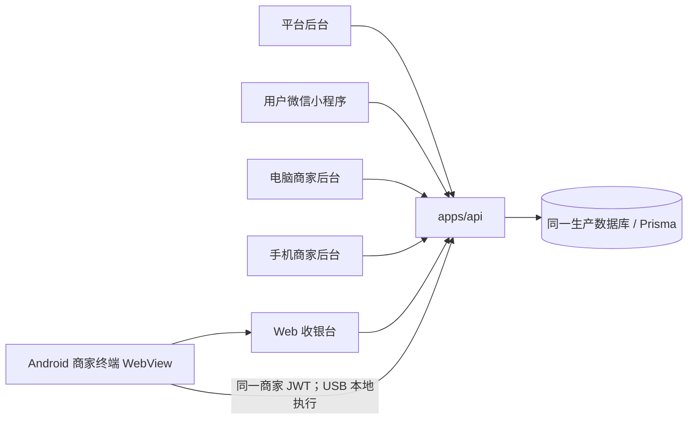
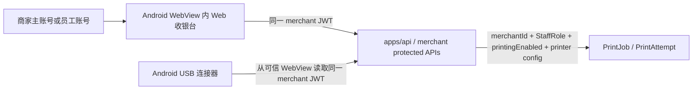
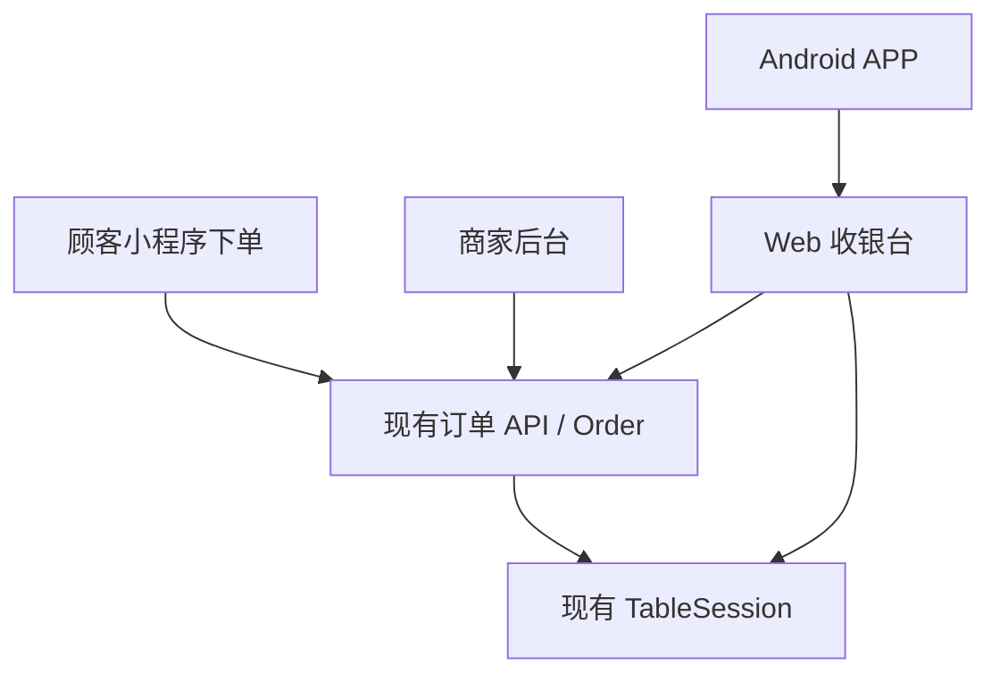

# 云桥 Life 全平台统一运行逻辑审计

审计日期：2026-07-15  
审计分支：`release/merchant-terminal-usb-rc1-deploy`  
审计目标：确认平台后台、小程序、电脑/手机商家后台、Web 收银台与 Android 商家终端继续复用同一套账号、权限、商家、桌台、订单、TableSession、打印配置和 API。

本轮结论：

- 继续使用同一个 monorepo、`apps/api` 和 Prisma 数据模型；未新增第二套订单、桌台、TableSession、商家或员工账号体系。
- 商家主账号仍由平台后台创建，初始密码保持 `12345678`，并设置 `mustChangePassword=true`。
- 员工账号仍由商家后台创建，沿用 `MerchantStaff`、`StaffRole`、启用/停用和统一 JWT 认证。
- 电脑商家后台、手机商家后台、Web 收银台、Android WebView 内嵌收银台均复用 `/merchant/auth/login` 和 `/merchant/me`。
- V1 运行链路已停用 Terminal Token、终端绑定码、独立设备认证和 Heartbeat；Android 原生 USB 连接器改为从 WebView 已登录商家/员工会话中读取同一商家 JWT。
- `MerchantTerminal` 等打印任务中心表仍保留在 RC migration 中，但 V1 不暴露商家后台终端绑定入口，不注册 `/terminal/*` controller，不要求 APP 配对。
- 打印能力继续遵循平台总开关 `Merchant.printingEnabled` + 商家打印中心配置；自动打印和执行端上线前仍默认关闭。

## 1. 全平台应用关系

事实证据：

| 项目 | 当前事实 | 证据 |
|---|---|---|
| API 单体 | 所有业务模块仍通过同一 NestJS `AppModule` 注册 | `apps/api/src/app.module.ts` |
| 电脑/手机商家后台 | 同一个 `apps/merchant-admin` Vue 应用通过响应式布局承担电脑与手机端 | `apps/merchant-admin/src/router/index.ts`, `apps/merchant-admin/src/layouts/MerchantLayout.vue` |
| Web 收银台 | 独立前端应用，但调用同一 merchant API | `apps/merchant-cashier/src/api/http.ts`, `apps/merchant-cashier/src/stores/auth.ts` |
| Android APP | WebView 加载 Web 收银台；原生层仅补足 USB 本地能力 | `apps/merchant-terminal-android/app/src/main/java/com/yunqiao/life/merchantterminal/MainActivity.kt` |
| 小程序 | 顾客下单和查看自己订单，仍调用同一 API | `apps/miniapp/src/api/http.ts`, `apps/miniapp/src/pages/checkout/index.vue` |
| 数据库 | 商家、订单、桌台、TableSession、打印任务均在同一 Prisma schema | `apps/api/prisma/schema.prisma` |

## 2. 账号与首次改密

### 2.1 商家主账号

平台后台创建商家时创建 OWNER 账号，初始密码固定为 `12345678`，服务端保存 bcrypt hash，并设置首次登录强制改密。

证据：

- 平台创建或重置商家 OWNER 密码时使用 `bcrypt.hash('12345678', 12)`：`apps/api/src/modules/platform/platform-merchants.service.ts`
- OWNER 账号写入 `role: StaffRole.OWNER` 与 `mustChangePassword: true`：`apps/api/src/modules/platform/platform-merchants.service.ts`
- Prisma 中商家员工账号使用 `passwordHash`，没有明文密码字段：`apps/api/prisma/schema.prisma`

### 2.2 首次登录强制改密

登录响应返回 `mustChangePassword`，前端路由基于该字段限制进入业务页面。改密后清除登录状态并要求重新登录。

证据：

- 商家登录返回 staff role/status/mustChangePassword：`apps/api/src/modules/auth/auth.service.ts`
- 改密接口：`POST /merchant/profile/change-password`：`apps/api/src/modules/auth/auth.controller.ts`
- 商家后台路由保护：`apps/merchant-admin/src/router/index.ts`
- Web 收银台路由保护：`apps/merchant-cashier/src/router/index.ts`
- Web 收银台改密页：`apps/merchant-cashier/src/views/ChangePasswordView.vue`

### 2.3 员工账号

员工账号由商家后台创建，沿用 `MerchantStaff`、`StaffRole`、启用/停用、统一认证和商家隔离。

证据：

- 员工管理 controller 只允许 OWNER 管理：`apps/api/src/modules/merchant-staff/merchant-staff.controller.ts`
- 员工创建/禁用/重置密码逻辑：`apps/api/src/modules/merchant-staff/merchant-staff.service.ts`
- 商家后台员工页面：`apps/merchant-admin/src/pages/StaffPage.vue`

审计结论：未发现 Web 收银台或 Android APP 新增第二套收银员账号、设备账号或 APP 专用账号。

## 3. 统一接口清单

以下清单只记录 V1 运行链路应复用的接口；未发现为了收银台或 APP 新增重复订单、桌台、TableSession 或账号 API。

| 功能 | 接口路径 | Controller / Service | DTO/类型 | 电脑/手机商家后台 | Web 收银台 | Android APP |
|---|---|---|---|---|---|---|
| 登录 | `POST /merchant/auth/login` | `apps/api/src/modules/auth/auth.controller.ts` / `auth.service.ts` | `MerchantLoginDto` | `apps/merchant-admin/src/api/client.ts` | `apps/merchant-cashier/src/api/auth.ts` | WebView 复用 |
| 当前账号/权限 | `GET /merchant/me` | `auth.controller.ts` / `auth.service.ts` | `AuthUser` | `merchant-admin/src/router/index.ts` | `merchant-cashier/src/stores/auth.ts` | WebView 复用；原生只读 JWT |
| 首次改密 | `POST /merchant/profile/change-password` | `auth.controller.ts` / `auth.service.ts` | `ChangeMerchantPasswordDto` | `MerchantProfilePage.vue` | `ChangePasswordView.vue` | WebView 复用 |
| 员工账号 | `/merchant/staff` | `merchant-staff.controller.ts` / `merchant-staff.service.ts` | `CreateMerchantStaffDto`, `UpdateMerchantStaffDto` | `StaffPage.vue` | 不提供员工管理 | WebView 复用 |
| 商家信息 | `GET /merchant/me` 与商家资料接口 | `auth.service.ts`, merchant profile 相关服务 | 现有 API 类型 | dashboard/profile | `stores/auth.ts` | WebView 复用 |
| 桌台列表 | `GET /merchant/tables` | `merchant-tables.controller.ts` / `tables.service.ts` | table DTO | 桌台页 | `apps/merchant-cashier/src/api/tables.ts` | WebView 复用 |
| 当前桌台会话 | `GET /merchant/tables/:tableId/current-session` | `merchant-tables.controller.ts` / table sessions service | table/session response | 桌台详情 | `api/tables.ts` | WebView 复用 |
| 开放 TableSession | `GET /merchant/table-sessions/open` | `merchant-table-sessions.controller.ts` / `table-sessions.service.ts` | query DTO | 桌台账单 | `api/tableSessions.ts` | WebView 复用 |
| 整桌账单 | `GET /merchant/table-sessions/:id` | `merchant-table-sessions.controller.ts` / `table-sessions.service.ts` | session detail | 桌台账单 | `api/tableSessions.ts` | WebView 复用 |
| 完成桌账（关闭桌台） | `POST /merchant/table-sessions/:id/close` | `merchant-table-sessions.controller.ts` / `table-sessions.service.ts` | close action | 桌台账单 | `api/tableSessions.ts` | WebView 复用 |
| 新订单/未完成/历史 | `GET /merchant/orders` | `merchant-orders.controller.ts` / `orders.service.ts` | order list query | dashboard/orders | `apps/merchant-cashier/src/api/orders.ts` | WebView 复用 |
| 订单详情 | `GET /merchant/orders/:id` | `merchant-orders.controller.ts` / `orders.service.ts` | order detail | order detail | `api/orders.ts` | WebView 复用 |
| 接单 | `POST /merchant/orders/:id/accept` | `merchant-orders.controller.ts` / `orders.service.ts` | action DTO | dashboard/order detail | `api/orders.ts` | WebView 复用 |
| 拒单 | `POST /merchant/orders/:id/reject` | `merchant-orders.controller.ts` / `orders.service.ts` | action DTO | order detail | `api/orders.ts` | WebView 复用 |
| 开始制作 | `POST /merchant/orders/:id/start-preparing` | `merchant-orders.controller.ts` / `orders.service.ts` | action DTO | dashboard/order detail | `api/orders.ts` | WebView 复用 |
| 完成订单 | `POST /merchant/orders/:id/complete` | `merchant-orders.controller.ts` / `orders.service.ts` | action DTO | dashboard/order detail | `api/orders.ts` | WebView 复用 |
| 打印中心 | `/merchant/printing/*` | `merchant-printing.controller.ts` 与 printing services | printing DTO | `PrintingCenterShell.vue` | `apps/merchant-cashier/src/api/printing.ts` | 原生使用同一商家 JWT 调用 connector 子路径 |

统一文案要求：

- Web 收银台桌账关闭语义为“完成桌账（关闭桌台）”。
- 该操作仅结束当前 TableSession，不代表线上收款。现有 Web 收银台测试已覆盖“关闭桌账不等同收款”的领域规则：`apps/merchant-cashier/src/domain/tables.test.ts`。

## 4. Terminal Token / 绑定码 / Heartbeat 审计

### 4.1 RC 原实现

RC 曾实现过以下 V2 候选能力：

- `MerchantTerminal` 数据模型与相关字段：`apps/api/prisma/schema.prisma`
- 终端服务、凭据服务、TerminalAuthGuard、ActiveTerminalGuard：`apps/api/src/modules/printing/services/terminal-credentials.service.ts`, `apps/api/src/modules/printing/guards/terminal-auth.guard.ts`
- 终端 pairing/heartbeat controller 文件：`apps/api/src/modules/printing/controllers/terminal-connector.controller.ts`, `apps/api/src/modules/printing/controllers/terminal-pairing.controller.ts`
- merchant-admin 曾有终端管理页：`apps/merchant-admin/src/pages/printing/PrintingTerminalsPage.vue`
- Android 曾有配对页与终端凭据存储：`apps/merchant-terminal-android/app/src/main/java/com/yunqiao/life/merchantterminal/connector/ConnectorSetupActivity.kt`

### 4.2 本轮 V1 校正

V1 运行链路已改为：

本轮代码校正：

| 项目 | 校正后状态 | 证据 |
|---|---|---|
| `/terminal/*` controller | 不再注册到 `PrintingModule.controllers` | `apps/api/src/modules/printing/printing.module.ts` |
| 商家后台终端 Tab | 从打印中心可见导航移除 | `apps/merchant-admin/src/components/printing/PrintingCenterShell.vue`, `apps/merchant-admin/src/router/index.ts` |
| Android 绑定码 UI | 配对输入和按钮隐藏，APP 不再要求先配对 | `ConnectorSetupActivity.kt` |
| Android 原生认证 | `ConnectorApiClient` 使用 `Authorization: Bearer <merchant JWT>` 调用 `/merchant/printing/connector/*` | `ConnectorApiClient.kt` |
| Android Token 存储 | Keystore 中保存 WebView 商家/员工会话 token，不保存 Terminal Token | `security/TerminalCredentialStore.kt` |
| WebView 登录同步 | 只在白名单 URL 下读取 `yunqiao_cashier_access_token` / sessionStorage token | `MainActivity.kt` |
| Heartbeat | V1 不调用 heartbeat；仅保留本地配置刷新间隔字段用于服务循环 | `PrinterConnectorService.kt`, `ConnectorApiClient.kt` |

说明：

- `MerchantTerminal` schema 和旧 terminal service 文件仍保留，原因是 RC migration 已包含这些表；生产 migration 尚未执行，V1 暂不暴露和使用，后续 V2 可基于用户确认再恢复独立终端认证。
- `PrintJob.claimedByTerminalId` 与 `PrintAttempt.terminalId` 已允许 V1 商家会话连接器以 `null` 记录执行主体，避免强制依赖 Terminal Token。
- 审计未发现需要新增另一套认证系统。

安全注意：

- Android 原生层只从可信 WebView 页面读取同一商家 JWT；不读取账号密码，不创建 JS Bridge 执行命令。
- 商家退出登录或 token 失效后，原生层清除本地 token 并停止连接器启动条件。
- 如果后续发现 WebView token 共享在目标 Android WebView 版本上不稳定，应停止上线并由用户确认替代方案；不得自行恢复 Terminal Token 作为 V1 前提。

## 5. 打印能力与平台开关

当前打印能力仍按“平台开通/关闭、商家配置”：

| 层级 | 责任 | 证据 |
|---|---|---|
| 平台 | `Merchant.printingEnabled` 为商家打印总能力开关；平台禁用商家时会关闭打印 | `apps/api/prisma/schema.prisma`, `apps/api/src/modules/platform/platform-merchants.service.ts` |
| 商家后台 | 新打印中心 Beta 管理打印机、模板、规则、任务；旧直打入口已隐藏 | `apps/merchant-admin/src/components/printing/PrintingCenterShell.vue`, `apps/merchant-admin/src/i18n/printing.ts` |
| API | `/merchant/printing/feature-state` 同时返回 legacy flag 与 `merchantPrintingEnabled` | `apps/api/src/modules/printing/controllers/merchant-printing.controller.ts` |
| Web 收银台 | 根据平台开关、配置、USB 设备状态显示“未开通/未配置/设备离线/可打印” | `apps/merchant-cashier/src/stores/printing.ts`, `apps/merchant-cashier/src/i18n/messages.ts` |
| Android APP | USB 本地执行前检查远端 execution、printer、automatic 开关和本地 USB 绑定 | `ConnectorSettings.kt`, `ConnectorServiceStarter.kt`, `PrinterConnectorService.kt` |

V1 状态：

- 旧服务器 Socket/TCP 局域网直打保持关闭；旧接口保留回滚能力但不作为可见入口。
- 新自动打印和执行端上线前默认关闭。
- 不连接 LAN、云打印或厂商内置 SDK。
- 本轮没有修改 Prisma schema、没有执行 migration、没有部署。

## 6. 权限与数据隔离

| 能力 | 当前权限表达 | 证据 | 结论 |
|---|---|---|---|
| 进入商家后台/收银台 | 统一商家登录 + `ActiveMerchantStaffGuard` / 前端 route guard | `auth.controller.ts`, `merchant-admin/src/router/index.ts`, `merchant-cashier/src/router/index.ts` | 可复用 |
| 查看/处理订单 | `MerchantRoles(OWNER, MANAGER, STAFF)` + merchantId scope | `merchant-orders.controller.ts` | 可复用 |
| 查看桌台/关闭桌账 | `MerchantRoles(OWNER, MANAGER, STAFF)` + merchantId scope | `merchant-table-sessions.controller.ts` | 可复用 |
| 管理员工 | `MerchantRoles(OWNER)` | `merchant-staff.controller.ts` | 可复用 |
| 管理打印配置 | 配置 mutation 限 OWNER/MANAGER | `merchant-printing.controller.ts` | 可复用 |
| 打印任务领取/回报 | V1 使用商家 JWT + merchantId scope + printingEnabled + printer config | `merchant-printing.controller.ts`, `print-jobs.service.ts`, `print-attempts.service.ts` | 可复用；未新增权限 |

审计结论：本轮没有发现必须新增打印权限才能继续 V1 的情况。平台 `printingEnabled` 是商家能力开关，不替代员工角色权限。

## 7. 订单、桌台、TableSession 一致性

事实：

- Web 收银台订单状态动作来自 `apps/merchant-cashier/src/domain/orders.ts`，与现有 merchant-admin 操作相同。
- Web 收银台 API 调用封装在 `apps/merchant-cashier/src/api/orders.ts`, `tables.ts`, `tableSessions.ts`。
- API 状态流仍由 `apps/api/src/modules/orders/orders.service.ts` 和 merchant order controller 统一执行。
- TableSession 仍由 `apps/api/src/modules/table-sessions/table-sessions.service.ts` 统一归集和关闭。
- 小程序只处理顾客自己的下单和订单查看，不承担商家整桌账单操作。

审计结论：未发现收银台或 Android APP 新增重复订单状态机、重复 TableSession 或 APP 专用业务接口。

## 8. 安全扫描结果

本轮对以下内容执行了人工/命令行审计：

- `12345678` 仅作为平台创建/重置商家 OWNER 初始密码或测试文案存在；服务端写入 bcrypt hash。
- 未发现本轮新增账号、密码、Token、Cookie、API Key、keystore、`.env.local`、生产数据库备份或 APK 到 Git。
- Android 本地 token 存储使用 Android Keystore AES-GCM 加密；测试仅使用伪 token。
- 旧 Terminal Token 字符串 `yt1.*` 已从 Android V1 单元测试与运行路径移除。
- 旧 terminal/pairing 文档仍存在于 `docs/printing-v1/*` 作为历史/V2 设计资料，不代表 V1 当前运行前提。

## 9. 当前仍需注意的历史/休眠代码

以下内容保留但不得作为 V1 到店上线前提：

| 内容 | 保留原因 | V1 运行状态 |
|---|---|---|
| `MerchantTerminal` schema/migration | RC migration 已包含；用户要求优先保留表、停用功能，避免反复改 migration | 不暴露商家后台入口，不要求 APP 绑定 |
| `terminal-credentials.service.ts` / terminal guards | 历史/V2 候选实现；模块不注册 `/terminal/*` controller | 不参与 V1 路由 |
| `PrintingTerminalsPage.vue` | 历史 UI 文件保留 | 路由和 Tab 已移除 |
| `docs/printing-v1/*` 中 Terminal JWT 方案 | 设计历史，部分用于 V2 参考 | 本文覆盖 V1 决策：当前不采用 |

若未来要恢复独立终端身份，应在 V2 单独立项，不能在 V1 生产 Gate 中隐式启用。

## 10. 审计结论

| 检查项 | 结果 |
|---|---|
| 各端共享同一 API/数据库 | PASS |
| 未新增重复订单/桌台/TableSession | PASS |
| 商家主账号由平台创建 | PASS |
| 初始密码 `12345678` + 首次强制改密 | PASS |
| 员工账号由商家后台创建 | PASS |
| 电脑/手机商家后台、Web 收银台、Android APP 使用同一账号体系 | PASS |
| V1 不使用 Terminal Token/绑定码/独立设备账号/Heartbeat | PASS，运行链路已校正；历史代码休眠保留 |
| 订单与桌台功能复用现有接口 | PASS |
| 打印遵循平台开关 + 商家配置 | PASS |
| 是否需要新增权限、订单接口或桌台接口 | 否 |
| 是否执行生产 migration、部署、DNS/Nginx 修改 | 否 |

下一步仅允许在测试全部通过后执行 GitHub 同步 Gate；GitHub 同步完成后停止，等待用户确认后再讨论生产部署。
