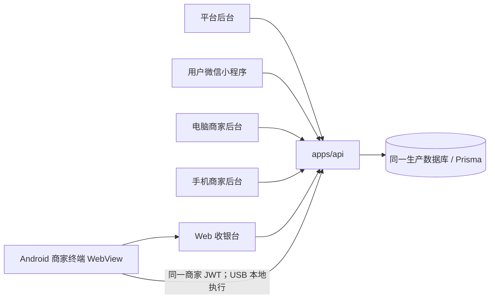
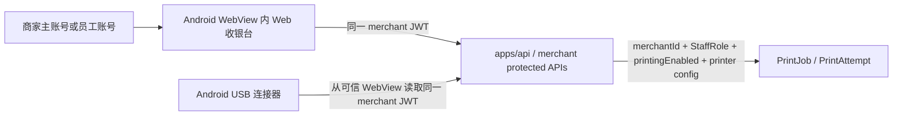
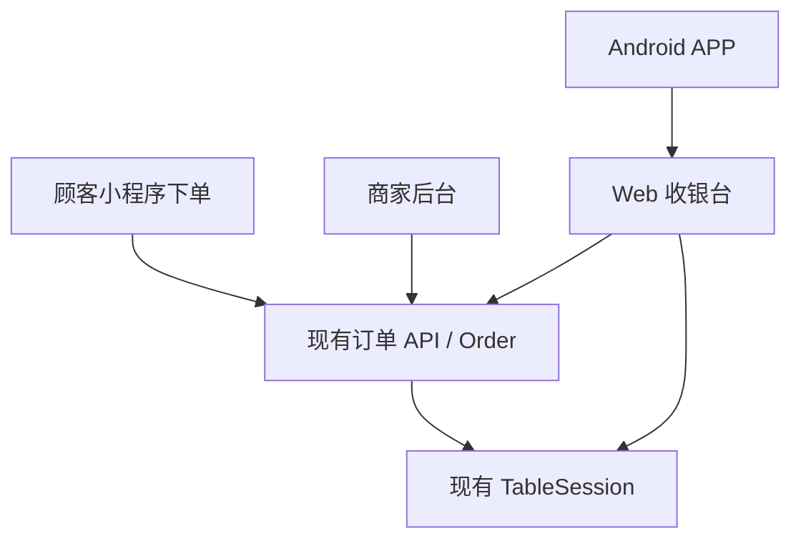

# 云桥 Life 全平台统一运行逻辑审计

审计日期：2026-07-15  
审计分支：`release/merchant-terminal-usb-rc1-deploy`  
审计目标：确认平台后台、小程序、电脑/手机商家后台、Web 收银台与 Android 商家终端继续复用同一套账号、权限、商家、桌台、订单、TableSession、打印配置和 API。

RC2 校正记录：`fix/printing-platform-gate-and-readiness-v1` 已在不修改 Prisma、订单、桌台、账号与权限体系的前提下，收敛平台打印总开关并落实 READY 正向白名单；详细规则与测试证据见 `docs/printing-v1/11_PLATFORM_PRINTING_GATE_AND_READINESS.md`。

本轮结论：

- 继续使用同一个 monorepo、`apps/api` 和 Prisma 数据模型；未新增第二套订单、桌台、TableSession、商家或员工账号体系。
- 商家主账号仍由平台后台创建，初始密码保持 `12345678`，并设置 `mustChangePassword=true`。
- 员工账号仍由商家后台创建，沿用 `MerchantStaff`、`StaffRole`、启用/停用和统一 JWT 认证。
- 电脑商家后台、手机商家后台、Web 收银台、Android WebView 内嵌收银台均复用 `/merchant/auth/login` 和 `/merchant/me`。
- V1 运行链路已停用 Terminal Token、终端绑定码、独立设备认证和 Heartbeat；Android 原生 USB 连接器改为从 WebView 已登录商家/员工会话中读取同一商家 JWT。
- `MerchantTerminal` 等打印任务中心表仍保留在 RC migration 中，但 V1 不暴露商家后台终端绑定入口，不注册 `/terminal/*` controller，不要求 APP 配对。
- 打印能力的固定实现是平台总开关 `Merchant.printingEnabled` + 商家打印中心配置；平台 capability `printerEnabled` 只作为既有平台 UI 输入并单向同步权威字段，商家端不能反向修改。自动打印和执行端上线前仍默认关闭。

## 全平台架构硬约束

本节是云桥 Life 后续需求分析、开发、评审和发布的架构基准。下列内容属于强制约束；“现有事实”由当前仓库实现支撑，“固定职责”和“禁止事项”约束后续实现，不得因单个页面、终端或交付阶段另建一套平行业务体系。

### 各端职责固定

```text
平台后台
=
平台配置与商家能力管理

电脑/手机商家后台
=
商家完整运营管理

Web 收银台
=
店员高频订单与桌台操作

Android APP
=
同一 Web 收银台 + 本地硬件能力

用户端微信小程序
=
顾客浏览、扫码、独立购物车和个人订单
```

#### 平台后台

平台后台负责：

- 创建商家；
- 维护商家基础资料、地址与定位；
- 管理平台能力开关；
- 创建商家主账号；
- 为商家开启或关闭打印能力；
- 提供平台侧诊断。

平台后台不承担商家日常订单和桌台操作。现有实现证据：`apps/merchant-admin/src/layouts/PlatformLayout.vue`、`apps/merchant-admin/src/pages/PlatformMerchantsPage.vue`、`apps/api/src/modules/platform/platform-merchants.service.ts`、`apps/api/prisma/schema.prisma`。

#### 电脑/手机商家后台

电脑端与手机端是同一个 `apps/merchant-admin` 应用，两端业务、数据、角色权限和 API 必须一致，只允许响应式布局和交互呈现不同。

商家后台负责：

- 订单、桌台、TableSession 和整桌账单；
- 菜品与营业设置；
- 商家员工账号、角色与权限；
- 打印机、打印规则与打印参数配置；
- 打印任务、失败记录和运营诊断。

现有实现证据：`apps/merchant-admin/src/router/index.ts`、`apps/merchant-admin/src/layouts/MerchantLayout.vue`、`apps/merchant-admin/src/components/printing/PrintingCenterShell.vue`。

#### Web 收银台

Web 收银台只承担店员高频操作：

- 桌台总览；
- 新订单、未完成订单和订单记录；
- 接单、拒单、开始制作和完成订单；
- 整桌账单与完成桌账；
- 手动打印、桌账打印、补打和查看打印结果。

Web 收银台不得承担商品管理、员工管理、商家资料管理、平台能力配置、完整打印机配置或新的订单状态机。它是独立前端应用，但不是独立业务系统；必须调用现有 merchant API。现有实现证据：`apps/merchant-cashier/src/api`、`apps/merchant-cashier/src/stores`、`apps/merchant-cashier/src/domain`。

#### Android APP

Android APP 的固定定位是：

```text
WebView 加载同一套 Web 收银台
+
USB / LAN / 云打印等网页无法完成的本地硬件能力
```

这是职责边界和后续可扩展方向，不代表所有通道已经实现：当前 V1 只准备 USB 本地执行，LAN、云打印和厂商 SDK 均未接入；云打印厂商凭据和服务端适配不得下放到 Android APP。

Android 原生层不得重新实现登录页面、订单页面、桌台页面、TableSession、菜品管理、员工管理、平台配置或第二套权限体系。不得自行管理一套独立商家登录。

统一会话链路必须保持为：

```text
WebView 使用现有商家主账号或员工账号登录
→ APP 原生层读取当前已登录会话
→ 根据同一 merchantId 和现有权限执行本地打印
```

APP 原生层只补足 WebView 生命周期、终端诊断、USB/LAN 等本地设备访问、ESC/POS 执行、防重复与恢复等网页无法可靠完成的能力；登录、订单、桌台和权限 UI 始终由同一 Web 收银台提供。现有实现证据：`apps/merchant-terminal-android/app/src/main/java/com/yunqiao/life/merchantterminal/MainActivity.kt`、`apps/merchant-terminal-android/app/src/main/java/com/yunqiao/life/merchantterminal/connector`。

#### 用户端微信小程序

小程序负责顾客浏览、扫码进入桌台场景、独立购物车、下单和查看个人订单。它不承担商家接单、制作、整桌账单或打印配置。现有实现证据：`apps/miniapp/src/pages`、`apps/miniapp/src/stores/cart.ts`、`apps/miniapp/src/api/http.ts`。

### 登录与权限统一

- 商家主账号由平台后台创建。
- 当前初始密码规则固定为 `12345678`；服务端只保存密码哈希，不保存明文。
- 主账号首次登录必须强制修改初始密码。
- 商家可在商家后台创建员工账号。
- 商家主账号和员工账号都沿用现有 `MerchantStaff`、`StaffRole`、账号状态、角色权限和商家数据隔离。
- 电脑商家后台、手机商家后台、Web 收银台和 Android APP 使用同一套商家账号认证与登录会话。
- 当前 V1 不采用 Terminal Token、绑定码、Heartbeat 或独立设备账号。
- Android APP 不得新增第二套登录，也不得复制或保存账号密码。

现有事实证据：`apps/api/src/modules/platform/platform-merchants.service.ts`、`apps/api/src/modules/auth/auth.controller.ts`、`apps/api/src/modules/auth/auth.service.ts`、`apps/api/src/modules/merchant-staff`、`apps/merchant-admin/src/stores`、`apps/merchant-cashier/src/stores/auth.ts`。

### 订单、桌台和 TableSession 唯一

```text
所有端只使用现有 Order、DiningTable、TableSession 和订单状态机。
```

所有端看到的必须是同一张订单、同一张桌台和同一个 TableSession。任一授权端通过现有 API 修改状态后，其他端必须通过同一 API 读取相同结果。

明确禁止：

- 新增 `/cashier/orders` 等重复订单接口；
- 新增 `/app/orders` 等 APP 专用订单接口；
- 新增收银机专用订单表；
- 新增 APP 专用 TableSession；
- 新增第二套桌台状态；
- 新增第二套接单、拒单、制作或完成逻辑；
- 新增收银台或 APP 专用员工、角色和权限体系。

现有事实证据：`apps/api/prisma/schema.prisma`、`apps/api/src/modules/orders`、`apps/api/src/modules/merchant-orders`、`apps/api/src/modules/tables`、`apps/api/src/modules/table-sessions`、`apps/merchant-admin/src/api`、`apps/merchant-cashier/src/api/orders.ts`、`apps/merchant-cashier/src/api/tables.ts`。

### 新接口限制

> 所有新增接口默认只能属于打印领域或明确的新业务领域。现有订单、桌台、TableSession、员工和权限接口可以满足时，禁止新增重复接口。

如果现有接口无法支持一个新需求，Codex 或开发人员必须按以下顺序处理：

1. 列出当前接口、实际缺口和受影响的端；
2. 停止实现；
3. 等待用户确认产品边界和接口方案；
4. 未确认前不得新增接口、状态、数据库表或业务逻辑。

### 打印职责划分

打印采用固定链路：

```text
平台开通或关闭能力
→ 商家配置打印机与规则
→ Web 收银台发起操作并查看结果
→ Android APP 执行本地硬件打印并回报结果
```

各端职责如下：

| 端 | 固定职责 | 不得承担 |
|---|---|---|
| 平台后台 | 控制 `Merchant.printingEnabled`；为商家开通或关闭打印能力；平台诊断 | 商家日常打印参数配置和本地硬件执行 |
| 电脑/手机商家后台 | 在同一打印中心配置打印机、通道、纸宽、打印点宽、图像阈值、切纸、单据类型、打印规则、份数和自动打印；查看任务与失败记录 | 绕过平台开关、直接访问 Android USB |
| Web 收银台 | 手动打印、桌账打印、补打、查看打印结果 | 管理平台开关、直接连接 USB/TCP、维护复杂打印规则 |
| Android APP | USB 识别与授权、本地 ESC/POS 执行、防重复、插拔和重启恢复、回报成功或失败 | 平台能力开关、复杂打印规则管理、订单业务状态变更 |

平台关闭 `Merchant.printingEnabled` 后，不允许打印，也不得创建新的自动打印任务；商家已有配置和历史记录保留。平台开启后，是否可打印仍必须继续检查商家配置和设备真实状态。

上述参数是职责归属和演进边界，不表示每个参数已经在当前 V1 UI/API 中启用；未实现能力必须保持关闭，并按独立阶段验证后才可开放。

### 打印状态必须真实区分

所有 UI 和 API 状态必须按真实条件区分以下四种结果，不得统一显示为“打印待接入”，也不得在证据不足时显示“在线”或“可打印”。

| 条件 | 对外状态 | 含义 |
|---|---|---|
| 平台未开启 `Merchant.printingEnabled` | 打印功能未开通 | 平台能力 Gate 未通过，不允许打印或创建自动任务 |
| 平台已开通，但商家没有当前操作所需的已启用打印机或必要配置 | 打印机未配置 | 需由商家在打印中心完成配置；自动打印还必须有有效规则 |
| 配置存在，但 Android APP、USB 或所选执行设备不可用、未知或未验证 | 打印设备离线 | 任务不能安全交给本地执行端 |
| 平台已开通、配置有效、执行设备有明确在线证据且执行条件满足 | 可以打印 | Web 收银台可发起当前授权范围内的打印操作 |

状态判断必须来源于现有平台开关、商家配置和执行端上报的真实数据；不能仅凭页面是否打开或配置记录是否存在推断。现有实现证据：`apps/api/src/modules/printing/controllers/merchant-printing.controller.ts`、`apps/merchant-cashier/src/stores/printing.ts`、`apps/merchant-cashier/src/i18n/messages.ts`、`apps/merchant-terminal-android/app/src/main/java/com/yunqiao/life/merchantterminal/connector`。

### RC2 偏差校正结果

此前审计发现的两个偏差已在 RC2 修复分支完成校正并纳入回归：

1. 平台 capability `printerEnabled` 继续复用现有平台商家能力编辑入口，但写入时在同一事务中单向同步 `Merchant.printingEnabled`，读取时以该权威字段覆盖历史 capability 漂移；商家 `OWNER/MANAGER` 直接调用 `PATCH /merchant/printing/settings` 也只会收到权限错误，不会改变总能力。证据：`apps/api/src/modules/platform/platform-merchants.service.ts`、`apps/api/src/modules/printing/services/printing-settings.service.ts`、`apps/merchant-admin/src/pages/PlatformMerchantDetailPage.vue`、`apps/merchant-admin/src/components/printing/PrintingCenterShell.vue`。
2. READY 改为正向白名单：仅 `ONLINE`、已启用且已实现的 USB ESC/POS 通道、有效配置，以及 120 秒内由 Android 明确上报的 USB 识别、权限、Interface、Endpoint 和 APP 可执行五项正向证据全部成立时才可打印。现有 Prisma 状态 `UNKNOWN`、`UNVERIFIED`、`OFFLINE`、`ERROR`，`enabled=false` 的停用设备，前端防御性收到的 `DISABLED`，以及证据缺失或过期均不可打印。证据：`apps/api/src/modules/printing/utils/printer-readiness.ts`、`apps/merchant-cashier/src/stores/printing.ts`、`apps/merchant-terminal-android/app/src/main/java/com/yunqiao/life/merchantterminal/connector/ConnectorPrintExecutionPolicy.kt`。

该校正没有新增订单、桌台、TableSession、员工、角色或权限接口，也没有恢复 Terminal Token、绑定码、独立设备账号或 Heartbeat。

### 完成桌账不等于收款

所有端统一使用“完成桌账（关闭桌台）”语义。该操作只结束当前 TableSession 并让桌台恢复空闲，不代表微信、支付宝、现金或其他支付方式已经在系统中完成收款，也不得由任一端自行扩展成收款状态。

现有事实证据：`apps/api/src/modules/table-sessions`、`apps/merchant-cashier/src/domain/tables.test.ts`。

### Git 和发布流程

固定发布链路为：

```text
功能分支
→ 本地测试
→ RC / release 分支
→ 完整回归
→ 普通 push 到原 GitHub
→ 只允许 fast-forward main
→ 创建 Tag
→ 生产部署 Gate
→ 部署
```

禁止：

- 功能完成后直接 push `main`；
- force push；
- 自动 rebase；
- 修改 `origin`；
- 新建第二个仓库；
- 未测试直接部署；
- 未完成并验证备份就执行 production migration。

## 1. 全平台应用关系



事实证据：

| 项目 | 当前事实 | 证据 |
|---|---|---|
| API 单体 | 所有业务模块仍通过同一 NestJS `AppModule` 注册 | `apps/api/src/app.module.ts` |
| 电脑/手机商家后台 | 同一个 `apps/merchant-admin` Vue 应用通过响应式布局承担电脑与手机端 | `apps/merchant-admin/src/router/index.ts`, `apps/merchant-admin/src/layouts/MerchantLayout.vue` |
| Web 收银台 | 独立前端应用，但调用同一 merchant API | `apps/merchant-cashier/src/api/http.ts`, `apps/merchant-cashier/src/stores/auth.ts` |
| Android APP | WebView 加载 Web 收银台；原生层仅补足 USB 本地能力 | `apps/merchant-terminal-android/app/src/main/java/com/yunqiao/life/merchantterminal/MainActivity.kt` |
| 小程序 | 顾客下单和查看自己订单，仍调用同一 API | `apps/miniapp/src/api/http.ts`, `apps/miniapp/src/pages/checkout/index.vue` |
| 数据库 | 商家、订单、桌台、TableSession、打印任务均在同一 Prisma schema | `apps/api/prisma/schema.prisma` |

## 2. 账号与首次改密

### 2.1 商家主账号

平台后台创建商家时创建 OWNER 账号，初始密码固定为 `12345678`，服务端保存 bcrypt hash，并设置首次登录强制改密。

证据：

- 平台创建或重置商家 OWNER 密码时使用 `bcrypt.hash('12345678', 12)`：`apps/api/src/modules/platform/platform-merchants.service.ts`
- OWNER 账号写入 `role: StaffRole.OWNER` 与 `mustChangePassword: true`：`apps/api/src/modules/platform/platform-merchants.service.ts`
- Prisma 中商家员工账号使用 `passwordHash`，没有明文密码字段：`apps/api/prisma/schema.prisma`

### 2.2 首次登录强制改密

登录响应返回 `mustChangePassword`，前端路由基于该字段限制进入业务页面。改密后清除登录状态并要求重新登录。

证据：

- 商家登录返回 staff role/status/mustChangePassword：`apps/api/src/modules/auth/auth.service.ts`
- 改密接口：`POST /merchant/profile/change-password`：`apps/api/src/modules/auth/auth.controller.ts`
- 商家后台路由保护：`apps/merchant-admin/src/router/index.ts`
- Web 收银台路由保护：`apps/merchant-cashier/src/router/index.ts`
- Web 收银台改密页：`apps/merchant-cashier/src/views/ChangePasswordView.vue`

### 2.3 员工账号

员工账号由商家后台创建，沿用 `MerchantStaff`、`StaffRole`、启用/停用、统一认证和商家隔离。

证据：

- 员工管理 controller 只允许 OWNER 管理：`apps/api/src/modules/merchant-staff/merchant-staff.controller.ts`
- 员工创建/禁用/重置密码逻辑：`apps/api/src/modules/merchant-staff/merchant-staff.service.ts`
- 商家后台员工页面：`apps/merchant-admin/src/pages/StaffPage.vue`

审计结论：未发现 Web 收银台或 Android APP 新增第二套收银员账号、设备账号或 APP 专用账号。

## 3. 统一接口清单

以下清单只记录 V1 运行链路应复用的接口；未发现为了收银台或 APP 新增重复订单、桌台、TableSession 或账号 API。

| 功能 | 接口路径 | Controller / Service | DTO/类型 | 电脑/手机商家后台 | Web 收银台 | Android APP |
|---|---|---|---|---|---|---|
| 登录 | `POST /merchant/auth/login` | `apps/api/src/modules/auth/auth.controller.ts` / `auth.service.ts` | `MerchantLoginDto` | `apps/merchant-admin/src/api/client.ts` | `apps/merchant-cashier/src/api/auth.ts` | WebView 复用 |
| 当前账号/权限 | `GET /merchant/me` | `auth.controller.ts` / `auth.service.ts` | `AuthUser` | `merchant-admin/src/router/index.ts` | `merchant-cashier/src/stores/auth.ts` | WebView 复用；原生只读 JWT |
| 首次改密 | `POST /merchant/profile/change-password` | `auth.controller.ts` / `auth.service.ts` | `ChangeMerchantPasswordDto` | `MerchantProfilePage.vue` | `ChangePasswordView.vue` | WebView 复用 |
| 员工账号 | `/merchant/staff` | `merchant-staff.controller.ts` / `merchant-staff.service.ts` | `CreateMerchantStaffDto`, `UpdateMerchantStaffDto` | `StaffPage.vue` | 不提供员工管理 | WebView 复用 |
| 商家信息 | `GET /merchant/me` 与商家资料接口 | `auth.service.ts`, merchant profile 相关服务 | 现有 API 类型 | dashboard/profile | `stores/auth.ts` | WebView 复用 |
| 桌台列表 | `GET /merchant/tables` | `apps/api/src/modules/tables/tables.controller.ts` / `tables.service.ts` | table DTO | 桌台页 | `apps/merchant-cashier/src/api/tables.ts` | WebView 复用 |
| 当前桌台会话 | `GET /merchant/tables/:tableId/current-session` | `apps/api/src/modules/table-sessions/merchant-table-sessions.controller.ts` / `table-sessions.service.ts` | table/session response | 桌台详情 | `api/tables.ts` | WebView 复用 |
| 开放 TableSession | `GET /merchant/table-sessions/open` | `merchant-table-sessions.controller.ts` / `table-sessions.service.ts` | query DTO | 桌台账单 | `api/tables.ts` | WebView 复用 |
| 整桌账单 | `GET /merchant/table-sessions/:id` | `merchant-table-sessions.controller.ts` / `table-sessions.service.ts` | session detail | 桌台账单 | `api/tables.ts` | WebView 复用 |
| 完成桌账（关闭桌台） | `POST /merchant/table-sessions/:id/close` | `merchant-table-sessions.controller.ts` / `table-sessions.service.ts` | close action | 桌台账单 | `api/tables.ts` | WebView 复用 |
| 新订单/未完成/历史 | `GET /merchant/orders` | `apps/api/src/modules/merchant-orders/merchant-orders.controller.ts` / `merchant-orders.service.ts` | order list query | dashboard/orders | `apps/merchant-cashier/src/api/orders.ts` | WebView 复用 |
| 订单详情 | `GET /merchant/orders/:id` | `merchant-orders.controller.ts` / `merchant-orders.service.ts` | order detail | order detail | `api/orders.ts` | WebView 复用 |
| 接单 | `POST /merchant/orders/:id/accept` | `merchant-orders.controller.ts` / `merchant-orders.service.ts` | action DTO | dashboard/order detail | `api/orders.ts` | WebView 复用 |
| 拒单 | `POST /merchant/orders/:id/reject` | `merchant-orders.controller.ts` / `merchant-orders.service.ts` | action DTO | order detail | `api/orders.ts` | WebView 复用 |
| 开始制作 | `POST /merchant/orders/:id/start-preparing` | `merchant-orders.controller.ts` / `merchant-orders.service.ts` | action DTO | dashboard/order detail | `api/orders.ts` | WebView 复用 |
| 完成订单 | `POST /merchant/orders/:id/complete` | `merchant-orders.controller.ts` / `merchant-orders.service.ts` | action DTO | dashboard/order detail | `api/orders.ts` | WebView 复用 |
| 打印中心 | `/merchant/printing/*` | `merchant-printing.controller.ts` 与 printing services | printing DTO | `PrintingCenterShell.vue` | `apps/merchant-cashier/src/api/printing.ts` | 原生使用同一商家 JWT 调用 connector 子路径 |

统一文案要求：

- Web 收银台桌账关闭语义为“完成桌账（关闭桌台）”。
- 该操作仅结束当前 TableSession，不代表线上收款。现有 Web 收银台测试已覆盖“关闭桌账不等同收款”的领域规则：`apps/merchant-cashier/src/domain/tables.test.ts`。

## 4. Terminal Token / 绑定码 / Heartbeat 审计

### 4.1 RC 原实现

RC 曾实现过以下 V2 候选能力：

- `MerchantTerminal` 数据模型与相关字段：`apps/api/prisma/schema.prisma`
- 终端服务、凭据服务、TerminalAuthGuard、ActiveTerminalGuard：`apps/api/src/modules/printing/services/terminal-credentials.service.ts`, `apps/api/src/modules/printing/guards/terminal-auth.guard.ts`
- 终端 pairing/heartbeat controller 文件：`apps/api/src/modules/printing/controllers/terminal-connector.controller.ts`, `apps/api/src/modules/printing/controllers/terminal-pairing.controller.ts`
- merchant-admin 曾有终端管理页：`apps/merchant-admin/src/pages/printing/PrintingTerminalsPage.vue`
- Android 曾有配对页与终端凭据存储：`apps/merchant-terminal-android/app/src/main/java/com/yunqiao/life/merchantterminal/connector/ConnectorSetupActivity.kt`

### 4.2 本轮 V1 校正

V1 运行链路已改为：



本轮代码校正：

| 项目 | 校正后状态 | 证据 |
|---|---|---|
| `/terminal/*` controller | 不再注册到 `PrintingModule.controllers` | `apps/api/src/modules/printing/printing.module.ts` |
| 商家后台终端 Tab | 从打印中心可见导航移除 | `apps/merchant-admin/src/components/printing/PrintingCenterShell.vue`, `apps/merchant-admin/src/router/index.ts` |
| Android 绑定码 UI | 配对输入和按钮隐藏，APP 不再要求先配对 | `ConnectorSetupActivity.kt` |
| Android 原生认证 | `ConnectorApiClient` 使用 `Authorization: Bearer <merchant JWT>` 调用 `/merchant/printing/connector/*` | `ConnectorApiClient.kt` |
| Android Token 存储 | Keystore 中保存 WebView 商家/员工会话 token，不保存 Terminal Token | `security/TerminalCredentialStore.kt` |
| WebView 登录同步 | 只在白名单 URL 下读取 `yunqiao_cashier_access_token` / sessionStorage token | `MainActivity.kt` |
| Heartbeat | V1 不调用 heartbeat；仅保留本地配置刷新间隔字段用于服务循环 | `PrinterConnectorService.kt`, `ConnectorApiClient.kt` |

说明：

- `MerchantTerminal` schema 和旧 terminal service 文件仍保留，原因是 RC migration 已包含这些表；生产 migration 尚未执行，V1 暂不暴露和使用，后续 V2 可基于用户确认再恢复独立终端认证。
- `PrintJob.claimedByTerminalId` 与 `PrintAttempt.terminalId` 已允许 V1 商家会话连接器以 `null` 记录执行主体，避免强制依赖 Terminal Token。
- 审计未发现需要新增另一套认证系统。

安全注意：

- Android 原生层只从可信 WebView 页面读取同一商家 JWT；不读取账号密码，不创建 JS Bridge 执行命令。
- 商家退出登录或 token 失效后，原生层清除本地 token 并停止连接器启动条件。
- 如果后续发现 WebView token 共享在目标 Android WebView 版本上不稳定，应停止上线并由用户确认替代方案；不得自行恢复 Terminal Token 作为 V1 前提。

## 5. 打印能力与平台开关

打印能力的固定实现是“平台开通/关闭、商家配置”。RC2 校正后的状态如下：

| 层级 | 责任 | 证据 |
|---|---|---|
| 平台 | `Merchant.printingEnabled` 是唯一权威总 Gate；既有 capability `printerEnabled` 由平台操作并单向同步该字段，回显也以该字段为准 | `apps/api/prisma/schema.prisma`, `apps/api/src/modules/platform/platform-merchants.service.ts`, `apps/merchant-admin/src/pages/PlatformMerchantDetailPage.vue` |
| 商家后台 | 新打印中心 Beta 管理打印机、模板、规则、任务；平台总开关只读，未开通时电脑与手机页面均 fail-closed，旧直打入口保持隐藏 | `apps/merchant-admin/src/components/printing/PrintingCenterShell.vue`, `apps/merchant-admin/src/i18n/printing.ts` |
| API | `/merchant/printing/feature-state` 同时返回 legacy flag 与 `merchantPrintingEnabled` | `apps/api/src/modules/printing/controllers/merchant-printing.controller.ts` |
| Web 收银台 | 按平台 Gate、配置、设备证据和现有账号权限显示严格四态；仅全部正向条件满足时 READY，状态刷新失败也 fail-closed | `apps/merchant-cashier/src/stores/printing.ts`, `apps/merchant-cashier/src/i18n/messages.ts` |
| Android APP | USB 执行前和写入前均检查平台 Gate、同商家、任务状态、服务端 READY、本地 USB 五项正向证据及现有商家会话 | `ConnectorPrintExecutionPolicy.kt`, `PrinterConnectorService.kt`, `UsbPrintJobExecutor.kt` |

V1 状态：

- 旧服务器 Socket/TCP 局域网直打保持关闭；旧接口保留回滚能力但不作为可见入口。
- 新自动打印和执行端上线前默认关闭。
- 不连接 LAN、云打印或厂商内置 SDK。
- 本轮没有修改 Prisma schema、没有执行 migration、没有部署。

## 6. 权限与数据隔离

| 能力 | 当前权限表达 | 证据 | 结论 |
|---|---|---|---|
| 进入商家后台/收银台 | 统一商家登录 + `ActiveMerchantStaffGuard` / 前端 route guard | `auth.controller.ts`, `merchant-admin/src/router/index.ts`, `merchant-cashier/src/router/index.ts` | 可复用 |
| 查看/处理订单 | `MerchantRoles(OWNER, MANAGER, STAFF)` + merchantId scope | `merchant-orders.controller.ts` | 可复用 |
| 查看桌台/关闭桌账 | `MerchantRoles(OWNER, MANAGER, STAFF)` + merchantId scope | `merchant-table-sessions.controller.ts` | 可复用 |
| 管理员工 | `MerchantRoles(OWNER)` | `merchant-staff.controller.ts` | 可复用 |
| 管理打印配置 | 配置 mutation 限 OWNER/MANAGER | `merchant-printing.controller.ts` | 可复用 |
| 打印任务领取/回报 | V1 使用商家 JWT + merchantId scope + printingEnabled + printer config | `merchant-printing.controller.ts`, `print-jobs.service.ts`, `print-attempts.service.ts` | 可复用；未新增权限 |

审计结论：本轮没有发现必须新增打印权限才能继续 V1 的情况。平台 `printingEnabled` 是商家能力开关，不替代员工角色权限。

## 7. 订单、桌台、TableSession 一致性



事实：

- Web 收银台订单状态动作来自 `apps/merchant-cashier/src/domain/orders.ts`，与现有 merchant-admin 操作相同。
- Web 收银台 API 调用封装在 `apps/merchant-cashier/src/api/orders.ts`、`apps/merchant-cashier/src/api/tables.ts`。
- 顾客下单由 `apps/api/src/modules/orders/orders.service.ts` 处理，商家订单查询与状态动作由 `apps/api/src/modules/merchant-orders/merchant-orders.service.ts` 统一执行。
- TableSession 仍由 `apps/api/src/modules/table-sessions/table-sessions.service.ts` 统一归集和关闭。
- 小程序只处理顾客自己的下单和订单查看，不承担商家整桌账单操作。

审计结论：未发现收银台或 Android APP 新增重复订单状态机、重复 TableSession 或 APP 专用业务接口。

## 8. 安全扫描结果

本轮对以下内容执行了人工/命令行审计：

- `12345678` 仅作为平台创建/重置商家 OWNER 初始密码或测试文案存在；服务端写入 bcrypt hash。
- 未发现本轮新增账号、密码、Token、Cookie、API Key、keystore、`.env.local`、生产数据库备份或 APK 到 Git。
- Android 本地 token 存储使用 Android Keystore AES-GCM 加密；测试仅使用伪 token。
- 旧 Terminal Token 字符串 `yt1.*` 已从 Android V1 单元测试与运行路径移除。
- 旧 terminal/pairing 文档仍存在于 `docs/printing-v1/*` 作为历史/V2 设计资料，不代表 V1 当前运行前提。

## 9. 当前仍需注意的历史/休眠代码

以下内容保留但不得作为 V1 到店上线前提：

| 内容 | 保留原因 | V1 运行状态 |
|---|---|---|
| `MerchantTerminal` schema/migration | RC migration 已包含；用户要求优先保留表、停用功能，避免反复改 migration | 不暴露商家后台入口，不要求 APP 绑定 |
| `terminal-credentials.service.ts` / terminal guards | 历史/V2 候选实现；模块不注册 `/terminal/*` controller | 不参与 V1 路由 |
| `PrintingTerminalsPage.vue` | 历史 UI 文件保留 | 路由和 Tab 已移除 |
| `docs/printing-v1/*` 中 Terminal JWT 方案 | 设计历史，部分用于 V2 参考 | 本文覆盖 V1 决策：当前不采用 |

若未来要恢复独立终端身份，应在 V2 单独立项，不能在 V1 生产 Gate 中隐式启用。

## 10. 审计结论

| 检查项 | 结果 |
|---|---|
| 各端共享同一 API/数据库 | PASS |
| 未新增重复订单/桌台/TableSession | PASS |
| 商家主账号由平台创建 | PASS |
| 初始密码 `12345678` + 首次强制改密 | PASS |
| 员工账号由商家后台创建 | PASS |
| 电脑/手机商家后台、Web 收银台、Android APP 使用同一账号体系 | PASS |
| V1 不使用 Terminal Token/绑定码/独立设备账号/Heartbeat | PASS，运行链路已校正；历史代码休眠保留 |
| 订单与桌台功能复用现有接口 | PASS |
| 平台/商家打印总开关边界 | PASS |
| READY 正向判定 | PASS |
| 打印遵循平台开关 + 商家配置 | PASS |
| 是否需要新增权限、订单接口或桌台接口 | 否 |
| 是否执行生产 migration、部署、DNS/Nginx 修改 | 否 |

本架构基准必须先按规定 Git 流程同步到原 GitHub；同步完成后停止，等待用户确认后再讨论生产部署 Gate。

## Codex 开发前强制检查

Codex 或其他开发人员开始任何云桥 Life 需求前，必须逐项回答：

1. 本需求属于哪个端？
2. 该功能应由平台后台、商家后台、Web 收银台、APP 还是小程序承担？
3. 是否已有现成 API？
4. 是否已有现成数据库模型？
5. 是否已有角色权限？
6. 是否会形成第二套订单、桌台、账号或权限？
7. 电脑和手机商家后台是否都需要同步？
8. APP 是否只增加本地硬件能力？
9. 平台能力开关是否需要参与判断？
10. 是否需要用户先讨论确认？

任何一项不明确时，先停止开发并向用户报告，不得自行扩展产品范围。
