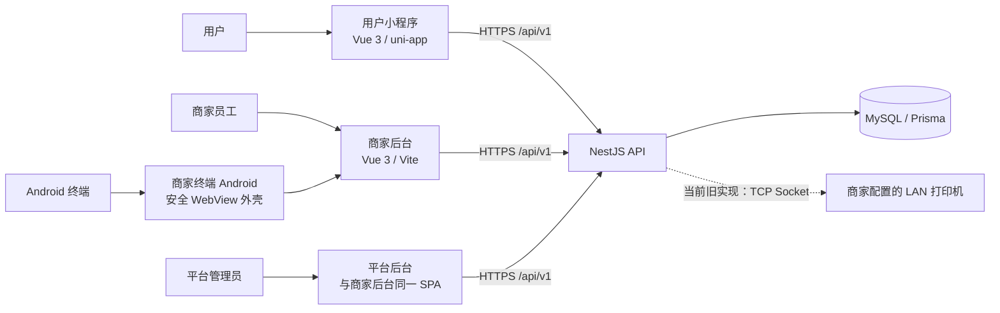
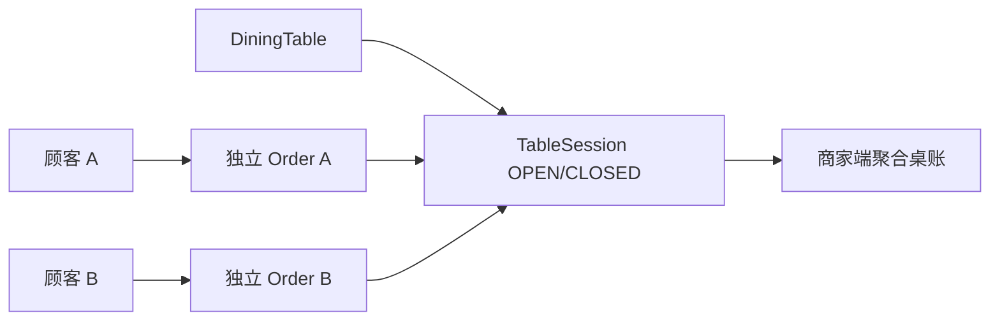
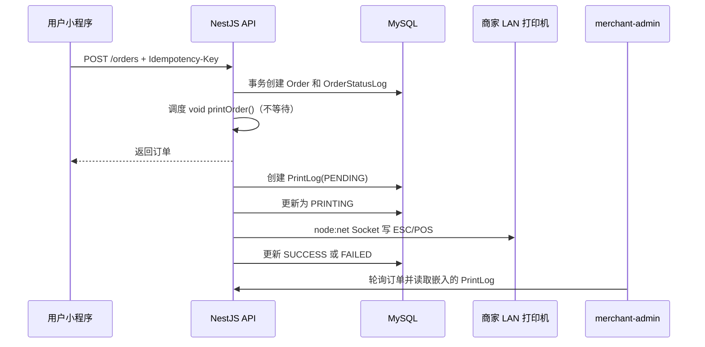

# 统一打印架构 V1：当前现状审计

> 审计基线：`5109960 chore: prepare d10 pro stage1 test build`。
> 本文只描述仓库中可以找到证据的事实；竞品资料仅作为产品参考，不作为云桥现状证据。硬件、生产网络与真实出纸均未在本文中视为已验证。

## 1. 当前系统结构

当前应用关系如下：

| 应用或组件 | 当前职责 | 事实证据 |
|---|---|---|
| 平台后台 | 平台登录、商家、订单、用户、字典和平台设置；与商家后台共用一个 Vue SPA | `apps/merchant-admin/src/router/index.ts:92-215` |
| 商家后台 | 登录、工作台、订单、桌台、商品、员工、商家设置和打印设置 | `apps/merchant-admin/src/router/index.ts:95-164` |
| 用户小程序 | 顾客浏览、购物车、堂食/自取/配送下单和订单查询 | `apps/miniapp/src/pages.json`；`apps/miniapp/src/api/cart.ts:57-95` |
| API | NestJS 单体 API；统一 `/api/v1` 前缀，连接 Prisma/MySQL | `apps/api/src/main.ts:9-38`；`apps/api/src/app.module.ts:26-73` |
| Android 终端 | 横屏 WebView、登录保持、网络错误页和诊断；当前不执行打印 | `apps/merchant-terminal-android/app/src/main/AndroidManifest.xml:5-42`；`apps/merchant-terminal-android/README.md:363-388` |
| 数据库 | MySQL；Prisma schema 和 migration 位于 API 应用内部 | `apps/api/prisma/schema.prisma:1-8`；`apps/api/prisma/migrations/migration_lock.toml:1` |
| 共享包 | 当前仅共享 API 前缀与 `OrderType`，尚无打印领域契约 | `packages/shared/src/index.ts:1-7` |

部署文档描述 Nginx、NestJS、MySQL 8 和可选 Redis；Redis 当前不承担订单或打印可靠性：`docs/DEPLOYMENT.md:1-52`。仓库根目录没有独立 `prisma/` 或 `scripts/`，实际 schema 在 `apps/api/prisma/`。

## 2. 已有打印相关能力

状态只使用本次约定的七种状态。

| 能力 | 当前状态 | 代码位置 | 数据库位置 | 是否真实可用 | 风险或缺口 |
|---|---|---|---|---|---|
| 商家级打印机配置 | 已实现但未验证 | `apps/api/src/modules/printers/printers.controller.ts:21-52`；`apps/merchant-admin/src/pages/MerchantProfilePage.vue:360-450` | `apps/api/prisma/schema.prisma:707-731` | CRUD 已接 API；硬件未验证 | 只支持 `NETWORK`，结构绑定 IP/端口；无通道抽象和独立启用状态 |
| 多台打印机记录 | 已实现但未验证 | `apps/api/src/modules/printers/printers.service.ts:184-203` | Merchant 1:N PrinterSetting | 可以保存多条记录 | 没有数据库约束保证每商家只有一个默认打印机；用途不等于分单规则 |
| 打印设置页面 | 已实现并可验证 | `apps/merchant-admin/src/pages/MerchantProfilePage.vue:1143-1234`；`apps/merchant-admin/src/api/printers.ts:8-40` | 使用 PrinterSetting | UI 与 API 确实连接 | `/merchant/printers` 已重定向到商家设置；权限主要由 UI 隐藏和角色守卫组合控制 |
| 独立 PrintersPage | 已废弃 | `apps/merchant-admin/src/pages/PrintersPage.vue`；路由未导入该组件 | 同上 | 当前路由不可达 | 与嵌入商家设置的 UI 重复，后续不要继续维护两套页面 |
| 测试打印 API | 已实现但未验证 | `apps/api/src/modules/printers/printers.controller.ts:54-57`；`apps/api/src/modules/printers/printers.service.ts:205-214` | 写 PrintLog | 会由 API 进程即时尝试 TCP | TCP 写入成功不等于物理出纸；云端通常无法路由到商家私网 |
| 服务端 LAN TCP | 已实现但未验证 | `apps/api/src/modules/printers/printers.service.ts:341-368` | 读取 PrinterSetting | 有真实 Socket 代码 | 商家可配置任意合法 IP 与 1..65535 端口，形成服务器侧网络探测面；无本地连接器 |
| ESC/POS 字节生成 | 部分实现 | `apps/api/src/modules/printers/printers.service.ts:370-451` | 不持久化字节或文档 | 有 `ESC @`、文本、`GS V` | `UTF8/GBK/CP1258` 三个分支实际都输出 UTF-8；中文、越南语、纸宽和切纸未验证 |
| 订单人工打印/补打 | 已实现但未验证 | `apps/api/src/modules/merchant-orders/merchant-orders.controller.ts:137-148`；`apps/merchant-admin/src/pages/OrderDetailPage.vue:222-240` | 每台打印机写一条 PrintLog | 页面可选择打印机并同步调用 API | 无补打原因、操作员工 ID、不可变快照或幂等保护；重新读取当前订单和当前模板代码 |
| 下单后自动打印 | 部分实现 | `apps/api/src/modules/orders/orders.service.ts:56-64,128-146` | PrinterSetting.autoPrintEnabled + PrintLog | 新订单事务后 fire-and-forget | 三种订单统一在 `PENDING_ACCEPTANCE` 触发；进程退出会丢；订单创建幂等能间接阻止同一创建请求再次触发，但无独立打印去重，不能覆盖事件重放、服务重试或旧/新链路并行 |
| 打印状态记录 | 部分实现 | `apps/api/src/modules/printers/printers.service.ts:273-339` | `apps/api/prisma/schema.prisma:733-750` | 实际写 PENDING/PRINTING/SUCCESS/FAILED | PrintLog 是薄日志，不是任务；无 attempt、快照、租约、完成时间或独立查询 API |
| 订单页面打印状态 | 部分实现 | `apps/api/src/modules/merchant-orders/merchant-orders.service.ts:218-298`；`apps/merchant-admin/src/pages/OrderDetailPage.vue:181-215,334-351` | 嵌入最近日志 | 可看订单最近 10/20 条日志 | 无独立打印日志页；测试打印因无 orderId 在现有 UI 不可见 |
| 打印份数 | 部分实现 | `apps/api/src/modules/printers/printers.service.ts:294-305` | PrinterSetting.copies | 同一调用内循环发送 | 多份共用一个 PrintLog；失败文案含第 x/y 份，但没有结构化逐份 Attempt，无法分别查询每份结果，也不能确认此前份数是否实际出纸 |
| 打印机在线状态 | 部分实现 | `apps/api/src/modules/printers/printers.service.ts:307-339` | PrinterSetting.status | 由最近一次 Socket 结果改写 | 不是心跳；一次失败设 OFFLINE 后自动打印持续跳过，且没有自动探活 |
| 打印用途 | 部分实现 | `apps/api/prisma/schema.prisma:128-133,712`；`apps/api/src/modules/printers/printers.service.ts:399-405` | FRONT_DESK/KITCHEN/BAR/GENERAL | UI 可配置且会改变当前小票标题 | 没有 PrintRule；用途不参与菜品筛选、档口路由或分单，所有自动打印机仍收到同一完整订单 |
| 自动打印开关 | 部分实现 | `apps/merchant-admin/src/pages/MerchantProfilePage.vue:120-133,345-357` | PrinterSetting.autoPrintEnabled | 会影响旧自动选择 | 开关绑在设备而不是规则；无法按订单类型、事件或小票类型表达 |
| 小票模板 | 不存在 | 无 | 无 ReceiptTemplate | 否 | 当前票据为 TypeScript 硬编码；无版本冻结 |
| 统一 PrintJob | 不存在 | 全仓及 Git 历史均未发现 | 无 | 否 | 无任务事实来源、领取、取消、查询、幂等和恢复 |
| PrintAttempt | 不存在 | 无 | 无 | 否 | PrintLog 无法表达一次任务的多次执行 |
| PrintRule | 不存在 | 无 | 无 | 否 | 现有用途和 autoPrint 不能代替规则 |
| MerchantTerminal | 不存在 | 无 | 无 | 否 | 无终端注册、撤销、凭据、心跳或设备绑定 |
| Android 打印连接器 | 不存在 | `apps/merchant-terminal-android/README.md:363-388` | 无 Room/本地任务表 | 否 | 当前无 Socket、打印 Bridge、后台服务或任务领取 |
| 云打印、USB、内置 SDK | 不存在 | 全仓及历史均未发现 | 无 | 否 | 仅为产品规划，不得描述为现有能力 |
| 桌码浏览器打印 | 已实现但未验证 | `apps/merchant-admin/src/pages/TablesPage.vue:480-498` | 无 | 使用 `window.open` + `window.print()` | 这是桌台二维码打印，与订单 ESC/POS 链路无关 |

打印模块由 `129df18 feat(printing): add printer module and merchant admin management` 引入；`46a9192` 只改善打印机弹窗布局；`ce95ca1` 将打印配置并入商家设置。Git 历史未发现曾存在后又删除的 PrintJob、PrintAttempt、ReceiptTemplate、MerchantTerminal、USB、云打印或 Android 打印实现。

### 2.1 当前相关表的关键约束

| 模型 | 主键与唯一约束 | 外键与删除策略 | 关键普通索引 | 打印设计含义 |
|---|---|---|---|---|
| `Order` | PK `id`；`orderNo` unique；`[userId,idempotencyKey]` unique | user/merchant 为 Restrict；table/session 删除 SetNull | `[merchantId,status,createdAt]`、`[userId,createdAt]`、`[tableSessionId]` | 下单幂等不能替代打印事件幂等 |
| `TableSession` | PK `id`；`sessionNo` unique；`openTableId` nullable unique | merchant/table 删除 Cascade | `[merchantId,status]`、`[tableId,openedAt]`、`[merchantId,openedAt]` | 一张桌可有多笔订单；关闭会话不是订单结算事件 |
| `PrinterSetting` | PK `id`；没有“每商家仅一个默认打印机”的唯一约束 | merchant 删除 Cascade | `[merchantId,isDefault]`、`[merchantId,status]` | 默认机一致性只由服务层维护，旧配置仅适合作迁移输入 |
| `PrintLog` | PK `id`；无 dedupe/attempt 唯一约束 | merchant 删除 Cascade；order/printer 删除 SetNull | `[merchantId,createdAt]`、`[orderId,createdAt]`、`[printerId,createdAt]` | 删除关联后缺订单号/打印机名快照，不适合作可靠审计事实源 |

证据：`apps/api/prisma/schema.prisma:469-509,549-592,707-750`；订单幂等 migration 为 `apps/api/prisma/migrations/20260611000000_add_order_idempotency/migration.sql:1-10`，打印表 migration 为 `apps/api/prisma/migrations/20260623000000_add_printer_settings_and_print_logs/migration.sql:1-54`，TableSession migration 为 `apps/api/prisma/migrations/20260702000000_add_table_sessions/migration.sql:1-35`。Git 历史没有删除这些打印 migration。

### 2.2 当前真实打印 API

所有下列路径实际带全局 `/api/v1` 前缀，并使用 JwtAuthGuard + MerchantRoleGuard；merchantId 来自商家 JWT，不接受请求体自报：`apps/api/src/main.ts:14-16`；`apps/api/src/modules/printers/printers.controller.ts:20-57`。

| Method / path | 当前调用方 | Controller / DTO | Service 行为 | 缺口 |
|---|---|---|---|---|
| `GET /merchant/printers` | OWNER/MANAGER/STAFF | `apps/api/src/modules/printers/printers.controller.ts:27-30` | 按 merchantId 返回配置 | 无 capability Guard；返回的是旧 PrinterSetting |
| `POST /merchant/printers` | OWNER/MANAGER | `apps/api/src/modules/printers/printers.controller.ts:32-36`；`apps/api/src/modules/printers/dto/create-printer.dto.ts` | 创建配置，可调整默认机 | 无通道抽象；默认机唯一性靠服务层 |
| `PATCH /merchant/printers/:id` | OWNER/MANAGER | `apps/api/src/modules/printers/printers.controller.ts:38-45`；`apps/api/src/modules/printers/dto/update-printer.dto.ts` | 更新同商家配置 | 无乐观版本；可改变即时执行目标 |
| `DELETE /merchant/printers/:id` | OWNER/MANAGER | `apps/api/src/modules/printers/printers.controller.ts:48-51` | 物理删除配置，PrintLog.printerId 被 SetNull | 新架构应改为禁用/软生命周期 |
| `POST /merchant/printers/:id/test` | OWNER/MANAGER/STAFF | `apps/api/src/modules/printers/printers.controller.ts:54-57` | 创建薄 PrintLog 后由 API 直接 TCP | 不是任务；无可靠重试/出纸确认 |
| `POST /merchant/orders/:id/print` | OWNER/MANAGER/STAFF | `apps/api/src/modules/merchant-orders/merchant-orders.controller.ts:137-148`；`apps/api/src/modules/merchant-orders/dto/print-order.dto.ts` | 重新读取当前订单，按选择的打印机即时执行 | 无补打原因、请求幂等、原快照 |

没有独立的 PrintLog 列表、任务状态回传、重新领取、租约、终端注册/认证/心跳 API。当前订单详情只把 PrintLog 嵌入订单响应：`apps/api/src/modules/merchant-orders/merchant-orders.service.ts:218-298`。

### 2.3 当前接单与认证基础设施

- merchant-admin 工作台/订单页/详情页分别通过约 10 秒、10 秒、5 秒的前台定时查询刷新；仓库没有订单 WebSocket、SSE 或后台消息队列实现：`apps/merchant-admin/src/pages/DashboardPage.vue`；`apps/merchant-admin/src/pages/OrdersPage.vue:873-878`；`apps/merchant-admin/src/pages/OrderDetailPage.vue`。
- 当前 MerchantStaff JWT 直接含 staff id、accountType、merchantId 和 role，默认有效期可配置为 7 天；没有 refresh、设备撤销或终端心跳：`apps/api/src/modules/auth/auth.service.ts:97-150`；`apps/api/src/app.module.ts:38-46`。
- 现有认证和 MerchantRoleGuard 可复用服务端风格，但不能作为长期 Terminal credential。

## 3. 订单和桌台模型

### 3.1 订单

- `OrderType` 只有 `DINE_IN`、`PICKUP`、`DELIVERY`：`apps/api/prisma/schema.prisma:80-84`。
- `OrderStatus` 为 `PENDING_ACCEPTANCE → ACCEPTED → PREPARING → READY`，堂食/自取可进入 `COMPLETED`，配送经 `DELIVERING → COMPLETED`；也可进入 `CANCELLED`：`apps/api/prisma/schema.prisma:92-100`；`apps/api/src/modules/merchant-orders/merchant-orders.service.ts:15-63,94-198`。
- 结算使用独立的 `SettlementStatus.UNSETTLED/SETTLED`，不是订单业务状态：`apps/api/prisma/schema.prisma:102-105,569`。
- 订单已有顾客创建幂等键，唯一约束是 `[userId, idempotencyKey]`：`apps/api/prisma/schema.prisma:552,588`。它只防重复建单，不能作为打印幂等键。
- `OrderItem` 在建单时保存商品名、图片、单价、数量、小计和备注；现有业务把它作为订单明细快照使用，但数据库不强制不可修改。它可作为生成 ReceiptDocument 的输入，却不是完整、不可变的 Receipt 快照：`apps/api/prisma/schema.prisma:595-612`。
- `OrderStatusLog` 记录状态迁移及用户/员工/系统操作者：`apps/api/prisma/schema.prisma:615-635`。它不是 outbox 或可靠领域事件，且不记录单独结算和桌台关闭。

### 3.2 TableSession 与共享桌台账单

- 第一笔堂食订单创建或取得开放 `TableSession`，后续同桌堂食订单复用它：`apps/api/src/modules/orders/orders.service.ts:73-90`。
- `openTableId` 是 nullable unique；开放时等于 tableId，关闭时置 null，以保证同桌至多一个开放会话：`apps/api/prisma/schema.prisma:490-509`；`apps/api/src/modules/table-sessions/table-sessions.service.ts:35-75,148-155`。
- 每位顾客仍创建独立订单；TableSession 聚合订单数、菜品数和金额，商家端显示整桌账单：`apps/api/src/modules/table-sessions/table-sessions.service.ts:332-420`；`apps/merchant-admin/src/pages/TablesPage.vue:1344-1605`。
- 有未完成订单时不能关闭会话：`apps/api/src/modules/table-sessions/table-sessions.service.ts:121-165`。
- 当前“完成结账”只关闭 TableSession，并不会把关联订单的 `settlementStatus` 全部改为 `SETTLED`；单笔订单结算另走 `/merchant/orders/:id/settle`：`apps/merchant-admin/src/pages/TablesPage.vue:544-554`；`apps/api/src/modules/merchant-orders/merchant-orders.service.ts:158-175`。
- 预结单、桌账打印、转台、并台、拆账和支付模型当前不存在，不能从 UI 文案推断出来。

## 4. 商家、门店和账号模型

当前没有 `Store`、`Branch` 或 `Shop` 模型，也没有 `storeId`/`branchId`。`Merchant` 同时保存名称、地址、坐标、营业时间、配送范围和经营能力，是现有唯一经营作用域：`apps/api/prisma/schema.prisma:191-261`。

所有相关实体直接归属 `merchantId`：

- MerchantStaff：`apps/api/prisma/schema.prisma:407-425`
- DiningTable / TableSession：`apps/api/prisma/schema.prisma:469-509`
- Order：`apps/api/prisma/schema.prisma:549-592`
- PrinterSetting / PrintLog：`apps/api/prisma/schema.prisma:707-750`

因此当前事实是：**一个 Merchant 行代表一个经营地点/门店作用域**。一个账号 `MerchantStaff` 只属于一个 Merchant，商家内用户名唯一。`ownerUserId` 可以让一个 User 认领多个 Merchant，但它不是品牌—门店层级：`apps/api/prisma/schema.prisma:185-186,200,237-238,423`。

V1 打印模型应使用 `merchantId` 隔离。未来如果产品引入品牌与多门店，必须单独设计和迁移；本轮不得虚构 `storeId`。

## 5. 当前打印链路

当前存在打印链路，但不存在统一任务链路：

人工打印和测试打印同样由 HTTP 请求同步触发 API 进程直接 Socket。`socket.write`/`socket.end` 无错误即被视为成功，不能证明打印机实际出纸：`apps/api/src/modules/printers/printers.service.ts:284-367`。

主要可靠性断点：

1. 订单事务与打印动作之间没有数据库任务；API 崩溃会漏单。
2. API 通常无法路由至商家私网，仓库没有 VPN、隧道或本地代理证据。
3. 没有任务幂等、租约、重试、取消、恢复或多执行器竞争控制。
4. 打印内容即时从当前订单和代码生成，不能保证补打与首次一致。
5. 旧 `autoPrintEnabled` 在打印机上，新 PrintRule 若并行启用会造成双打。

## 6. 可复用内容

| 可复用项 | 建议复用方式 | 证据 |
|---|---|---|
| Merchant 作用域 | 新模型继续用 merchantId；所有查询在服务层校验同商家 | `apps/api/src/common/decorators/merchant-id.decorator.ts:8-18` |
| 商家角色守卫 | 管理配置沿用 JWT + MerchantRoleGuard；打印成功回报不得给普通网页 | `apps/api/src/common/guards/merchant-role.guard.ts:12-37` |
| API 响应包装与错误结构 | 新接口延续 `code/message/data/requestId/timestamp` 和 BigInt 字符串化 | `apps/api/src/common/interceptors/response.interceptor.ts:21-48` |
| Order/OrderItem 快照字段 | 作为创建 ReceiptDocument 的输入 | `apps/api/prisma/schema.prisma:549-612` |
| OrderStatusLog | 作为触发判断的业务证据之一；不能直接当可靠事件队列 | `apps/api/prisma/schema.prisma:615-635` |
| TableSession | 桌账类小票的聚合边界；需先明确结算语义 | `apps/api/prisma/schema.prisma:490-509` |
| PrinterSetting 数据 | 作为旧配置迁移输入；用途、纸宽、语言、份数可映射 | `apps/api/prisma/schema.prisma:707-731` |
| PrintLog | 作为历史兼容数据；不可直接充当 PrintJob/Attempt | `apps/api/prisma/schema.prisma:733-750` |
| MySQL 行锁先例 | PrintJob 领取可复用事务和 `FOR UPDATE` 经验，具体算法另设计 | `apps/api/src/modules/table-sessions/table-sessions.service.ts:209-300` |
| 前端轮询模式 | 独立 Web 收银台可先复用订单查询；打印任务分发不能依赖页面轮询 | `apps/merchant-admin/src/pages/OrdersPage.vue:873-878` |
| 声音提醒 | 可复用新订单 WAV/beep/speech 逻辑，但当前仅前台且需用户解锁 | `apps/merchant-admin/src/utils/order-notification.ts:86-173` |
| Android WebView 外壳 | 可复用网络监测、DataStore、诊断、协程和安全 Origin 策略 | `apps/merchant-terminal-android/app/src/main/java/com/yunqiao/life/merchantterminal/` |
| Android UA 终端模式 | 独立 Web 收银台可继续识别终端外壳 | `apps/merchant-admin/src/main.ts:7-12`；`apps/merchant-terminal-android/app/build.gradle.kts:125-153` |

## 7. 必须避免的冲突

1. **旧直连与新任务双打**：PrintJob 触发上线时必须原子切断 `OrdersService → PrintersService.printOrder()` 的旧 fire-and-forget 路径，不能双写双执行。
2. **名称与事实源冲突**：现有 `PrinterSetting`、`PrintLog` 与建议 `Printer`、`PrintJob`、`PrintAttempt` 需要明确迁移及只读保留策略，不能形成两个可写事实源。
3. **SSRF/网络探测风险**：旧 API 接受任意合法 IP 和端口后由服务器连接；新本地通道必须由已注册商家终端执行，服务器不得连接商家 LAN。
4. **错误的在线语义**：旧 ONLINE/OFFLINE 只是最后一次 Socket 结果，不能迁移成终端心跳或打印机真实在线状态。
5. **错误的编码承诺**：GBK/CP1258 枚举目前不代表真实编码支持；迁移时必须按硬件能力重新验证。
6. **自动开关归属冲突**：旧 autoPrintEnabled 在设备上；新架构应由 PrintRule 决定是否、何时、向哪台打印机打印。
7. **订单幂等误用**：`[userId,idempotencyKey]` 只保护建单；PrintJob 需要独立、按事件/规则/打印机/份数构造的去重键。
8. **桌台结账语义冲突**：TableSession CLOSED、Order COMPLETED 与 Order SETTLED 是三件不同的事；没有产品决定前不能把任一状态当作“结账单”触发。
9. **门店实体虚构**：当前只有 Merchant；所有 V1 权限和外键先使用 merchantId。
10. **终端身份混用**：当前商家 JWT 默认最长可配置为 7 天，且无 refresh/revoke；未来终端必须单独注册和撤销，不能长期复用网页员工 Token：`apps/api/src/app.module.ts:38-46`；`apps/api/src/modules/auth/auth.service.ts:97-150`。
11. **能力守卫不完整**：打印 capability 主要影响前端展示，打印 controller 没有独立 capability guard；新接口必须在服务端同时校验角色、商家和功能授权。
12. **审计丢失**：现有 PrintLog 删除 Printer/Order 后关联置空且没有名称/内容快照；新日志必须保留可解释的历史快照和操作者。
