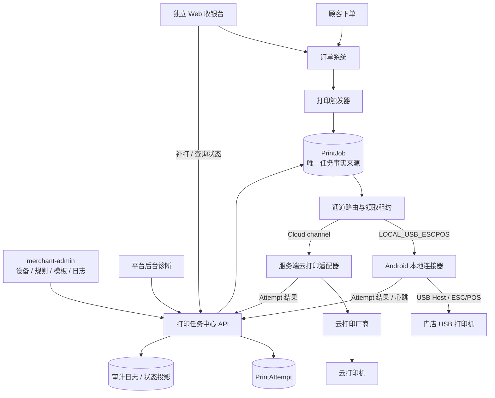
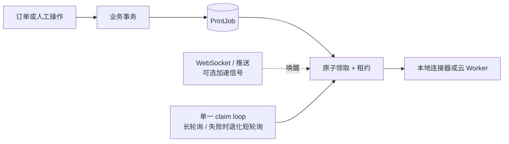

# 统一打印架构 V1

> 文档性质：建议方案，不代表功能已经实现。
> 当前事实基线见 `docs/printing-v1/00_CURRENT_STATE_AUDIT.md`。目标 Android 终端、目标打印机、USB/LAN、ESC/POS 和任何具体设备参数均未视为验证成功。
> 决策更新（2026-07-15）：本文最初以 LAN ESC/POS 为首个本地通道；该未来方向现已被 USB ESC/POS 优先取代。LAN 继续作为后续 adapter 保留，原决策摘要见 `docs/printing-v1/06_DECISIONS_AND_OPEN_QUESTIONS.md`。

## 1. 设计目标与非目标

### 1.1 目标

1. Web 收银台、merchant-admin 与打印硬件解耦。
2. 普通网页不直接连接 TCP、USB 或厂商 SDK。
3. 正式产品链路中的测试打印、首次人工打印、人工补打和自动打印都先创建持久化 `PrintJob`；阶段 D 不连接生产 API、只含合成内容的 USB 硬件 smoke 是受控验证例外，不构成第二条产品打印链路。
4. `PrintJob` 是唯一任务事实来源，网页关闭不导致任务消失。
5. 同一自动业务事件不会重复创建同一打印任务。
6. 人工补打每次都是可审计的新任务，同时保护 HTTP 重试幂等。
7. 每次物理执行保存为独立 `PrintAttempt`，失败可诊断、可控重试。
8. 本地连接器离线后，任务留在服务端；恢复后继续领取。
9. 为前台、厨房、水吧、多打印机和云打印预留扩展点，但 V1 不实现复杂分单。
10. 小票内容形成不可变快照，补打不因订单或模板后来变化而改变。

### 1.2 V1 明确边界

- 本架构设计文档本身不授权修改 schema、API 或 Web 业务；Android USB 诊断/smoke 能力由后续独立阶段按受控范围实施，不能据此提前开启生产打印。
- 首个计划实现的执行通道仅为 `LOCAL_USB_ESCPOS`，且必须先经过阶段 D 实机硬件与权限验证。
- LAN、云打印和厂商内置 SDK 继续保留通道概念，不在首个 USB 执行阶段同时实现。
- 不把现有 merchant-admin 直接扩张成最终收银界面；独立 Web 收银台按既定阶段先行。
- 不引入大而全微服务。任务中心仍位于当前 NestJS 代码库，数据库仍是当前 MySQL/Prisma：`apps/api/prisma/schema.prisma:5-8`。
- 不把 USB bulkTransfer、TCP 写入或云厂商请求提交成功表述为百分之百物理出纸成功。

## 2. 建议总体架构

任务与信号的关系：

即使信号丢失，执行器仍可从数据库任务队列补偿；WebSocket、FCM 或推送永远不是任务事实来源。

## 3. 各端职责

### 3.1 独立 Web 收银台（业务 V1 已实现，打印职责待后续）

当前独立 Web 收银台已经完成登录、订单、桌台、整桌账单和三语言业务 V1；打印仍正确显示“待接入”，尚未创建或查询 PrintJob。以下打印条目是后续目标职责，不是本轮 smoke 功能。

负责：

- 商家登录和当前 Merchant 作用域。
- 新订单、未完成订单、订单详情和桌台操作。
- 创建首次人工打印或人工补打请求；补打要求选择源任务并填写原因。
- 查看任务当前状态和最近失败摘要。
- 新订单声音提醒。

不负责：

- 直接 Socket、WebUSB 或 USB 权限。
- 保存厂商打印密钥。
- 生成最终设备命令。
- 把任务直接标记为 `SUCCEEDED`。
- 以浏览器标签页存活作为可靠性条件。

### 3.2 merchant-admin（打印中心 Beta 已实现基础管理）

当前已存在“打印中心 Beta”及 Printer、Template、Rule、Job、Terminal 的基础管理/查询代码；自动打印与执行端保持关闭，旧入口已默认隐藏。下列完整职责仍以各页面和 API 的实际实现状态为准，不能仅凭导航存在判断已经可执行打印。

负责：

- Printer 管理、启停和终端绑定。
- PrintRule 管理。
- ReceiptTemplate 及版本发布。
- PrintJob、PrintAttempt 和打印日志查询。
- MerchantTerminal 注册码生成、撤销和状态查看。
- 测试打印入口与失败诊断。

当前商家角色为 OWNER/MANAGER/STAFF；配置修改建议仅 OWNER/MANAGER，STAFF 可测试、人工打印/补打和只读查询。当前只有商家级 feature capability，没有员工级权限模型；如果未来需要更细 staff permission，必须单独设计数据模型和 Guard，不能把现有 capability 写成员工授权。现有角色证据：`apps/api/src/modules/printers/printers.controller.ts:21-56`；capability 证据：`apps/api/prisma/schema.prisma:312-359,407-425`。

### 3.3 API 打印任务中心（阶段 C 基础中心已实现，执行端未实现）

当前源码和未执行的 migration 已建立模型、管理 API、状态服务和 feature flags；生产 migration 未执行，终端 claim/lease/report、USB 通道配置和任何真实 executor 均未实现或未启用。以下同时列出已建立的核心边界和后续正式执行职责。

负责：

- 在数据库事务内创建 PrintJob。
- 生成自动任务幂等键和校验人工请求 Idempotency-Key。
- 冻结 ReceiptDocument、模板版本、channelType、renderProfile 和创建时 Printer configVersion/脱敏摘要；连接 endpoint 与 credential 不进入 Job 快照。
- 按 merchantId、Printer、Terminal 和 channelType 路由。
- 原子领取、租约、续租、超时回收和状态机校验。
- 记录每次 PrintAttempt、错误、重试和审计事件。
- 终端注册、短期认证、撤销、凭据轮换和心跳。
- 服务端云打印适配与密钥解密。
- 向 Web 提供脱敏状态；向平台提供更完整诊断。

API 不再负责连接商家 LAN。阶段 C.1 已通过默认关闭的旧链路 feature flags 停止旧 `node:net.Socket` 执行，旧代码只为受控回滚保留；事实与回滚边界见 `09_LEGACY_PRINTING_CUTOVER_V1.md`。

待处理任务执行时读取当前启用、当前绑定且经校验的 Printer endpoint/credential，因此修正 IP 或轮换密钥后可以恢复；每次 Attempt 记录实际 `configVersion`。若 renderProfile 或纸宽等内容兼容性条件改变，则不得静默用新配置执行旧 Job，应拒绝并要求生成受审计的新任务。

### 3.4 Android 本地连接器（目标职责，正式 PrintJob 连接器当前未实现）

负责：

- 以独立终端身份注册和认证。
- 获取当前终端绑定的本地打印机配置。
- 领取、续租并串行执行本地任务。
- 把不可变 ReceiptDocument 渲染为设备数据。
- 通过 Android USB Host 权限流程连接已绑定、已验证的 USB 打印机并发送受控 ESC/POS；后续 LAN adapter 复用同一任务与回报边界。
- 回报成功、失败或结果不确定；结果不确定在服务端落为 `FAILED + PRINT_OUTCOME_UNKNOWN + retryBlocked=true`。
- 保存最小本地执行账本，重启后优先对账旧任务。
- 上报 App、网络、打印机连接和渲染能力诊断。

上述是完整目标职责；阶段 E/F 只验收前台连接和执行，持久本地台账、进程/设备重启、开机恢复和必要的前台服务在阶段 G 实现。

不负责：

- 完整订单业务和订单状态机。
- 决定自动打印规则。
- 访问其他商家的任务。
- 长期复用 merchant-admin 的员工登录 Token。
- 接收网页传入的任意 Socket 字节、任意 Host 或任意命令。

当前 Android 的网络监测、DataStore、诊断、协程生命周期和安全 WebView 可复用。本轮在现有 `apps/merchant-terminal-android` 内增加了前台可见、隔离的 USB 设备诊断、权限处理、通用 USB ESC/POS adapter 和合成测试小票能力，用于构建测试 APK 后做实机 smoke test；这些代码尚未经过目标硬件验证，也不连接云桥生产 API 或 `PrintJob`。正式终端注册/认证、任务领取、租约、回报、后台恢复和生产 USB executor 仍不存在。相关实现位于 `apps/merchant-terminal-android/app/src/main/java/com/yunqiao/life/merchantterminal/diagnostics/` 与 `apps/merchant-terminal-android/app/src/main/java/com/yunqiao/life/merchantterminal/printing/`。

### 3.5 云打印适配器（目标职责，当前未实现）

- 运行在服务器端的当前 NestJS 代码库或同代码库独立 Worker 进程中，不要求立即拆微服务；即使初期与 API 同部署，也必须使用独立、可恢复的执行循环和数据库租约，不能沿用 fire-and-forget。
- 领取云通道任务，把 ReceiptDocument 转为厂商格式，调用厂商 API，并记录厂商任务 ID。
- 厂商 SN、密钥和应用密钥由服务端加密存储；不得返回网页或 Android。
- 利用厂商 idempotency/status API（若有）降低重复；厂商差异封装在 adapter 层。
- 云打印阶段开始前，不实现或假定任何厂商协议。

## 4. 打印通道

| channelType | 定位 | 阶段 C | 首次真实执行 | 备注 |
|---|---|---|---|---|
| `LOCAL_USB_ESCPOS` | Android USB Host / ESC/POS | 后端仍只预留 enum/concept；Android 已有隔离诊断与合成 smoke adapter，但未接 `PrintJob` 且未真机验证 | 阶段 D 完成 APK 实机验证后，由阶段 E 正式 Android 连接器实现 | 当前首个计划本地通道；需系统 USB 权限、受控设备匹配、插拔恢复和真机能力验证，不预写具体设备标识 |
| `LOCAL_LAN_ESCPOS` | 门店 LAN ESC/POS | 已建立枚举与受控配置校验，但没有 executor | 阶段 J 或后续独立评审阶段 | 从首发降为后续通道；IP、端口、网络与设备能力仍不得预先写死 |
| `CLOUD_FEIE` | 飞鹅云打印 | 仅预留 enum/concept | 阶段 I 选定厂商后 | 厂商凭据只在服务端 |
| `CLOUD_XINYE` | 芯烨云打印 | 仅预留 enum/concept | 阶段 I 选定厂商后 | 供应商 API 待后续调研 |
| `CLOUD_GPRINTER` | 佳博云打印 | 仅预留 enum/concept | 阶段 I 选定厂商后 | 供应商 API 待后续调研 |
| `BUILTIN_SUNMI` | 商米内置打印机 SDK | 仅预留 enum/concept | 阶段 J | 设备 SDK 与签名/系统版本需单独验证 |
| `BUILTIN_IMIN` | iMin 内置打印机 SDK | 仅预留 enum/concept | 阶段 J | 同上 |

预留枚举不代表依赖已接入。未实现通道创建 Printer 时返回 `PRINT_CHANNEL_NOT_SUPPORTED`，不得落入通用 Socket 分支。

## 5. 任务分发机制

### 5.1 方案比较

| 方案 | 优点 | 缺点 | V1 判断 |
|---|---|---|---|
| 固定间隔轮询 | 简单；断线自然恢复；不依赖常连接 | 空轮询、延迟、终端增多后请求量增加 | 作为长轮询不可用时的退化模式，不与长轮询并发 claim |
| 长轮询 | 与现有 HTTP/NestJS 易集成；无任务时请求可挂起 20–25 秒；断线重连简单 | 需要限制并发、超时和代理设置 | **V1 推荐的主要领取方式** |
| WebSocket | 低延迟、适合状态推送 | 连接维护、代理和 Android 后台恢复复杂；消息不是可靠队列 | 后续仅做唤醒/加速，不能替代 DB |
| FCM/系统推送 | App 被系统回收时可唤醒或提醒 | 依赖 Google/系统策略；到达不保证；数据任务不可只放推送 | 阶段 G 评估为唤醒信号 |
| 数据库任务队列 | 持久、可查询、事务和租约可控 | 需正确索引、领取并发和清理策略 | **必须使用，是唯一事实来源** |

### 5.2 V1 推荐

1. PrintJob 持久化于当前 MySQL。
2. Android 使用单一 claim loop，对 `/api/v1/terminal/print-jobs/claim` 做 20–25 秒有界长轮询；同一终端同一时刻最多一个 claim 请求。
3. 长轮询失败、代理不支持或进入退避时，才退化为每 10–15 秒一次短轮询；两种模式不并发领取。服务端先返回该终端现有未终结租约，再决定是否领取新任务，并保证一台终端最多一个 `CLAIMED/PRINTING` Job。
4. API 通过事务 + 条件 `updateMany` compare-and-set 原子领取；当前项目已有 MySQL `FOR UPDATE` 先例：`apps/api/src/modules/table-sessions/table-sessions.service.ts:209-273`。
5. V1 不要求 Redis/Bull。若后续任务量证明需要，可引入 worker 队列，但 MySQL PrintJob 仍是事实源。
6. 多终端只能领取与其 merchantId、绑定关系、channelType 和 capability 匹配的任务。
7. `CLAIMED` 在尚未开始写设备前租约过期可以安全回到可领取状态；`PRINTING` 后租约过期属于结果不确定，不能盲目自动重打。

当前数据库是 MySQL：`apps/api/prisma/schema.prisma:5-8`。不得把 PostgreSQL `SKIP LOCKED` 当成现状。若未来选择 MySQL 8 `FOR UPDATE SKIP LOCKED`，必须先验证生产版本、Prisma transaction 行为和回归测试；V1 优先使用可测试的 CAS 领取。

## 6. Receipt 内容生成

### 6.1 方案比较

| 方案 | 优点 | 缺点 |
|---|---|---|
| A. 服务器生成 ESC/POS 字节 | 首次与补打字节可完全一致；连接器简单 | 不同机型编码/图像指令差异大；云厂商格式不通用；服务器需知道设备能力 |
| B. 服务器生成整张图片 | 中文/越南语和布局稳定；连接器只打印图像 | 长票内存与流量较大；58/80mm、切图和云厂商限制仍需适配；可访问性差 |
| C. 服务器生成结构化 ReceiptDocument，连接器渲染 | 跨 LAN/USB/云通道；模板和业务内容集中；适配器可按设备能力渲染 | 不同 renderer 版本可能产生视觉差异；连接器复杂度更高 |
| D. 混合模式 | 结构化快照为事实源，适配器按能力输出位图、文本或厂商格式 | 需要明确 schema/version/hash 和 renderer 兼容策略 |

### 6.2 V1 推荐：D，结构化快照为核心

API 在创建 PrintJob 时生成并冻结 `ReceiptDocumentV1`，包含：

- document schema 版本。
- receiptType、语言、纸宽和目标用途。
- 已解析的商家、订单、桌台、金额，以及该 receiptType/template 实际需要的最少顾客字段；厨房票默认不包含电话或地址。
- 文本块、行项目、分割线、二维码内容和对齐样式。图片/Logo 必须内嵌在受限大小内，或复制到以 contentHash 标识、生命周期不短于快照保留期的不可变对象；普通可覆盖 URL 不算快照。
- templateVersionId、ruleVersion、contentHash 和创建时间。
- 隐私分级，供日志列表脱敏。

`PrintJob.receiptSnapshot` 必须是不可变快照，不能只保存 orderId。原因：

1. 商品名、价格、备注、商家名称、桌号或模板以后会改变。
2. 订单或打印机可能被删除/停用，历史补打仍需可解释。
3. 多次 Attempt 必须处理相同内容，才能区分设备问题和内容变化。
4. 人工补打永远创建新 PrintJob，并用 `reprintOfJobId` 指向原任务；“按原单补打”复制原 receiptSnapshot，“按当前订单重新生成”则生成并冻结新快照。任何方式都不得重开原 Job/Attempt，同一 HTTP 重试由 Idempotency-Key 合并。
5. 只有已发布且不可变的 ReceiptTemplateVersion 可以生成正式 Job；草稿和规则后来变化不影响历史任务。

### 6.3 多语言与设备渲染

- 中文、越南语重音和英文不能假设打印机支持 UTF-8。现有编码枚举实际全输出 UTF-8：`apps/api/src/modules/printers/printers.service.ts:444-451`。
- V1 设计首选 Android 使用内置、版本固定且许可合规的字体，把文本分段渲染为单色 Bitmap，再转 ESC/POS raster 命令；只有阶段 D 验证 raster 指令、点宽、缓存和吞吐成功后才能确认。若失败，改用经真机验证的字符集或混合 profile。
- 58mm/80mm 使用明确像素宽度的 render profile，不仅依赖字符数。
- 长票分块渲染，避免整张超长 Bitmap 占用过多内存。
- QR、Logo 和图片在 ReceiptDocument 中保存语义与不可变内容 hash；适配器可使用设备原生命令或位图，Attempt 记录 fontAssetVersion、rendererVersion、renderProfile 和实际 Printer configVersion。
- 云 adapter 从同一 ReceiptDocument 转厂商模板/markup，不把厂商格式反向污染领域文档。
- ReceiptDocument 使用明确的 canonical JSON 规则（阶段 C 建议 RFC 8785/JCS 或服务端直接下发 canonical UTF-8 bytes）计算 SHA-256；NestJS/Kotlin 必须对同一字节序列校验，hash 不含可变执行字段。
- 结构化快照保证业务语义、模板版本和内容 hash 一致，不单独保证 renderer/font 升级后的像素完全相同。为减少差异，可缓存首次成功的渲染 artifact/hash；无法复用旧 renderer 时必须提示差异，不能声称“原样”像素复现。

## 7. 安全与权限边界

1. 所有 Printer、Terminal、Rule、Job、Attempt 和 Template 查询必须带 merchantId；当前没有 storeId。
2. 管理配置需要 MerchantRoleGuard，并在服务端检查商家级 feature capability，不能只依赖前端隐藏；当前不存在员工级 capability。
3. 终端注册使用一次性、短有效期绑定码；Android Keystore 生成高熵 secret，经 TLS 提交，服务器长期只存 hash。绑定码明文仅可用短 TTL 加密 escrow 支持同一创建请求重放，消费/过期即销毁。
4. 终端 secret 只交换短期 Terminal JWT；JWT 包含 terminalId、merchantId、tokenVersion，但 claim/lease/report 等关键请求仍读取数据库中的 Terminal status、tokenVersion、当前绑定与能力。撤销或轮换靠这些服务端检查立即阻止操作，短 TTL 只是第二层，不能只信 JWT 内 capability。
5. 终端只能领取绑定到自身或允许自身执行的任务；状态回报必须同时匹配 jobId、merchantId、terminalId、leaseVersion。
6. 普通网页不能调用 `succeed/fail/lease` 端点，不能伪造打印成功。
7. 云厂商 credential 用服务端主密钥信封加密，保存 cipherText/keyVersion；普通 API 永不返回明文。
8. USB-first 只允许 Android 系统授权后访问服务端绑定且本机验证匹配的打印设备；网页不能传设备标识、接口、端点或任意字节，连接器不得枚举后自动信任所有 USB 设备。具体匹配规则必须由阶段 D 实机证据形成，不能在设计文档写死。
9. 本地 LAN config 可返回给绑定终端，但不返回给无设备管理权限的普通页面；服务器不主动连接该地址。后续 LAN adapter 默认只允许绑定 Printer 配置中的 RFC1918 literal IPv4 和受控端口，并在服务端/Android 双重阻止 loopback、link-local、multicast、unspecified、broadcast 和公网地址；ReceiptDocument 不能携带 endpoint。若真实现场使用其他范围，必须做显式审计例外。
10. Receipt 可能含姓名、电话、地址。列表接口默认脱敏，详情按角色授权，日志不得打印完整 receipt、Token 或 credential。
11. 人工补打、任务取消、规则修改、终端撤销和 credential 轮换全部写审计日志。
12. 平台后台可看 requestId、错误码和适配器诊断；商家只看可行动的脱敏错误，不展示内部堆栈或厂商密钥。

## 8. 与当前实现的迁移边界

建议使用“新任务中心为唯一新事实源、旧表只读保留”的切换方式：

1. 盘点 `PrinterSetting` 与 `PrintLog` 实际数据量和有效性。
2. 建立新 canonical `Printer`、`PrintJob`、`PrintAttempt` 等表；把旧 PrinterSetting 映射为 `LOCAL_LAN_ESCPOS` 候选配置，但标记 `UNVERIFIED`。
3. 一次性 migration 后，新 Job 只引用新 Printer ID；保留 legacy ID 映射。新 API/UI 只写新表，旧 PrintLog 仅通过查询投影只读展示，不在运行时双读择一。
4. 通过单一 feature flag 切换任务创建；切换事务中停止旧 `printOrder()` 调用，绝不同时执行。
5. 旧 PrintLog 保留为历史只读来源，不伪装成 Attempt；需要时在 UI 标注“旧版日志”。
6. 回滚时关闭新任务触发和领取，不默认恢复未经验证且有 SSRF 风险的服务器直连 LAN。

具体模型和切换索引见 `02_PRINTING_DATA_MODEL_V1.md`，状态可靠性见 `04_PRINTING_STATE_MACHINE_V1.md`。
