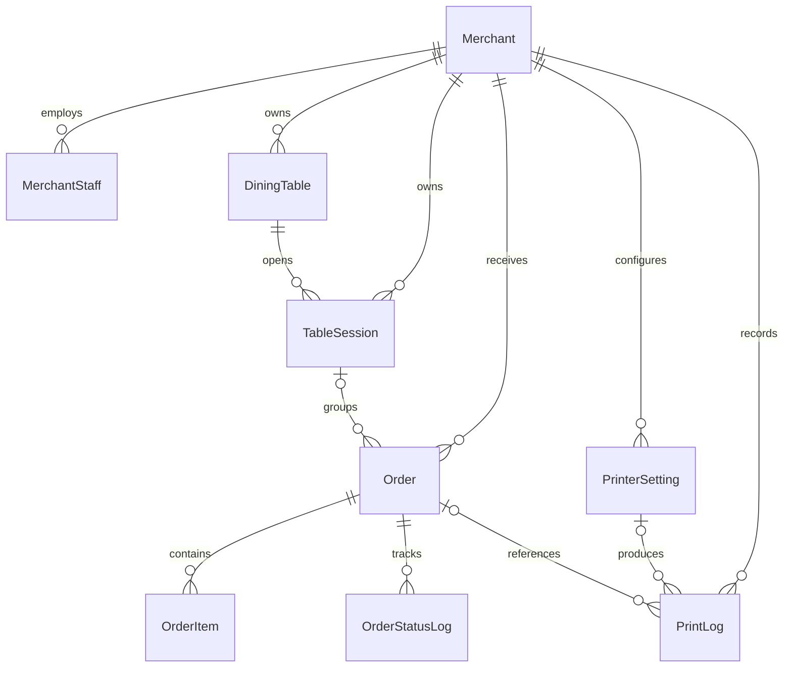
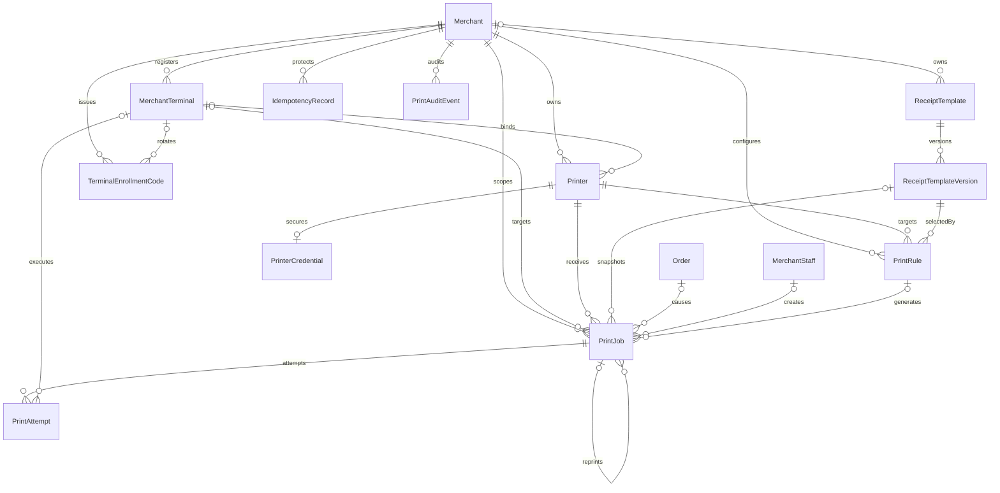

# 统一打印架构 V1：数据模型设计

> 文档性质：建议草案。本文中的 Prisma 代码块不可直接执行，本轮没有修改 `apps/api/prisma/schema.prisma`，也没有创建 migration。

## 1. 当前相关模型

当前数据库是 MySQL：`apps/api/prisma/schema.prisma:5-8`。



事实摘要：

- 当前无 Store/Branch，Merchant 是唯一经营作用域：`apps/api/prisma/schema.prisma:191-261`。
- `PrinterSetting` 是 LAN/IP 专用结构；`PrintLog` 是一次即时执行/一次 `printOrder` 调用的薄日志。人工与测试请求等待调用，自动链路则 fire-and-forget：`apps/api/prisma/schema.prisma:707-750`；`apps/api/src/modules/orders/orders.service.ts:128-146`。
- 当前不存在 Printer、MerchantTerminal、PrintRule、PrintJob、PrintAttempt、ReceiptTemplate 或 ReceiptTemplateVersion。
- Order 的 `[userId,idempotencyKey]` 只保护下单：`apps/api/prisma/schema.prisma:552,588`。
- TableSession 聚合同桌多笔独立订单：`apps/api/prisma/schema.prisma:490-509,549-592`。

## 2. 建议模型总览

| 模型 | V1 是否建议新增 | 作用 | 备注 |
|---|---:|---|---|
| `Printer` | 是 | 通道无关的逻辑/物理打印机 | 新 canonical 表；旧 PrinterSetting 作为迁移输入 |
| `PrinterCredential` | 是，但仅云通道有记录 | 服务端加密保存厂商 credential | 本地 LAN 不需要 credential 行 |
| `MerchantTerminal` | 是 | Android 本地连接器身份、状态和能力 | 独立于 MerchantStaff Token |
| `PrintRule` | 是 | 最小自动打印映射 | V1 不实现表达式/分类规则引擎 |
| `ReceiptTemplate` | 是 | 模板逻辑身份和归属 | 系统模板或商家模板 |
| `ReceiptTemplateVersion` | 是 | 已发布模板的不可变版本 | 版本化是历史补打一致性的必要拆分 |
| `PrintJob` | 是 | 唯一任务事实来源 | 一条 Job 对应一次物理出纸意图 |
| `PrintAttempt` | 是 | 每次执行尝试 | 不得只保留 Job 最终结果 |
| `TerminalEnrollmentCode` | 是 | 一次性绑定/轮换码状态 | hash 用于验证；短 TTL 加密 escrow 只为同请求响应重放，消费/过期即销毁 |
| `IdempotencyRecord` | 是 | 跨进程重放有副作用 API 的原响应/资源引用 | 解决同 key 不同 body、批量 Job 和注册码并发 |
| `PrintAuditEvent` | 是，或落入等价通用 AuditLog | 记录配置、补打、取消、发布、终端和凭据操作 | 当前 HTTP request logger 不是业务审计 |
| `PrinterCapability` | 暂不拆表 | 先存受 schema 校验的 JSON | 稳定后再规范化 |

## 3. 推荐关系图



## 4. Printer

### 4.1 建议字段

| 字段 | 建议 | 说明 |
|---|---|---|
| `id` | BigInt PK | 延续当前主键风格 |
| `merchantId` | 必填 FK | V1 唯一租户/门店作用域；当前无 storeId |
| `terminalId` | 可空 FK | 本地通道绑定的执行终端；云通道为空 |
| `name` | 必填 | 商家可识别名称 |
| `channelType` | 必填 enum | LOCAL_LAN_ESCPOS 等 |
| `usageType` | 必填 enum | 可映射旧 FRONT_DESK/KITCHEN/BAR/GENERAL |
| `paperWidth` | 必填 enum | WIDTH_58 / WIDTH_80 |
| `enabled` | Boolean | 是否允许新任务路由，与在线状态分开 |
| `status` | enum | UNVERIFIED / UNKNOWN / ONLINE / OFFLINE / ERROR；只表达连接/验证状态，启停只看 enabled |
| `configVersion` | 递增整数 | endpoint、纸宽或 render profile 等配置变化时递增；Attempt 记录实际版本 |
| `connectionConfig` | Json | 非敏感、按 channelType 校验的连接配置 |
| `capabilities` | Json | 字符集、raster、cut、二维码等已验证能力 |
| `lastSeenAt` | 可空 | 最近由终端或云 adapter 验证的时间 |
| `createdAt/updatedAt` | 必填 | 审计时间 |

本地 LAN `connectionConfig` 示例仅表示结构，不表示硬件已确认：

```json
{
  "schemaVersion": 1,
  "host": "192.168.x.x",
  "port": 12345,
  "connectTimeoutMs": 5000,
  "renderProfile": "ESCPOS_RASTER_V1"
}
```

示例中的 `12345` 只是合法范围内的占位端口，不代表真实打印端口。真实 IP 和端口必须在硬件阶段填写；文档不把 9100 当已确认值。API 只保存并下发给已绑定终端，服务器不得用该配置发起 TCP。

### 4.2 通道字段存储方案比较

| 方案 | 优点 | 缺点 | 建议 |
|---|---|---|---|
| 所有通道字段直接放 Printer nullable 列 | 查询简单 | nullable 列快速膨胀；本地 IP 与云密钥混杂 | 不采用 |
| 每个通道一张子表 | 强类型、约束好 | V1 通道多为预留，每新增通道要表和 join | 成熟后按需要拆分 |
| 主表 + JSON config | V1 迁移简单；避免大量 nullable 列 | 数据库不能完整约束 JSON 内容 | **V1 推荐**，NestJS DTO 按 channelType 严格校验 |
| 主表 + credential 表 | 密钥生命周期和权限独立 | 多一张表 | **与 JSON config 组合采用** |

建议：非敏感通道配置用 `connectionConfig Json`；云厂商密钥只进 `PrinterCredential`。每种 channelType 有独立 DTO、allowlist 和 schemaVersion，不能接受任意 JSON 后透传命令。

### 4.3 旧数据迁移

- `PrinterSetting.type=NETWORK` 映射为 `LOCAL_LAN_ESCPOS` 候选。
- `usageType/paperWidth/language/copies` 可作为迁移输入；`copies` 应迁移到 PrintRule。旧 `language` 用来选择/生成相应语言的 ReceiptTemplate/ReceiptDocument locale，不进入 Printer connectionConfig；无法无歧义映射时规则保持 disabled 等待确认。
- `ipAddress/port/encoding` 进入 connectionConfig，但状态设 `UNVERIFIED`。
- `autoPrintEnabled` 不能继续作为 Printer 权威字段，应生成待确认 PrintRule 或默认关闭。
- `status` 不能直接迁移为实时在线状态。
- 旧记录建议通过 `legacyPrinterSettingId @unique` 保留追溯，验证后再移除兼容列。

## 5. MerchantTerminal

### 5.1 建议字段

| 字段 | 说明 |
|---|---|
| `id` | BigInt PK |
| `merchantId` | 当前唯一作用域；不得虚构 storeId |
| `name` | 如“前台 D10-01” |
| `platform` | ANDROID；预留 SERVER_WORKER 但不要混为实体终端 |
| `deviceIdentifierHash` | 设备标识的 hash；不保存可滥用的原始硬件标识 |
| `deviceIdentifierSuffix` | 脱敏展示后几位，用于人工识别 |
| `appVersion` / `buildRevision` | 诊断和兼容判断 |
| `status` | PENDING / ACTIVE / DISABLED / REVOKED |
| `tokenHash` | 高熵终端 secret 的 hash；绝不存明文 |
| `tokenVersion` | 轮换/撤销时令旧 JWT 失效 |
| `lastSeenAt` | 最近成功心跳 |
| `lastHeartbeatSeq` | 最近已接受的单调心跳序号，防重复/乱序诊断写入 |
| `revokedAt` | 撤销时间 |
| `capabilities` | LAN、raster、纸宽、SDK 等终端能力 JSON |
| `createdAt/updatedAt` | 时间 |

本地 Printer 通过 `Printer.terminalId` 绑定一个主要执行终端。V1 建议一台本地 Printer 同时只绑定一个 ACTIVE Terminal，避免多终端竞争同一物理设备；后续高可用切换需另行设计。

`deviceIdentifierHash` 采用 `[merchantId,deviceIdentifierHash]` 唯一，而不是全局唯一：重装时优先复用同商家旧行；跨商家绑定前必须人工撤销旧商家的 ACTIVE Terminal，并创建新的商家作用域记录，不能移动旧行破坏历史隔离。设备 hash 不是硬件身份密码，不能单独授权。

### 5.2 终端认证

1. OWNER/MANAGER 在 merchant-admin 生成一次性、短时绑定码；验证只用 codeHash，同一 Idempotency-Key 的响应重放使用短 TTL 信封加密 escrow，消费/过期后销毁。
2. Android 先在 Keystore 生成高熵 terminal secret，再通过 TLS 提交绑定码、secret、设备 hash 和能力；API 只返回 terminalId/tokenVersion，不返回服务器生成的 secret。
3. Android 始终持有自己生成的 secret，因此 enroll/rotate 提交成功但响应丢失时不会丢失新凭据。
4. 服务器只保存 `tokenHash`，终端用 secret 换短期 Terminal JWT。
5. JWT 至少包含 `accountType=MERCHANT_TERMINAL`、terminalId、merchantId、tokenVersion；capabilities 只能作提示，授权以数据库当前 Terminal/Printer 绑定为准。
6. claim、lease、report 等关键请求读取 Terminal 当前 status/tokenVersion；撤销、禁用或成功轮换后拒绝旧凭据。

不能长期复用当前 MerchantStaff JWT。当前 JWT 直接携带 staff role 和 merchantId，且没有 refresh/revoke：`apps/api/src/modules/auth/auth.service.ts:97-150`；`apps/api/src/common/guards/jwt-auth.guard.ts:15-28`。

## 6. PrintRule

V1 采用配置表，不建立通用表达式引擎。

| 字段 | 说明 |
|---|---|
| `merchantId` | 规则所属商家 |
| `name` | 可识别名称 |
| `orderType` | DINE_IN/PICKUP/DELIVERY；可空表示 V1 明确允许的全类型规则 |
| `triggerEvent` | 如 ORDER_ACCEPTED；不是任意字符串脚本 |
| `receiptType` | TEST、ORDER_RECEIPT、KITCHEN_TICKET 等受控枚举 |
| `printerId` | 目标 Printer |
| `templateVersionId` | 已发布模板版本 |
| `copies` | 1..N；创建时展开为每份一个 PrintJob |
| `autoPrint` | 是否自动创建任务；人工打印不依赖它 |
| `enabled` | 是否参与匹配 |
| `priority` | 小整数；V1 只做顺序，不做复杂调度 |
| `version` | 每次修改递增并写入 Job 快照；自动 dedupe 以不可变事件为根，不因旧事件用新规则重算而双打 |

V1 不做：菜品分类表达式、数量拆分、按档口、时间段、条件脚本或多层规则继承。后续分单可增加受控 `filterConfig` schema，但不能执行任意代码。

## 7. PrintJob

### 7.1 核心字段

| 字段 | 说明 |
|---|---|
| `id/jobNo` | 内部 BigInt PK + 对外 API 使用不可猜 `jobNo` |
| `merchantId` | 强制作用域 |
| `orderId` | 可空；测试打印无订单 |
| `printerId` | 目标打印机 |
| `targetTerminalId` | 本地通道目标终端；云通道为空 |
| `ruleId/ruleVersion` | 自动任务来源；人工/测试可空 |
| `templateVersionId` | 使用的模板版本 |
| `channelType` | 创建时冻结，避免 Printer 后续修改改变旧任务 |
| `receiptType` | 小票类型 |
| `triggerEvent` | 触发事件 |
| `source` | AUTO / MANUAL_PRINT / MANUAL_REPRINT / TEST；首次人工打印与补打分开，人工重试不改变原 Job source |
| `status` | PENDING/CLAIMED/PRINTING/SUCCEEDED/FAILED/RETRY_WAIT/CANCELLED |
| `priority` | 领取排序 |
| `dedupeKey` | 自动任务或 HTTP 幂等键 |
| `requestGroupId` | 多打印机/多份任务的关联 ID |
| `triggerEventKey` | 自动任务所依据的不可变事件标识；状态事件可引用 OrderStatusLog.id |
| `copyIndex/copyCount` | 每 Job 只打印一份，便于判断部分失败 |
| `reprintOfJobId` | 人工补打所复制的原 Job，可空 |
| `receiptSnapshot` | 逻辑上的不可变 ReceiptDocument；应用层 canonical JSON 后信封加密保存，列表另用脱敏 summary |
| `contentHash` | 快照 hash，诊断和防篡改 |
| `availableAt` | 可领取时间/退避截止 |
| `claimedAt` | 最近领取时间 |
| `leaseOwner` | terminalId 或 server worker instance |
| `leaseVersion` | 防止旧执行器回报覆盖新租约 |
| `leaseExpiresAt` | 租约过期时间 |
| `attemptCount/maxAttempts` | 已尝试和上限 |
| `claimCount/consecutiveClaimTimeouts` | 分发次数与连续未 start 超时；不计作物理 Attempt，用于阻止坏终端无限领取循环 |
| `printerConfigVersion/renderProfile` | 冻结兼容性条件和审计摘要；endpoint/credential 不进 Job |
| `retryBlocked` | 结果未知等情况禁止自动/普通人工重试 |
| `createdByType/createdByStaffId` | SYSTEM 或实际商家员工 |
| `reprintReason` | 人工补打必填 |
| `createdAt/updatedAt/completedAt` | 时间 |
| `lastErrorCode/lastErrorMessage` | 最后失败摘要；对外展示需脱敏 |

### 7.2 自动打印与人工补打幂等

自动任务建议以事件发生时冻结的匹配结果构造唯一键：

```text
auto:v1:<merchantId>:<triggerEventKey>:<ruleId>:<printerId>:<receiptType>:<copyIndex>
```

数据库使用 `@@unique([merchantId, dedupeKey])`。`ruleVersion` 保存在 Job 快照供审计，但不允许规则升级后对旧事件重新按当前规则求值；事件处理必须冻结当时匹配的 ruleId/version。当前 `OrderStatusLog.id` 可作为订单状态事件的稳定来源证据，但它不是可靠 outbox：`apps/api/prisma/schema.prisma:615-635`。阶段 G 若不能在业务事务内直接创建 Job，应增加可靠 trigger/outbox 记录。

人工补打：

- 每次有意识的补打生成新 requestGroupId 和新任务，不能使用首次自动打印 dedupeKey。
- 同一次 HTTP 请求必须带 `Idempotency-Key`。服务端先原子写入 `IdempotencyRecord(scope,key,requestHash)`，在同一事务创建 requestGroup 和每台 Printer/每份各一条 Job，再保存资源引用；相同 key 不同 body 返回 409，响应丢失可重放相同结果。
- 用户再次点击补打时客户端生成新的 Idempotency-Key，因此可合法生成新任务。
- 必须保存 staffId、原因和 `reprintOfJobId`（若按原票补打）。

### 7.3 为什么必须保存快照

PrintJob 不能只引用当前 Order。订单、商家名称、模板、语言、商品或桌台信息会变化；仅引用实时数据会让重打与首次不一致。建议同时保存 templateVersionId 和完全解析后的 receiptSnapshot；在快照保留期内，即使模板停用，历史任务仍可复现。Printer 的 IP/credential 不属于票据内容：Job 只冻结 channelType、renderProfile 和创建时 configVersion，执行时读取当前有效 endpoint，并在 Attempt 记录实际 configVersion，使授权修复 IP/轮换密钥后待处理任务可以恢复。

### 7.4 租约恢复

- CLAIMED 且尚无 Attempt/start 证据：租约过期回到 `PENDING`，设置 `availableAt` 退避并递增 `consecutiveClaimTimeouts`；连续 3 次领取超时后进入 `FAILED/EXECUTOR_UNSTABLE`。该计数不是物理打印 Attempt。
- PRINTING：租约过期意味着可能已经写入设备，Job 进入 `FAILED`、记录 `PRINT_OUTCOME_UNKNOWN` 并设 `retryBlocked=true`，等待原终端对账或人工处理，不立即自动重打。
- leaseVersion 每次重新领取递增；回报必须匹配当前 leaseVersion。

## 8. PrintAttempt

每次真实执行必须单独记录：

| 字段 | 说明 |
|---|---|
| `jobId` | 所属任务 |
| `attemptNo` | Job 内递增；`@@unique([jobId,attemptNo])` |
| `executorType` | TERMINAL / CLOUD_WORKER |
| `terminalId` | 本地执行终端，可空 |
| `adapter` | 如 ANDROID_LAN_ESCPOS_RASTER_V1 |
| `leaseVersion` | 与领取租约关联 |
| `startedAt/finishedAt` | 服务器记录的实际时间；设备自报时间另存 deviceFinishedAt |
| `result` | SUCCEEDED / FAILED / OUTCOME_UNKNOWN |
| `errorCode/errorMessage` | 结构化错误和脱敏说明 |
| `printerResponse` | 有限、截断、脱敏的设备/厂商响应 |
| `appVersion/adapterVersion` | 诊断版本 |
| `printerConfigVersion/renderProfile/rendererVersion/fontAssetVersion` | 本次实际执行版本 |
| `networkInfo` | Wi-Fi/Ethernet、连接时间等非敏感摘要 |
| `bytesWritten/contentHash` | 诊断，不代表纸张成功 |

`PrintJob` 保存最终汇总状态；`PrintAttempt` 保存每次事实。Job 锁定、Attempt 创建和 `attemptCount` 递增必须在同一事务完成，`@@unique([jobId,attemptNo])` 是竞争保护；漂移时以 Attempt 行核对修复。人工重试明确未出纸的失败 Job 可以增加 Attempt，并在 Attempt/PrintAuditEvent 记录 initiator/reason；人工补打已成功或结果不确定的票必须创建新 Job。

## 9. ReceiptTemplate 与版本

### 9.1 ReceiptTemplate

- `merchantId?`：空表示平台系统模板，非空表示商家模板。
- `name`、`receiptType`、`paperWidth`、`language`、`enabled`。
- 当前发布版本通过受控发布事务维护“每模板至多一个 PUBLISHED”；V1 草案不增加循环 `currentVersionId` FK。
- 不存可执行 JS/HTML。

### 9.2 ReceiptTemplateVersion

- `templateId + version` 唯一。
- `schemaVersion`、`definition Json`、`contentHash`。
- `status=DRAFT/PUBLISHED/RETIRED`。
- `publishedAt/publishedByStaffId`。
- `publishedByType` 区分 MERCHANT_STAFF 与 SYSTEM_DEPLOYMENT；V1 系统模板只随受审查的 seed/部署版本发布，不提供 PlatformAdmin 在线编辑，因此没有伪造 merchantId 的平台发布审计问题。
- PUBLISHED 后不可原地修改；修改创建新版本。
- PrintJob 同时引用版本并保存 resolved snapshot。

模板 definition 只允许受控组件：文本、字段、行项目、分隔线、Logo、二维码、对齐、字号/强调和条件显示。V1 不允许表达式代码或任意网络 URL。

## 10. 支撑幂等、注册和审计的最小模型

### 10.1 TerminalEnrollmentCode

- 验证只使用一次性 code 的 hash；包含 `merchantId`、规范化 terminalName、可选 `terminalId`、`purpose=ENROLL/ROTATE`、`expiresAt`、`usedAt`、失败次数。
- 为处理“服务端已创建 code、响应却丢失”，可在 code 有效期内保存一次性响应的信封加密 escrow，仅允许同一 Idempotency-Key 重放；消费/过期后立即销毁 escrow。普通日志、数据库查询和 API 都不回显该密文内容。
- Android 在 Keystore 生成 terminal secret；ENROLL 创建/激活 Terminal 并只保存该 secret 的 hash。ROTATE 由同一 `/terminal/enroll` 消费，保留 terminalId，原子写入设备提交的新 tokenHash/tokenVersion 后才让旧 secret 失效。
- code 短时有效、单次消费，并按 IP/code/terminal 维度限流；设备 identifier 只是绑定提示，不是不可伪造身份。

### 10.2 IdempotencyRecord

- 用于补打 requestGroup、测试 Job、注册码生成和其他有副作用的创建操作；配置更新优先使用 `expectedVersion`，无需对所有 PATCH 强制此表。
- 唯一作用域为 `[merchantId,scopeType,scopeId,idempotencyKey]`，保存 `requestHash/state/resourceRef/responseStatus/expiresAt`。
- 首个请求原子占位；同 key+同 hash 在处理中返回可重试状态、完成后重放相同资源引用；同 key+不同 hash 返回 409。
- `scopeId` 来自认证的 merchant/staff/terminal，而非请求体；TTL 到期清理不删除所创建业务资源。

### 10.3 PrintAuditEvent

- 记录 Printer/Rule/Template/Terminal/credential 创建和变更，以及测试、补打、人工重试、取消、发布、绑定、撤销和轮换。
- 最小字段：merchantId、actor type/id、action、resource type/id、requestId、reason、脱敏 before/after summary、客户端摘要和服务器时间。
- 当前 request logger 只记录 HTTP method/path/status/IP，不是业务审计：`apps/api/src/common/middleware/request-logger.middleware.ts:9-23`。
- 若项目先建立等价通用 AuditLog，可以复用并省略此专用表，但字段和保留要求不能消失。

## 11. Prisma 草案

以下是方向性摘录，关系回写、索引长度和 migration 细节须在阶段 C 结合真实数据验证：

```prisma
enum PrinterChannelType {
  LOCAL_LAN_ESCPOS
  LOCAL_USB_ESCPOS
  CLOUD_FEIE
  CLOUD_XINYE
  CLOUD_GPRINTER
  BUILTIN_SUNMI
  BUILTIN_IMIN
}

enum PrinterLifecycleStatus {
  UNVERIFIED
  UNKNOWN
  ONLINE
  OFFLINE
  ERROR
}

enum TerminalStatus {
  PENDING
  ACTIVE
  DISABLED
  REVOKED
}

enum PrintJobStatus {
  PENDING
  CLAIMED
  PRINTING
  SUCCEEDED
  FAILED
  RETRY_WAIT
  CANCELLED
}

enum PrintJobSource {
  AUTO
  MANUAL_PRINT
  MANUAL_REPRINT
  TEST
}

enum PrintAttemptResult {
  SUCCEEDED
  FAILED
  OUTCOME_UNKNOWN
}

model Printer {
  id                     BigInt                 @id @default(autoincrement())
  merchantId             BigInt                 @map("merchant_id")
  terminalId             BigInt?                @map("terminal_id")
  legacyPrinterSettingId BigInt?                @unique @map("legacy_printer_setting_id")
  name                   String                 @db.VarChar(80)
  channelType            PrinterChannelType     @map("channel_type")
  usageType              PrinterUsageType       @default(GENERAL) @map("usage_type")
  paperWidth             PaperWidth             @map("paper_width")
  enabled                Boolean                @default(false)
  status                 PrinterLifecycleStatus @default(UNVERIFIED)
  configVersion          Int                    @default(1) @map("config_version")
  connectionConfig       Json                   @map("connection_config")
  capabilities           Json?                  @map("capabilities")
  lastSeenAt             DateTime?              @map("last_seen_at")
  createdAt              DateTime               @default(now()) @map("created_at")
  updatedAt              DateTime               @updatedAt @map("updated_at")

  merchant   Merchant          @relation(fields: [merchantId], references: [id], onDelete: Restrict)
  terminal   MerchantTerminal? @relation(fields: [terminalId], references: [id], onDelete: SetNull)
  credential PrinterCredential?
  rules      PrintRule[]
  jobs       PrintJob[]

  @@index([merchantId, enabled, channelType])
  @@index([terminalId, enabled])
  @@map("printers")
}

model PrinterCredential {
  id             BigInt   @id @default(autoincrement())
  printerId      BigInt   @unique @map("printer_id")
  encryptedValue Bytes    @map("encrypted_value")
  keyVersion     Int      @map("key_version")
  displayHint    String?  @map("display_hint") @db.VarChar(32)
  rotatedAt      DateTime? @map("rotated_at")
  createdAt      DateTime @default(now()) @map("created_at")
  updatedAt      DateTime @updatedAt @map("updated_at")

  printer Printer @relation(fields: [printerId], references: [id], onDelete: Cascade)

  @@map("printer_credentials")
}

model MerchantTerminal {
  id                     BigInt         @id @default(autoincrement())
  merchantId             BigInt         @map("merchant_id")
  name                   String         @db.VarChar(80)
  platform               String         @default("ANDROID") @db.VarChar(32)
  deviceIdentifierHash   String         @map("device_identifier_hash") @db.VarChar(128)
  deviceIdentifierSuffix String?        @map("device_identifier_suffix") @db.VarChar(16)
  appVersion             String?        @map("app_version") @db.VarChar(64)
  buildRevision          String?        @map("build_revision") @db.VarChar(64)
  status                 TerminalStatus @default(PENDING)
  tokenHash              String         @map("token_hash") @db.VarChar(255)
  tokenVersion           Int            @default(1) @map("token_version")
  capabilities           Json?          @map("capabilities")
  lastSeenAt             DateTime?      @map("last_seen_at")
  lastHeartbeatSeq       BigInt         @default(0) @map("last_heartbeat_seq")
  revokedAt              DateTime?      @map("revoked_at")
  createdAt              DateTime       @default(now()) @map("created_at")
  updatedAt              DateTime       @updatedAt @map("updated_at")

  merchant Merchant       @relation(fields: [merchantId], references: [id], onDelete: Restrict)
  printers Printer[]
  attempts PrintAttempt[]
  targetJobs PrintJob[] @relation("TargetTerminalJobs")
  enrollmentCodes TerminalEnrollmentCode[]

  @@index([merchantId, status])
  @@index([merchantId, lastSeenAt])
  @@unique([merchantId, deviceIdentifierHash])
  @@map("merchant_terminals")
}

model PrintRule {
  id                BigInt       @id @default(autoincrement())
  merchantId        BigInt       @map("merchant_id")
  printerId         BigInt       @map("printer_id")
  templateVersionId BigInt       @map("template_version_id")
  name              String       @db.VarChar(80)
  orderType         OrderType?   @map("order_type")
  triggerEvent      String       @map("trigger_event") @db.VarChar(64)
  receiptType       String       @map("receipt_type") @db.VarChar(64)
  copies            Int          @default(1)
  autoPrint         Boolean      @default(false) @map("auto_print")
  enabled           Boolean      @default(false)
  priority          Int          @default(100)
  version           Int          @default(1)
  createdAt         DateTime     @default(now()) @map("created_at")
  updatedAt         DateTime     @updatedAt @map("updated_at")

  merchant        Merchant               @relation(fields: [merchantId], references: [id], onDelete: Restrict)
  printer         Printer                @relation(fields: [printerId], references: [id], onDelete: Restrict)
  templateVersion ReceiptTemplateVersion @relation(fields: [templateVersionId], references: [id], onDelete: Restrict)
  jobs            PrintJob[]

  @@index([merchantId, enabled, triggerEvent, orderType])
  @@index([printerId, enabled])
  @@map("print_rules")
}

model PrintJob {
  id                    BigInt           @id @default(autoincrement())
  jobNo                 String           @unique @map("job_no") @db.VarChar(36)
  merchantId            BigInt           @map("merchant_id")
  orderId               BigInt?          @map("order_id")
  printerId             BigInt           @map("printer_id")
  targetTerminalId      BigInt?          @map("target_terminal_id")
  reprintOfJobId        BigInt?          @map("reprint_of_job_id")
  ruleId                BigInt?          @map("rule_id")
  ruleVersion           Int?             @map("rule_version")
  templateVersionId     BigInt?          @map("template_version_id")
  channelType           PrinterChannelType @map("channel_type")
  receiptType           String           @map("receipt_type") @db.VarChar(64)
  triggerEvent          String           @map("trigger_event") @db.VarChar(64)
  triggerEventKey       String?          @map("trigger_event_key") @db.VarChar(191)
  source                PrintJobSource
  status                PrintJobStatus   @default(PENDING)
  priority              Int              @default(100)
  dedupeKey             String           @map("dedupe_key") @db.VarChar(191)
  requestGroupId        String?          @map("request_group_id") @db.VarChar(36)
  copyIndex             Int              @default(1) @map("copy_index")
  copyCount             Int              @default(1) @map("copy_count")
  receiptSnapshotCiphertext Bytes?       @map("receipt_snapshot_ciphertext")
  receiptSummary        Json?            @map("receipt_summary")
  snapshotKeyVersion    Int?             @map("snapshot_key_version")
  snapshotDeletedAt     DateTime?        @map("snapshot_deleted_at")
  contentHash           String           @map("content_hash") @db.VarChar(64)
  printerConfigVersion  Int              @map("printer_config_version")
  renderProfile         String           @map("render_profile") @db.VarChar(64)
  availableAt           DateTime         @default(now()) @map("available_at")
  claimedAt             DateTime?        @map("claimed_at")
  leaseOwner            String?          @map("lease_owner") @db.VarChar(80)
  leaseVersion          Int              @default(0) @map("lease_version")
  leaseExpiresAt        DateTime?        @map("lease_expires_at")
  attemptCount          Int              @default(0) @map("attempt_count")
  maxAttempts           Int              @default(3) @map("max_attempts")
  claimCount            Int              @default(0) @map("claim_count")
  consecutiveClaimTimeouts Int           @default(0) @map("consecutive_claim_timeouts")
  retryBlocked          Boolean          @default(false) @map("retry_blocked")
  createdByType         String           @map("created_by_type") @db.VarChar(32)
  createdByStaffId      BigInt?          @map("created_by_staff_id")
  reprintReason         String?          @map("reprint_reason") @db.VarChar(255)
  lastErrorCode         String?          @map("last_error_code") @db.VarChar(64)
  lastErrorMessage      String?          @map("last_error_message") @db.VarChar(500)
  completedAt           DateTime?        @map("completed_at")
  createdAt             DateTime         @default(now()) @map("created_at")
  updatedAt             DateTime         @updatedAt @map("updated_at")

  merchant        Merchant                @relation(fields: [merchantId], references: [id], onDelete: Restrict)
  order           Order?                  @relation(fields: [orderId], references: [id], onDelete: SetNull)
  printer         Printer                 @relation(fields: [printerId], references: [id], onDelete: Restrict)
  targetTerminal  MerchantTerminal?       @relation("TargetTerminalJobs", fields: [targetTerminalId], references: [id], onDelete: Restrict)
  reprintOfJob    PrintJob?               @relation("JobReprints", fields: [reprintOfJobId], references: [id], onDelete: Restrict)
  reprints        PrintJob[]              @relation("JobReprints")
  rule            PrintRule?              @relation(fields: [ruleId], references: [id], onDelete: SetNull)
  templateVersion ReceiptTemplateVersion? @relation(fields: [templateVersionId], references: [id], onDelete: SetNull)
  createdByStaff  MerchantStaff?          @relation("PrintJobCreatedBy", fields: [createdByStaffId], references: [id], onDelete: SetNull)
  attempts        PrintAttempt[]

  @@unique([merchantId, dedupeKey])
  @@index([targetTerminalId, status, availableAt, priority, createdAt])
  @@index([merchantId, status, createdAt])
  @@index([merchantId, requestGroupId])
  @@index([orderId, createdAt])
  @@index([printerId, createdAt])
  @@index([reprintOfJobId, createdAt])
  @@index([status, leaseExpiresAt])
  @@map("print_jobs")
}

model PrintAttempt {
  id              BigInt             @id @default(autoincrement())
  jobId           BigInt             @map("job_id")
  attemptNo       Int                @map("attempt_no")
  executorType    String             @map("executor_type") @db.VarChar(32)
  terminalId      BigInt?            @map("terminal_id")
  adapter         String             @db.VarChar(80)
  adapterVersion  String?            @map("adapter_version") @db.VarChar(64)
  leaseVersion    Int                @map("lease_version")
  startedAt       DateTime           @map("started_at")
  finishedAt      DateTime?          @map("finished_at")
  deviceFinishedAt DateTime?         @map("device_finished_at")
  result          PrintAttemptResult?
  errorCode       String?            @map("error_code") @db.VarChar(64)
  errorMessage    String?            @map("error_message") @db.VarChar(500)
  printerResponse String?            @map("printer_response") @db.VarChar(500)
  appVersion      String?            @map("app_version") @db.VarChar(64)
  printerConfigVersion Int           @map("printer_config_version")
  renderProfile   String             @map("render_profile") @db.VarChar(64)
  rendererVersion String?            @map("renderer_version") @db.VarChar(64)
  fontAssetVersion String?           @map("font_asset_version") @db.VarChar(64)
  initiatedByType String             @default("EXECUTOR") @map("initiated_by_type") @db.VarChar(32)
  initiatedByStaffId BigInt?         @map("initiated_by_staff_id")
  retryReason     String?            @map("retry_reason") @db.VarChar(255)
  networkInfo     Json?              @map("network_info")
  bytesWritten    Int?               @map("bytes_written")
  contentHash     String             @map("content_hash") @db.VarChar(64)
  createdAt       DateTime           @default(now()) @map("created_at")

  job      PrintJob          @relation(fields: [jobId], references: [id], onDelete: Restrict)
  terminal MerchantTerminal? @relation(fields: [terminalId], references: [id], onDelete: Restrict)
  initiatedByStaff MerchantStaff? @relation("PrintAttemptInitiatedBy", fields: [initiatedByStaffId], references: [id], onDelete: SetNull)

  @@unique([jobId, attemptNo])
  @@index([terminalId, startedAt])
  @@index([result, startedAt])
  @@map("print_attempts")
}

model ReceiptTemplate {
  id               BigInt   @id @default(autoincrement())
  merchantId       BigInt?  @map("merchant_id")
  name             String   @db.VarChar(80)
  receiptType      String   @map("receipt_type") @db.VarChar(64)
  paperWidth       PaperWidth @map("paper_width")
  language         PrintLanguage
  enabled          Boolean  @default(true)
  createdAt        DateTime @default(now()) @map("created_at")
  updatedAt        DateTime @updatedAt @map("updated_at")

  merchant Merchant?                @relation(fields: [merchantId], references: [id], onDelete: Restrict)
  versions ReceiptTemplateVersion[]

  @@index([merchantId, receiptType, enabled])
  @@map("receipt_templates")
}

model ReceiptTemplateVersion {
  id                 BigInt   @id @default(autoincrement())
  templateId         BigInt   @map("template_id")
  version            Int
  schemaVersion      Int      @default(1) @map("schema_version")
  status             String   @db.VarChar(16)
  definition         Json
  contentHash        String   @map("content_hash") @db.VarChar(64)
  publishedByType    String?  @map("published_by_type") @db.VarChar(32)
  publishedAt        DateTime? @map("published_at")
  publishedByStaffId BigInt?  @map("published_by_staff_id")
  createdAt          DateTime @default(now()) @map("created_at")

  template ReceiptTemplate @relation(fields: [templateId], references: [id], onDelete: Restrict)
  publishedByStaff MerchantStaff? @relation("ReceiptTemplatePublishedBy", fields: [publishedByStaffId], references: [id], onDelete: SetNull)
  rules    PrintRule[]
  jobs     PrintJob[]

  @@unique([templateId, version])
  @@index([status, publishedAt])
  @@map("receipt_template_versions")
}

model TerminalEnrollmentCode {
  id           BigInt   @id @default(autoincrement())
  merchantId   BigInt   @map("merchant_id")
  terminalId   BigInt?  @map("terminal_id")
  terminalName String   @map("terminal_name") @db.VarChar(80)
  codeHash     String   @unique @map("code_hash") @db.VarChar(255)
  responseEscrowCiphertext Bytes? @map("response_escrow_ciphertext")
  escrowKeyVersion Int? @map("escrow_key_version")
  purpose      String   @db.VarChar(16) // ENROLL / ROTATE
  expiresAt    DateTime @map("expires_at")
  usedAt       DateTime? @map("used_at")
  attemptCount Int      @default(0) @map("attempt_count")
  createdAt    DateTime @default(now()) @map("created_at")

  merchant Merchant @relation(fields: [merchantId], references: [id], onDelete: Restrict)
  terminal MerchantTerminal? @relation(fields: [terminalId], references: [id], onDelete: SetNull)

  @@index([merchantId, purpose, expiresAt])
  @@map("terminal_enrollment_codes")
}

model IdempotencyRecord {
  id             BigInt   @id @default(autoincrement())
  merchantId     BigInt   @map("merchant_id")
  scopeType      String   @map("scope_type") @db.VarChar(32)
  scopeId        String   @map("scope_id") @db.VarChar(80)
  idempotencyKey String   @map("idempotency_key") @db.VarChar(128)
  requestHash    String   @map("request_hash") @db.VarChar(64)
  state          String   @db.VarChar(16) // PROCESSING / COMPLETED / FAILED
  responseStatus Int?     @map("response_status")
  resourceRef    Json?    @map("resource_ref")
  expiresAt      DateTime @map("expires_at")
  createdAt      DateTime @default(now()) @map("created_at")
  updatedAt      DateTime @updatedAt @map("updated_at")

  merchant Merchant @relation(fields: [merchantId], references: [id], onDelete: Restrict)

  @@unique([merchantId, scopeType, scopeId, idempotencyKey])
  @@index([expiresAt])
  @@map("idempotency_records")
}

model PrintAuditEvent {
  id            BigInt   @id @default(autoincrement())
  merchantId    BigInt   @map("merchant_id")
  actorType     String   @map("actor_type") @db.VarChar(32)
  actorId       String?  @map("actor_id") @db.VarChar(80)
  action        String   @db.VarChar(64)
  resourceType  String   @map("resource_type") @db.VarChar(32)
  resourceId    String?  @map("resource_id") @db.VarChar(80)
  requestId     String?  @map("request_id") @db.VarChar(80)
  reason        String?  @db.VarChar(255)
  beforeSummary Json?    @map("before_summary")
  afterSummary  Json?    @map("after_summary")
  clientSummary Json?    @map("client_summary")
  createdAt     DateTime @default(now()) @map("created_at")

  merchant Merchant @relation(fields: [merchantId], references: [id], onDelete: Restrict)

  @@index([merchantId, createdAt])
  @@index([resourceType, resourceId, createdAt])
  @@map("print_audit_events")
}
```

该摘录有意不重复现有 `Merchant/Order/MerchantStaff` 定义。阶段 C 写真实 schema 时，必须在这些现有模型增加对应反向 relation，并使用上面的 relation name；否则 Prisma 草案不能直接编译。`receiptSnapshotCiphertext` 是 canonical ReceiptDocument 经应用层信封加密后的字节，`receiptSummary` 只含列表所需脱敏字段。

## 12. 索引、外键和一致性建议

1. `PrintJob @@unique([merchantId,dedupeKey])` 是单个 Job 自动去重的最终防线；批量补打和通用副作用请求由 IdempotencyRecord 的 requestHash 保护。
2. 领取热索引以 `targetTerminalId/status/availableAt/priority/createdAt` 开头；上线前用真实查询 `EXPLAIN`。
3. 租约恢复索引使用 `[status,leaseExpiresAt]`，把等值/IN 状态放在范围时间前；仍须按真实查询 `EXPLAIN`。未来云 worker 需要独立评估 `[channelType,status,availableAt,priority,createdAt]`，阶段 C 若不执行云通道可暂缓建立。
4. merchantId 与 orderId、printerId、targetTerminalId、ruleId、templateVersionId、createdByStaffId、reprintOfJobId，以及 PrintAttempt.terminalId/initiatedByStaffId、ReceiptTemplateVersion.publishedByStaffId、TerminalEnrollmentCode.terminalId 都是独立外键；MySQL 不能自动证明它们同属一个 Merchant。服务事务必须逐项校验，系统模板是 merchantId 可空的唯一例外；若性能和 schema 允许，可增设复合唯一键及复合 FK。
5. Printer.terminalId 只能表达“一条 Printer 绑定一个 Terminal”，不能证明 Terminal ACTIVE、同商家，也不能阻止同一物理设备被重复建成两条 Printer；这些是服务事务约束。V1 领取前锁定/检查 Terminal 活动任务，保证每终端最多一个 CLAIMED/PRINTING Job。
6. Printer、Rule、Template 和 Terminal 应禁用/撤销而非物理删除。PrintJob/Attempt 外键使用 Restrict 或 SetNull，不使用 Cascade 删除审计事实。
7. 更新 PrintRule 时递增 version；已创建 Job 不随规则修改，旧 triggerEvent 也不能用新 version 重算。
8. 发布模板版本后不可 update definition；新内容必须新版本。草案不存 currentVersionId，发布事务锁定 Template 并保证每模板至多一个 PUBLISHED；阶段 C 评估是否需要专门 activeVersion 字段。
9. `requestGroupId` 索引支持一次补打的多 Printer/多份查询；同一事务先去重 printerIds、限制 printer/copy 数量并全成全败创建 Jobs。
10. Job 锁定、Attempt 创建和 attemptCount 递增必须同一事务；`@@unique([jobId,attemptNo])` 是最终竞争保护，运维可按 Attempt 行重建计数。

## 13. 数据保留与敏感字段

建议初始策略，仍需业务/合规确认：

- Receipt snapshot 建议加密在线保留 90 天；保留期间 canonical JSON 不原地修改。到期后将 nullable `receiptSnapshotCiphertext` 清空或销毁每任务数据密钥，保留脱敏任务元数据和 hash 1 年；届时 UI 必须明确“原始内容已过保留期，无法原样补打”，不能静默用当前订单替代。
- Enrollment code 的 response escrow 只保留到 code 消费/过期，用途仅为同一幂等请求重放；它不属于长期凭据。
- PrintAttempt 诊断建议保留 180 天，设备原始响应最多 500 字符并过滤密钥/Token；任务/配置审计摘要建议保留 1 年。
- 以上是初始建议，必须在阶段 C 结合越南法规、售后需求和存储成本确认。不可同时承诺永久原样补打和到期销毁 PII。
- 失败日志不得保存完整 Authorization、终端 secret、云 credential 或完整 receipt JSON。
- `PrinterCredential.encryptedValue` 使用服务端信封加密；密钥版本化，支持轮换。数据库备份不应单独具备解密能力。
- Terminal tokenHash 使用适合高熵 token 的 hash/HMAC 方案；日志只显示 terminalId 和 tokenVersion。
- 顾客 PII 的平台可见范围大于商家错误摘要，但仍需授权和访问审计。

## 14. 旧表保留策略

1. 阶段 C 先创建新表，新 Printer/Rule 默认 disabled；不在同一版本物理删除 `printer_settings`/`print_logs`。
2. 复制旧 PrinterSetting 为 `UNVERIFIED` 候选并保留 legacy ID；不自动启用。旧 language 映射到 template/locale，无法映射则等待人工确认。
3. 旧 PrintLog 不反推成 PrintJob/Attempt，也不修改旧行增加假状态；兼容查询投影为 `legacy=true`。
4. 验证新旧查询投影后，通过单一 feature flag 对试点商家切断旧 `printOrder()`，再允许新 Job 写入/执行；禁止旧/新双写或双执行。
5. 新 Job 只引用新 Printer ID；旧 PrintLog 只读展示，新任务不得同时写 PrintLog 和 PrintAttempt 作为两个权威记录。
6. 回滚只允许恢复一个执行事实源；经过数据核对、硬件链路和回滚窗口后，再单独 migration 归档或删除旧表。
