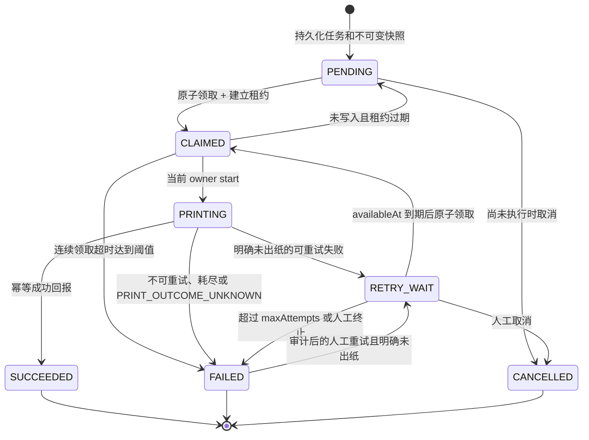

# 统一打印架构 V1：状态机与可靠性

> 文档性质：建议方案，不代表功能已实现。当前数据库为 MySQL，当前系统没有 PrintJob、领取租约或自动重试；事实证据见 `00_CURRENT_STATE_AUDIT.md`。

## 1. 设计前提

- `PrintJob` 是打印意图的唯一事实来源，Web 页面、推送和连接器本地队列都不能取代它。
- 一条 Job 对应一次物理出纸意图；规则的多份打印展开成多条 Job。
- `PrintAttempt` 记录每次实际尝试，不能只覆盖 Job 的最终状态。
- 本地和云通道共用状态语义，但 executor、adapter 和错误分类可以不同。
- “成功写入 Socket/厂商 API”不等于能够百分之百证明纸张已输出。当前旧实现恰好存在这个局限：`apps/api/src/modules/printers/printers.service.ts:341-367`。
- 当前数据库是 MySQL：`apps/api/prisma/schema.prisma:5-8`。下文不依赖 PostgreSQL 专属语法。

## 2. PrintJob 状态

| 状态 | 含义 | 谁可进入 | 谁可离开 | 超时处理 | 终态 |
|---|---|---|---|---|---:|
| `PENDING` | 已持久化，等待首次或再次领取 | API 创建任务或租约恢复协调器 | API dispatcher 原子领取；商家取消 | 无执行超时；按 `availableAt` 排队 | 否 |
| `CLAIMED` | 已被唯一 executor 租用，尚未开始向打印机写入 | API 的原子领取操作 | 当前 lease owner 开始；租约回收器恢复 | 无 Attempt 时回 `PENDING` 并累计领取超时；达到阈值后 FAILED/告警 | 否 |
| `PRINTING` | 已创建 Attempt，并可能已向设备/厂商发送数据 | 当前 lease owner 的 start 请求 | 当前 owner 回报成功/失败；协调器处理租约过期 | 过期后结果可能不确定，不得盲目自动重打 | 否 |
| `SUCCEEDED` | executor 已完成约定执行步骤 | 当前 lease owner 的成功回报；云 adapter 对账 | 不再自动离开；额外出纸需新建补打 Job | 无 | 是 |
| `FAILED` | 不可重试、次数耗尽或结果不确定需人工判断 | API 按 Attempt/error/outcome 决策 | 人工明确重试可进入 `RETRY_WAIT`；补打则新建 Job | 无自动离开 | 条件终态 |
| `RETRY_WAIT` | 已失败但允许在 `availableAt` 后重试 | API 重试策略或人工重试 | dispatcher 在到期后领取；商家取消 | 到期前不领取 | 否 |
| `CANCELLED` | 尚未执行的打印意图被审计取消 | 商家 OWNER/MANAGER 或系统策略 | 不允许离开 | 无 | 是 |

`FAILED` 对原 Job 默认视为终态；只有受审计的人工“重试原任务”操作才能在确认未出纸、错误可重试且未超限时将其转入 `RETRY_WAIT`。若操作者要额外打印一份，应创建 `MANUAL_REPRINT` 新 Job，而不是改写旧 Job。

统一术语：执行尝试的结果枚举为 `PrintAttempt.result=OUTCOME_UNKNOWN`；对应 Job 不新增 UNKNOWN 状态，而是 `status=FAILED`、`lastErrorCode=PRINT_OUTCOME_UNKNOWN`、`retryBlocked=true`。

### 2.1 状态图



### 2.2 禁止转移

- 普通网页不得把任何任务直接改为 `SUCCEEDED` 或 `PRINTING`。
- 非 lease owner 不得 start、续租或回报结果。
- `SUCCEEDED` 不得回到可执行状态；补打必须创建新 Job。
- `CANCELLED` 不得恢复；需要打印时新建任务并记录原因。
- `PRINTING` 不得因 lease 过期直接回到 `PENDING`，否则可能重复出纸。
- V1 取消只允许 `PENDING/RETRY_WAIT`；`CLAIMED` 已存在与本地执行并发窗口，不提供取消转移。
- V1 不提供 `CLAIMED → RETRY_WAIT` 的无 Attempt 快捷路径。连接器在任何设备连接/渲染尝试前先调用 start 创建 Attempt；之后的明确未写入失败走 `PRINTING → RETRY_WAIT`。
- 终端不能自行选择最终 `RETRY_WAIT`/`FAILED`；它只报告标准化错误、阶段、`bytesWritten` 与 `outcome`，由 API 决策。

## 3. 原子领取和租约

### 3.1 V1 领取条件

本地终端只能领取同时满足以下条件的任务：

- `merchantId` 来自 Terminal JWT，不接受请求体自报；
- `targetTerminalId` 等于当前终端；
- `channelType` 在数据库当前 Terminal capability 与 Printer binding 范围内，不能只信 JWT/请求体声明；
- `status IN (PENDING, RETRY_WAIT)`；
- `availableAt <= serverNow`；
- Printer、Terminal 都为启用/ACTIVE；
- 按 `priority DESC, availableAt ASC, createdAt ASC` 排序；
- V1 每次最多领取一条，先降低设备并发和重复风险。
- 服务端先返回当前终端已有的 `CLAIMED/PRINTING` Job，并锁定/检查 Terminal 活动任务；同一终端不得同时拥有第二条活动 Job。

### 3.2 MySQL + Prisma 建议算法

仓库已有在事务内使用 MySQL `SELECT ... FOR UPDATE` 的先例：`apps/api/src/modules/table-sessions/table-sessions.service.ts:209-235,258-300`。打印任务可采用两种实现，阶段 C 必须用并发测试选定并固定：

1. 在短事务中查找候选 ID；必要时用 MySQL 8 支持的行锁能力。开始实现前先确认生产 MySQL 精确版本，不能假设支持 `SKIP LOCKED`。
2. 对候选执行带旧状态和版本条件的 `updateMany`/条件更新：`id=? AND status IN (...) AND availableAt<=? AND (leaseExpiresAt IS NULL OR leaseExpiresAt<?) AND leaseVersion=?`。
3. 只有受影响行数为 1 才领取成功；同时写入 `CLAIMED`、`leaseOwner`、`claimedAt`、`leaseExpiresAt`，并递增 `leaseVersion`/乐观锁版本。
4. 事务提交后才把 Job 返回连接器；竞争失败则选择下一个候选。
5. `start/lease/succeed/fail` 都必须匹配内部 jobId（外部路径用 jobNo）+ merchantId + leaseOwner + leaseVersion + 当前状态。

关键点：不能“先查询后无条件更新”，也不能仅依靠进程内 mutex；多个 API 实例和多个终端都必须由数据库条件更新裁决。

### 3.3 租约参数建议

- 初始 CLAIMED 租约：60 秒。
- 进入 PRINTING 前创建 Attempt，并在需要时把租约延长到 90 秒。
- 连接器在预计剩余时间低于 30 秒时续租；单次延长受服务端上限限制。
- 所有过期判断使用服务器时间；终端时间只作诊断。
- 每次新领取递增 `leaseVersion`，旧进程迟到的回报会得到 `LEASE_CONFLICT`。
- 心跳与 Job 租约分开；心跳在线不意味着某个 Job 租约仍有效。
- 若回报只略晚于 expiresAt，但 owner/leaseVersion/attempt 仍匹配且尚无后继 Attempt，可在短 grace window 接受终态；产生后继 Attempt 后，旧回报只能进入冲突审计。

### 3.4 崩溃恢复

- `CLAIMED` 且没有 Attempt/start 证据：租约过期后可恢复到 `PENDING`，因为连接器尚未声明开始写入；同时递增 `consecutiveClaimTimeouts` 并设置退避。连续 3 次领取超时后进入 `FAILED/EXECUTOR_UNSTABLE` 并告警，防止坏终端无限热循环。该计数不是物理 Attempt。
- `PRINTING` 且租约过期：转为 `FAILED`，错误 `PRINT_OUTCOME_UNKNOWN`；不自动重打。
- 连接器重启后先读取本地执行台账，再向 API 对账 active Job；不得只清空本地状态重新领取。
- API 重启不影响数据库中的 Job/lease；协调器恢复扫描必须可重复执行。
- 终端重绑时，只允许对**没有任何 Attempt**且处于 `PENDING/RETRY_WAIT` 的 Job 做审计式原子 retarget；`CLAIMED/PRINTING` 不迁移，必须先完成租约/结果未知处理。

## 4. 幂等与防重复

### 4.1 自动任务

当前 Order 的 `[userId,idempotencyKey]` 只保护下单，不能复用为打印幂等键：`apps/api/prisma/schema.prisma:552,588`。

建议自动任务以事件发生时冻结的匹配结果构造 canonical material：

```text
merchantId | triggerEventKey | ruleId |
printerId | receiptType | copyIndex
```

对规范化字符串做 SHA-256，保存为 `dedupeKey`，并建立数据库唯一索引。这样可以抵抗：

- 同一订单事件被重复投递；
- API 请求重试；
- API 进程重启后再次扫描；
- 规则 copies 大于 1 时，用 `copyIndex` 形成有意的不同任务。

`triggerEventKey` 必须稳定；订单状态事件可引用 `OrderStatusLog.id`，ruleVersion 保存在 Job 快照供审计。事件发生时冻结匹配的 ruleId/version，规则升级后不得用当前规则重算旧事件。数据库唯一冲突时返回已有 Job，不新建第二条。

阶段 C 只定义和测试 Job/幂等/事务原语；阶段 G 接入生产订单事件时，必须在同一业务事务持久化 Job 或可靠 trigger/outbox，不能继续使用当前 `void ...catch()` fire-and-forget 路径：`apps/api/src/modules/orders/orders.service.ts:128-145`。

### 4.2 人工补打

- 每次有意识的补打都是新的物理出纸意图，生成新的 Job 和新 `dedupeKey`。
- 同一 HTTP 请求重试由 `Idempotency-Key + merchantId + staffId + requestHash` 返回同一个 requestGroup/Job，不因网络重试双打。
- 操作者、原因、源 Job、内容模式（原快照/当前订单）必须记录。
- 默认复制 `sourceJob.receiptSnapshot`；选择当前订单时生成并冻结一个新快照，UI 必须明确提示内容可能变化。

### 4.3 重复回报

- 成功/失败接口按 `jobNo + attemptId + leaseVersion` 幂等。
- 同一 Attempt 重复成功回报返回已有成功结果。
- 已成功后收到失败回报不改写状态，并记录冲突诊断。
- 租约已经转移后，旧连接器回报只记录受限安全日志，不能覆盖新 owner。

## 5. 重试策略

### 5.1 错误分类

| 类别 | 示例错误码 | V1 默认 | 原因 |
|---|---|---|---|
| 建连暂时失败 | `NETWORK_TIMEOUT`、`CONNECTION_REFUSED`、`NO_ROUTE_TO_HOST` | 可重试 | 可能是 Wi-Fi、路由器或打印机短时恢复 |
| 写入前连接关闭 | `SOCKET_CLOSED_BEFORE_WRITE` | 可重试 | 能证明尚未发送打印内容 |
| 打印机暂时离线 | `PRINTER_OFFLINE`、`PAPER_OUT_CONFIRMED`、`COVER_OPEN_CONFIRMED` | 可重试等待；纸张类建议人工恢复后触发 | 故障可恢复，但不应高频重试耗尽纸张/网络 |
| 云厂商暂时异常 | `CLOUD_VENDOR_TIMEOUT`、`CLOUD_VENDOR_RATE_LIMITED`、`CLOUD_VENDOR_UNAVAILABLE` | 可重试/先查询 | 必须结合厂商幂等与状态查询；是否已接受另存阶段/厂商 jobId |
| 领取租约超时 | `LEASE_EXPIRED_BEFORE_START` | 可重试 | 未开始写入时安全 |
| 写入后断开 | `SOCKET_CLOSED_AFTER_WRITE`、`PRINT_OUTCOME_UNKNOWN` | 不自动重试 | 是否出纸未知 |
| 配置错误 | `INVALID_CHANNEL_CONFIG` | 不可重试 | 不经人工修复不会恢复；IP、端口等字段错误统一映射到此码 |
| 内容/模板错误 | `INVALID_RECEIPT_DOCUMENT`、`CONTENT_HASH_MISMATCH`、`TEMPLATE_VERSION_NOT_PUBLISHED` | 不可重试 | 需修复配置/渲染器 |
| 权限/设备错误 | `TERMINAL_REVOKED`、`PRINTER_NOT_BOUND`、`MERCHANT_SCOPE_MISMATCH` | 不可重试 | 安全约束，不得绕过 |
| 能力不匹配 | `CAPABILITY_MISMATCH`、`UNSUPPORTED_PAPER_WIDTH` | 不可重试 | 需重新绑定或配置 |
| 结果不确定 | `PRINT_OUTCOME_UNKNOWN` | 不自动重试 | 自动重打可能造成重复小票 |

错误是否可重试不能只按异常类决定，还必须结合执行阶段和 `bytesWritten`。例如 connect timeout 可重试；完整写入后的读超时则属于结果不确定。

### 5.2 V1 参数

- 自动尝试上限：3 次（首次 + 2 次自动重试）。
- 建议退避：首次失败后 5 秒、第二次失败后 30 秒；第三次为最终自动尝试。可加入不超过 20% jitter，避免大量终端同时重连。
- `availableAt` 是服务端领取门槛。
- `maxAttempts` 创建时冻结；测试任务可设 1，避免诊断按钮隐式多次出纸。
- 达到上限后进入 `FAILED` 并触发商家端可见告警；平台端可聚合持续失败、终端离线和厂商异常。
- 人工重试前必须显示最近错误和结果确定性；Job 的 `PRINT_OUTCOME_UNKNOWN` 只提供“生成补打任务”，不提供无提示的原任务重试。

## 6. 自动打印触发

### 6.1 当前事实

当前顾客下单事务完成后，API 在订单仍为 `PENDING_ACCEPTANCE` 时对所有订单类型触发旧自动打印：`apps/api/src/modules/orders/orders.service.ts:56-64,128-146`。订单类型是 `DINE_IN/PICKUP/DELIVERY`，状态是 `PENDING_ACCEPTANCE/ACCEPTED/PREPARING/READY/DELIVERING/COMPLETED/CANCELLED`：`apps/api/prisma/schema.prisma:80-100`。

这只是当前行为，不等于 V1 产品决定。

### 6.2 方案比较

| 触发 | 优点 | 风险 | 建议 |
|---|---|---|---|
| `ORDER_CREATED` / 顾客下单 | 最快提醒厨房；延续旧行为 | 商家尚未确认，取消/无效订单也可能出纸 | 仅在明确要求“来单即打”的规则中启用 |
| `ORDER_ACCEPTED` / 商家接单 | 减少无效单；业务意图清楚 | 接单前没有纸质提醒；需 Web/语音提醒先可靠 | **V1 默认推荐，仍需用户确认** |
| 按 orderType 不同触发 | 符合堂食、自取、配送差异 | 配置和验收复杂一些 | 模型必须支持；V1 可提供三种显式规则，不做脚本引擎 |

推荐 V1 默认所有当前 orderType 采用 `ORDER_ACCEPTED`，每个 orderType 独立规则、默认关闭，完成真实硬件验证后人工启用。堂食是否需要 `ORDER_CREATED` 厨房单、配送/自取是否必须接单后打印，需要产品确认，不能在本轮固化。

`TableSession.CLOSED`、`Order.status=COMPLETED` 和 `Order.settlementStatus=SETTLED` 是不同事实。当前关闭桌台会话并不会批量更新订单结算状态：`apps/api/src/modules/table-sessions/table-sessions.service.ts:121-165`；因此预结单/结账单后续必须定义专门事件，不能从 UI 文案推断。

## 7. 失败场景矩阵

| 场景 | 数据库任务 | V1 行为 | 重复风险/操作提示 |
|---|---|---|---|
| Web 页面关闭 | 保留 | 不影响已创建任务；重开后查询状态 | 无需依赖页面常驻 |
| Android APP 正常关闭 | 保留 | 停止领取；当前未开始任务待租约恢复 | PRINTING 时应尽量完成/回报，不能承诺后台常驻 |
| Android 进程被回收 | 保留 | CLAIMED 未开始可回收；PRINTING 进入结果不确定对账 | 本地执行台账用于恢复，不盲打 |
| D10 重启 | 保留 | 启动后认证、心跳、读取本地台账并对账 | 开机恢复在阶段 G，阶段 E 不假设已实现 |
| Wi-Fi 断开 | 保留 | 建连前失败进入退避；写入后断网按 outcome 判断 | 写入后未知不自动重试 |
| 路由器重启 | 保留 | 与网络暂时失败相同，网络恢复后继续领取 | 限制重试频率 |
| 打印机断电 | 保留 | connect refused/timeout，退避重试 | 达上限告警 |
| 打印机缺纸 | 保留 | 若设备能可靠报告则暂停重试；否则表现为设备错误/未知 | 人工装纸后明确重试 |
| 打印机 IP 改变 | 保留 | 旧地址失败；状态页提示重新发现/修改配置；待处理任务执行时可读取经授权的新 endpoint | 不做全网段侵入扫描；Attempt记录实际configVersion；render profile不兼容时不静默执行 |
| 打印机响应慢 | 保留 | 连接/写入使用有界超时；按执行阶段分类 | 不无限等待；写后超时可能未知 |
| API 重启 | 保留 | DB Job/lease 不丢；重启后恢复 long poll 与扫描 | 进程内通知仅加速，不能做事实源 |
| 数据库短暂故障 | 可能尚未创建或已存在 | 事务失败不回成功；连接器保持本地结果待幂等回报 | 不得在 DB 未持久化时执行新任务 |
| 云打印厂商超时 | 保留 | 接受前可重试；接受后先按厂商 jobId 查询 | 无查询/幂等证据时 Attempt=OUTCOME_UNKNOWN、Job=FAILED/PRINT_OUTCOME_UNKNOWN |
| 回报成功前连接器崩溃 | PRINTING | 恢复本地台账并重报；无法确认则 Attempt=OUTCOME_UNKNOWN | Job=FAILED且retryBlocked；不直接再写一遍 |
| 打印成功但成功回报丢失 | PRINTING | 同 Attempt 幂等重报；长期无法对账则 Job=FAILED/PRINT_OUTCOME_UNKNOWN | 软件无法绝对证明纸张状态，人工决定补打 |

### 7.1 “打印成功但回报丢失”的边界

普通 ESC/POS RAW Socket 通常没有可依赖的、与每张小票绑定的物理完成回执。即使 TCP 写入完成，也可能未出纸；即使连接随后断开，纸张也可能已经输出。因此软件无法同时保证“绝不漏打”和“绝不重复”这两个绝对目标。

V1 降低风险的措施：

1. 连接器在本地以 `jobNo/contentHash/attemptId/阶段/bytesWritten/结果` 保存最小执行台账；阶段 E/F 只验收前台链路，正式持久台账、进程/设备重启和开机恢复在阶段 G 落地，本轮仅定义要求。
2. 先持久化 Attempt/start，再发送字节；发送后先写本地完成标记，再幂等回报 API。
3. CLAIMED 过期可回收，PRINTING 过期不盲目重打。
4. 云通道优先使用厂商 idempotency key 和状态查询。
5. 商家 UI 将 `PRINT_OUTCOME_UNKNOWN` 与明确失败区分，展示“可能已出纸”；人工确认后创建有审计的新补打 Job。
6. 后续若硬件提供可靠状态查询，只能把它作为更强证据，仍需按具体型号验证，不能预设 ZY305UL 已支持。

## 8. 安全、权限和审计约束

- 所有 Job、Attempt、Printer、Rule、Template、Terminal 查询和更新都必须以认证身份的 `merchantId` 限定；当前不存在 Store/Branch，不虚构门店权限。
- 终端使用独立注册、撤销和轮换凭据；服务器只存终端 secret 的 hash，Android 使用 Keystore 保存明文 secret。
- 终端只领取绑定给自己的任务；不能通过请求体改变 merchantId、terminalId、printerId 或 channelType。
- 普通网页不能领取任务，也不能标记成功。
- 云厂商 credential 服务端加密保存，不进入 Job 快照、网页、Android配置、日志或普通 API 响应。
- Receipt 可能含客户姓名、电话、地址和备注；商家日志默认脱敏，平台完整查看受更高权限和审计控制。
- 补打、人工重试、取消、Printer/Rule/Template/Terminal 配置变更均记录操作者、原因和前后摘要。
- errorMessage 在入库前分级和脱敏；不得把 Token、密钥、完整网络请求或客户 PII 写入普通日志。
- 终端回报必须匹配当前 lease 与 Attempt；不能伪造其他商家或其他终端的成功。

## 9. V1 验收重点

- 并发领取测试证明同一 Job 只有一个 lease owner。
- 重复事件、重复 HTTP 请求、重复回报均不生成意外打印。
- CLAIMED 崩溃可恢复，PRINTING 崩溃不会自动双打。
- 可重试和不可重试错误按阶段正确分类，达到上限后可见。
- Web 关闭、API 重启、短时断网后数据库任务仍存在。
- 人工补打生成新 Job，并完整记录操作者、原因和源任务。
- 所有跨商家访问、伪造 terminal、过期 lease 回报均被拒绝并审计。
