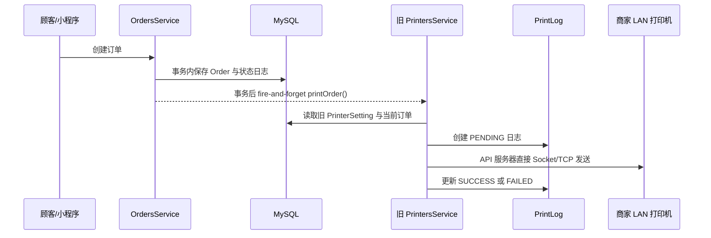
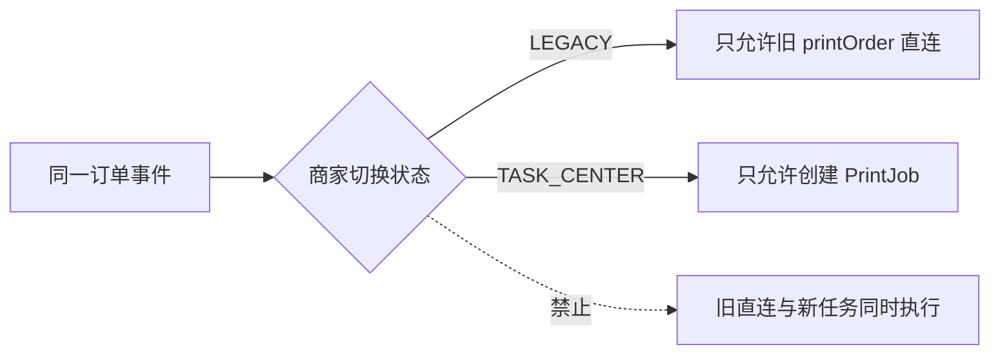

# 旧打印系统兼容与迁移边界

> 文档性质：阶段 C 兼容设计与后续迁移约束。
> 当前结论：本轮新打印任务中心与旧打印系统独立并存；不复制旧配置、不迁移旧日志、不切换真实订单，也不执行生产 migration。

## 1. 当前事实：旧打印系统仍在运行路径中

### 1.1 旧数据结构

当前 Prisma schema 中已有两张旧表，且本轮必须原样保留：

| 旧模型 | 当前职责 | 关键事实 | 证据 |
|---|---|---|---|
| `PrinterSetting` | 保存商家 LAN 打印机配置 | 直接保存 IP、端口、纸宽、编码、份数、语言、`autoPrintEnabled`、默认机和最近一次连接结果；默认端口为 9100 | `apps/api/prisma/schema.prisma` |
| `PrintLog` | 保存一次旧即时打印调用的薄日志 | 只有 `PENDING/PRINTING/SUCCESS/FAILED` 汇总状态；可关联订单和旧打印机，但没有任务领取、租约、去重键、内容快照或多次 Attempt | `apps/api/prisma/schema.prisma` |

旧表由 migration `apps/api/prisma/migrations/20260623000000_add_printer_settings_and_print_logs/migration.sql` 创建。它们不是本轮新 `Printer`、`PrintJob` 和 `PrintAttempt` 的别名，也不能作为可靠任务队列使用。

### 1.2 旧 API 与旧管理页面

下列旧接口继续保持原路径和原行为：

| 路径 | 当前行为 | 证据 |
|---|---|---|
| `GET /merchant/printers` | 查询旧 `PrinterSetting` | `apps/api/src/modules/printers/printers.controller.ts` |
| `POST /merchant/printers` | 新增旧打印机配置 | `apps/api/src/modules/printers/printers.controller.ts` |
| `PATCH /merchant/printers/:id` | 修改旧打印机配置 | `apps/api/src/modules/printers/printers.controller.ts` |
| `DELETE /merchant/printers/:id` | 删除旧打印机配置 | `apps/api/src/modules/printers/printers.controller.ts` |
| `POST /merchant/printers/:id/test` | API 服务器生成旧测试票据并直接 TCP 连接打印机 | `apps/api/src/modules/printers/printers.controller.ts`、`apps/api/src/modules/printers/printers.service.ts` |
| `POST /merchant/orders/:id/print` | 重新读取当前订单后调用旧即时打印 | `apps/api/src/modules/merchant-orders/merchant-orders.controller.ts`、`apps/api/src/modules/printers/printers.service.ts` |

merchant-admin 的旧客户端封装仍访问 `/merchant/printers`，证据为 `apps/merchant-admin/src/api/printers.ts`。旧打印配置 UI 仍位于商家资料页面，`/merchant/printers` 会重定向到 `/merchant/profile`；证据为 `apps/merchant-admin/src/pages/MerchantProfilePage.vue` 和 `apps/merchant-admin/src/router/index.ts`。仓库中仍保留 `apps/merchant-admin/src/pages/PrintersPage.vue`，本轮也不删除该历史页面文件。

### 1.3 旧订单创建直连链路

当前真实链路不是统一任务中心：

事实证据：

- 订单创建成功后异步调用 `PrintersService.printOrder()`：`apps/api/src/modules/orders/orders.service.ts`。
- 旧服务直接使用 `node:net` 的 `Socket`：`apps/api/src/modules/printers/printers.service.ts`。
- 旧服务会把最后一次 Socket 结果回写为旧打印机的 `ONLINE/OFFLINE`；这不等于终端心跳或可靠的实时在线状态：`apps/api/src/modules/printers/printers.service.ts`。

## 2. 本轮实现：新旧系统独立并存

本轮新任务中心使用独立命名空间与独立表：

- 六个核心数据模型：`Printer`、`ReceiptTemplate`、`PrintRule`、`PrintJob`、`PrintAttempt`、`MerchantTerminal`，定义于 `apps/api/prisma/schema.prisma`。
- 一个支撑审计模型：`PrintingAuditLog`，记录配置变更、取消、重试、测试任务和人工补打等受控操作；敏感键名在写入前脱敏。它不替代 `PrintAttempt`，也不是打印执行日志。
- 新 NestJS 模块：`apps/api/src/modules/printing/`。
- 新商家 API 前缀：`/merchant/printing/*`。
- 新 merchant-admin 入口：`打印中心 Beta`，路由前缀为 `/printing-center/*`。
- 新 migration：`apps/api/prisma/migrations/20260715000000_add_printing_task_center_v1/migration.sql`。

上述新资源不会覆盖、代理或重定向旧 `/merchant/printers` 和 `/merchant/orders/:id/print`。新页面顶部必须持续显示：

> Beta：当前任务中心尚未接入执行端，不影响旧打印配置。

### 2.1 新任务记录的可靠性边界

新中心的数据结构按“一次 `PrintJob` 对应一份物理出纸意图”设计：

- 规则配置多份时，为每一份分别创建 `PrintJob`，而不是在同一个 Job 内循环出多份。
- 同一批任务以 `requestGroupId` 关联，并用 `copyIndex`、`copyCount` 标识第几份及总份数。
- 自动任务的 `dedupeKey` 使用调用方提供的稳定 `eventKey`、商家、规则、打印机、票据类型、触发事件和份序号生成；规则 `updatedAt` 不参与去重，因此无关配置更新时间不会把同一业务事件误判为新任务。
- `PRINTING` 中的租约过期不能证明是否已经出纸，任务会记录 `PRINT_OUTCOME_UNKNOWN`、设置 `retryBlocked=true` 并停止自动重试；只能人工核对后创建新的补打任务。

这些字段只服务于新中心，不回写旧 `PrintLog`，也不改变旧即时打印链路。

### 2.2 本轮明确不做的数据迁移

本轮 migration 只允许增加新表、索引和外键：

1. 不删除或改名 `printer_settings`、`print_logs`。
2. 不从 `PrinterSetting` 自动创建新 `Printer`。
3. 不从 `PrintLog` 回填 `PrintJob` 或 `PrintAttempt`。
4. 不把旧 `status=ONLINE` 解释成新打印机已在线。
5. 不把旧 `autoPrintEnabled=true` 转换成启用的新 `PrintRule`。
6. 不把旧编码枚举解释成已经验证的中文、越南语或 ESC/POS 能力。
7. 不自动为现有订单或桌账创建 `PrintJob`。
8. 不把旧打印调用补写为 `PrintingAuditLog`，也不伪造旧操作的审计主体。

旧 `PrintLog` 缺少不可变票据快照、去重键、租约和逐次 Attempt，强行回填会制造无法证实的执行历史，因此只能作为旧版历史事实保留。

## 3. 防止双执行

### 3.1 本轮保护

本轮通过以下边界防止新中心影响真实经营：

- `PRINTING_AUTO_CREATE_ENABLED=false`：订单事件不自动创建新任务。
- `PRINTING_EXECUTION_ENABLED=false`：即使存在测试或人工创建的任务，也没有执行器自动领取或发送。
- 不接入订单创建监听器，不修改 `apps/api/src/modules/orders/orders.service.ts` 的旧生产行为。
- 不公开 Android/connector 任务领取路由，不运行 worker。
- 新 `PrintRule` 的 `autoPrint` 与 `enabled` 默认关闭。
- 新 `Printer` 不因保存 LAN host/port 而发起连接，也不能显示为已在线。
- 新模板更新会创建新版本、停用旧版本，并把关联规则改指向新版本且重新关闭 `enabled/autoPrint`，避免未经复核的模板变更立即进入自动链路；历史 Job 仍保留原模板 ID、版本和快照。

因此本轮不存在“旧即时直打 + 新 PrintJob 执行”同时出纸的运行路径。新中心当前只提供配置、任务记录和状态机基础能力。

### 3.2 未来切换的硬性条件

未来启用真实任务执行时，不能只打开新开关。对同一商家、同一订单事件必须先确定唯一触发源：

未来切换必须在单一可审计操作中完成：

1. 先停用该商家的旧自动直打来源。
2. 再启用新规则与任务创建。
3. 最后启用经验证的执行端领取。
4. 每一步均验证旧 `autoPrintEnabled`、新 `PrintRule` 和执行开关没有交叉启用。
5. 任何状态不确定时保持新执行关闭，不得通过重复打印“探测”结果。

## 4. 旧配置未来可映射，但本轮不复制

未来若决定迁移，可把旧数据作为人工确认后的候选输入，而不是直接继承运行状态：

| 旧字段 | 候选映射 | 迁移限制 |
|---|---|---|
| `merchantId` | 新资源的商家作用域 | 必须再次校验商家归属 |
| `name` | `Printer.name` | 可直接作为候选名称 |
| `type=NETWORK` | `channelType=LOCAL_LAN_ESCPOS` | 只表示配置类型，不证明硬件支持 ESC/POS |
| `ipAddress/port` | `connectionConfig.host/port` | 必须重新验证私网 IP、端口和现场网络；服务器不得主动探测商家 LAN |
| `paperWidth` | 新 `paperWidth` | 需真机确认 58/80mm |
| `usageType` | 新 `purpose` 或规则用途 | `GENERAL` 等旧语义不能无损映射时保持停用 |
| `copies` | `PrintRule.copies` | 范围须重新校验为 1–3 |
| `language` | 模板语言模式 | 不属于连接配置，且不证明打印机字库支持 |
| `autoPrintEnabled` | 无自动映射 | 新规则必须由管理员明确审核并启用 |
| `status` | 无自动映射 | 旧 Socket 结果不能作为新在线状态 |

为保留追溯，未来迁移实施前必须评审 legacy ID 映射方式和唯一约束；本轮 schema 不以“自动复制旧数据”为前提。

## 5. 未来迁移准入条件

只有同时满足以下条件，才允许另开阶段和分支迁移真实商家：

1. D10 Pro 与目标打印机已在现场完成独立 LAN 硬件验证，不能假设 ZY305UL 或 9100 已可用。
2. Android 本地连接器具备独立终端认证、撤销、心跳、原子领取、租约续期和安全回报。
3. `claimNextJob`、状态机、租约过期、幂等、未知结果和多终端竞争测试通过。
4. 票据模板、中文/越南语/英文、纸宽和切纸行为完成真机验收。
5. 选定专用测试商家和试点商家，并完成旧配置/旧自动打印数据审计。
6. 有逐商家切换开关、观察窗口、告警和人工止损流程。
7. 已明确“打印成功但成功回报丢失”的处理策略，不把未知结果自动盲目重打。
8. 已获得用户对迁移范围、时间窗口和回滚方式的明确确认。
9. 生产 migration 已经过单独审批、备份和演练；本轮创建 migration 不等于获准执行生产 migration。

## 6. 建议的后续迁移步骤

以下仅是未来方案，不在本轮执行：

1. **只读盘点**：统计旧 PrinterSetting、PrintLog、自动开关和近期开启情况。
2. **人工映射草稿**：生成 disabled/unverified 的新 Printer 候选，不创建规则、不创建任务。
3. **现场验证**：绑定一个已认证终端，验证配置、模板和测试 PrintJob。
4. **试点切换**：关闭一个试点商家的旧自动来源，再启用新任务来源和一个执行端。
5. **观察与核对**：对比订单事件、PrintJob、Attempt 和实际小票，确认无漏打、双打或跨商家访问。
6. **逐商家推进**：每个商家独立确认，不全量自动切换。
7. **旧链路退役评审**：只有全部使用方完成迁移且有充分观察期后，才可另案将旧 UI/API 变为只读或移除；不得在本轮删除。

## 7. 回滚原则

### 7.1 本轮代码/管理能力回滚

- 关闭 `PRINTING_TASK_CENTER_ENABLED`，隐藏或阻断 Beta 管理能力。
- 保持 `PRINTING_AUTO_CREATE_ENABLED=false` 和 `PRINTING_EXECUTION_ENABLED=false`。
- 回退应用代码时保留新增表，不在紧急回滚中删除 schema 或历史数据。
- 旧 `/merchant/printers`、旧订单打印接口和旧页面本轮未被替换，因此无需通过数据反向迁移来恢复。

### 7.2 未来试点执行回滚

- 先停止新任务创建和领取，保留所有 Job/Attempt 供审计。
- 对 `CLAIMED/PRINTING` 任务等待租约或进入人工核对，不直接重置后盲打。
- 未执行的 `PENDING/RETRY_WAIT` 任务可经权限和审计后取消。
- 若暂时恢复旧链路，必须确认新链路已彻底停用；绝不允许两个执行路径并行。
- 不删除成功、失败或结果未知的历史记录，不把旧 PrintLog 伪装成新 Attempt。

## 8. 本轮不变声明

- 不执行生产 migration。
- 不连接 LAN、USB、内置或云打印机。
- 不调用 TCP 9100 或云打印厂商 API。
- 不修改 Android APP 和 Web 收银台业务。
- 不把 Web 收银台的“打印待接入”改为在线。
- 不部署、不 push。
