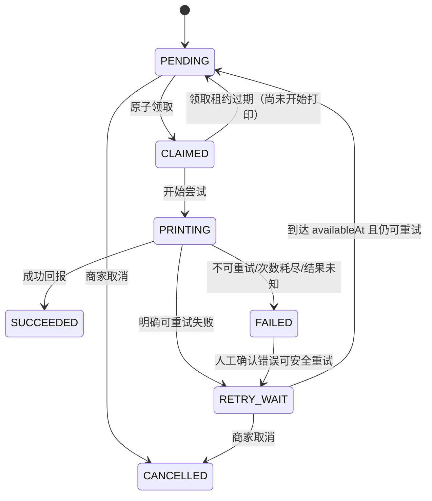

# 统一打印任务中心 V1 实施记录

> 文档性质：阶段 C 实施范围、契约与验证记录。
> 安全基线：本轮只建立任务中心基础，不执行真实打印；自动创建和任务执行默认关闭。
> 验证状态：本文末尾记录了本分支实际验证结果；migration 仅完成静态审计，未连接或变更数据库。

## 1. 目标与边界

本轮目标是为后续 Android LAN/USB 连接器和云打印适配器建立统一基础：

- 使用数据库中的 `PrintJob` 作为新任务事实来源。
- 冻结不可变 `ReceiptDocument` 快照。
- 记录每次执行尝试，而不是覆盖最终结果。
- 提供状态机、幂等、原子领取和租约服务能力。
- 持久化配置和任务操作审计，并与实际执行 Attempt 分离。
- 提供商家级配置与查询 API。
- 在 merchant-admin 新增独立“打印中心 Beta”。
- 保留旧 `PrinterSetting`、`PrintLog`、旧 API 和旧页面。

本轮明确不做：真实订单自动建任务、worker、公开 connector 领取接口、Android 终端配对、LAN/USB/内置打印执行、云打印适配、生产 migration、部署或 push。

## 2. 设计文档与本轮指令的取舍

本轮以“阶段 C：统一打印任务中心 V1 开发指令”为实施范围，并参考 `docs/printing-v1/00_CURRENT_STATE_AUDIT.md` 至 `docs/printing-v1/06_DECISIONS_AND_OPEN_QUESTIONS.md`。其中需要明确以下收敛：

1. 早期设计草案提出了独立 `ReceiptTemplateVersion`、credential 和 enrollment code；本轮实现六个核心模型，并增加支撑模型 `PrintingAuditLog`。模板以“每次修改创建新的 `ReceiptTemplate` 行和递增 `version`”实现版本化，Job 同时冻结模板 ID、版本和票据快照；敏感云凭据与完整终端配对流程后置。
2. 早期设计建议迁移旧配置；本轮明确不回填、不复制、不切换真实商家。兼容策略见 `docs/printing-v1/07_LEGACY_COMPATIBILITY_AND_MIGRATION.md`。
3. 本轮商家 API 使用 `/merchant/printing/*` 前缀，避免与旧 `/merchant/printers` 冲突。
4. 本轮定义所有计划通道枚举，但不实现任何 adapter；保存通道配置不代表已连接、在线或验证成功。
5. 本轮只预建 MerchantTerminal 最小管理能力，不发放长期明文 Token，也不开放未认证的 claim/report 接口。

## 3. 数据模型实施契约

本轮新模型定义于 `apps/api/prisma/schema.prisma`，对应 migration 位于 `apps/api/prisma/migrations/20260715000000_add_printing_task_center_v1/migration.sql`。旧 `PrinterSetting` 与 `PrintLog` 保持不变。

| 模型 | V1 职责 | 核心约束 |
|---|---|---|
| `Printer` | 商家作用域的通道无关逻辑打印机 | channel、纸宽、用途、启停、状态、受校验 JSON 配置和 capability；`(merchantId, enabled)` 索引；停用/软删除不删除历史 Job |
| `ReceiptTemplate` | 系统或商家的版本化结构化模板 | `ORDER_CUSTOMER`、`TABLE_BILL`；58/80mm；语言模式；版本、definition、启用状态；修改时新增版本行并停用旧版本，Job 创建后不受模板变更影响 |
| `PrintRule` | 描述何时向哪台打印机生成哪种票据 | 订单类型可空；触发事件、票据类型、打印机、份数 1–3、优先级；`autoPrint=false`、`enabled=false` 为安全默认；打印机必须属于同一商家 |
| `PrintJob` | 一份物理出纸意图与唯一任务事实来源 | 七状态、来源、不可变快照、模板版本、规则引用/版本、批次与份序号、可用时间、领取/租约、次数、错误与 `retryBlocked`；`dedupeKey` 可空唯一；`(merchantId,status,availableAt,priority)` 查询索引 |
| `PrintAttempt` | 单次实际执行尝试 | 每次重试新增一行；`(jobId,attemptNo)` 唯一；记录执行者、终端/adapter、起止时间、结果及脱敏诊断信息 |
| `MerchantTerminal` | 为后续本地连接器预建的商家终端 | 商家、名称、平台、状态、capabilities、App 版本、lastSeen/revoked 时间；本轮不配对、不返回长期明文 Token |
| `PrintingAuditLog` | 配置与任务管理操作的支撑审计 | 记录商家、操作员工、动作、资源、变更前后、原因、请求标识和时间；按敏感键名脱敏；不冒充实际打印 Attempt |

### 3.1 多份任务与版本冻结

- `PrintRule.copies=N` 会展开为 N 条独立 `PrintJob`；每条 Job 只表达一份物理出纸，分别领取、尝试和结算。
- 同一批 Job 共享 `requestGroupId`，并分别保存 `copyIndex=1..N` 与相同的 `copyCount=N`，便于 UI 和审计按批次聚合，同时避免某一份失败污染其他份的状态。
- 自动 Job 保存 `printRuleId` 与创建时的 `ruleVersion`；`receiptTemplateId` 与 `receiptTemplateVersion` 指向当时选择的模板版本；最终可打印内容以不可变 `receiptSnapshot` 为准。
- 更新模板时创建新模板行、停用旧行、把引用旧版本的规则改指向新版本，并把这些规则的 `enabled` 和 `autoPrint` 重新置为 `false`，要求管理员复核后再启用。
- 历史 Job 不被改写。人工补打从原 Job 克隆并校验原快照，允许继续引用其已停用的历史模板版本。

### 3.2 通道与用途

定义但不实现的通道：

- `LOCAL_LAN_ESCPOS`
- `LOCAL_USB_ESCPOS`
- `CLOUD_FEIE`
- `CLOUD_XINYE`
- `CLOUD_GPRINTER`
- `BUILTIN_SUNMI`
- `BUILTIN_IMIN`

V1 打印用途实现 `FRONT_DESK`，并仅预留 `KITCHEN`、`BAR`、`LABEL`。LAN `connectionConfig` 只允许保存受 DTO 校验的私网 IPv4 和端口；保存时不连接、不扫描、不发送字节。云打印密钥不得写入普通 JSON、API 响应或日志。

### 3.3 索引、外键与历史保护

实施必须满足：

- `PrintJob(dedupeKey)` 唯一。
- `PrintJob(merchantId, status, availableAt, priority)` 用于领取查询。
- `PrintJob(requestGroupId, copyIndex)` 用于同批多份任务查询。
- `PrintJob(printRuleId, createdAt)` 用于按规则追溯任务。
- `PrintAttempt(jobId, attemptNo)` 唯一。
- `Printer(merchantId, enabled)`。
- `PrintRule(merchantId, enabled, triggerEvent)`。
- Job/Attempt 不因删除订单、桌账、模板、打印机或终端而级联消失。
- 所有商家资源由 `merchantId` 做服务端隔离，不能依赖前端过滤。

## 4. ReceiptDocument 与快照

`apps/api/src/modules/printing/` 中的快照服务从真实订单或 TableSession 聚合所需信息，生成结构化 `ReceiptDocument`。顶层、上下文、菜品与金额对象使用字段白名单，并限制数组数量、文本长度、日期和安全整数；未知字段或不合法结构会在建任务前被拒绝。V1 快照至少包含：

- `schemaVersion=1`、票据类型和生成时间。
- 商家 ID、名称及可选公开联系信息。
- 订单号、订单类型、桌台、人数和时间等上下文。
- 菜品名称、多语言可选名称、数量、单价、小计、规格和备注。
- VND 小计、折扣、服务费和总额。

保护要求：

1. 输入验证失败时不得创建任务。
2. 默认不把顾客手机号、地址等隐私写入快照。
3. `PrintJob.receiptSnapshot` 创建后不可由当前订单或当前模板覆盖。
4. 人工补打创建新 Job；若按原单补打，则复制已冻结快照。
5. 模板更新不会重写历史 Job 的 `receiptTemplateId`、`receiptTemplateVersion` 或快照。
6. 本轮不生成 ESC/POS 字节、不渲染 Bitmap，也不向硬件发送内容。

## 5. 任务创建、幂等与默认关闭

内部服务提供以下能力，但不接入 Web 收银台业务按钮：

- `createAutomaticJob(...)`
- `createManualReprintJob(...)`
- `createTestJob(...)`

约束：

- 自动任务调用必须提供稳定、非空的 `eventKey`（例如未来可使用不可变订单状态日志 ID）；服务以 `eventKey`、商家、规则、打印机、票据类型、触发事件和 `copyIndex` 生成 `dedupeKey`。规则 `updatedAt` 不参与去重，因此同一业务事件不会因无关配置更新时间变化而重复建任务。
- 规则的 `copies` 范围为 1–3，并按每份一条 Job 展开；每份拥有独立 dedupe key，同批共享 `requestGroupId`。唯一约束竞争时读取整批既有 Job，重复事件或 API 重试不能再建第二批。
- 人工补打是新的物理出纸意图，必须创建新 Job，不复用首次自动任务的 dedupe key。
- 测试打印也建 `source=TEST` 的 Job；本轮由于没有执行端，只验证任务与状态基础，不出纸。
- 人工补打/测试任务创建与对应 `PrintingAuditLog` 在同一数据库事务内完成；补打操作者必须是当前商家的有效员工。
- 自动建任务默认关闭，不监听真实订单事件。

## 6. 状态机、原子领取与租约

### 6.1 状态

`SUCCEEDED` 和 `CANCELLED` 为终态。`FAILED` 默认停止执行，只有服务判定该错误可安全重试、未达到 `maxAttempts` 且 `retryBlocked=false` 时，管理员才能把原任务送回 `RETRY_WAIT`；人工重试不会增加 `maxAttempts`。普通商家网页不能把任务标记为 `SUCCEEDED`。非法转移必须被服务层拒绝。

`PRINTING` 表示字节可能已经发往设备。该状态租约过期时不能安全回到队列：Job 转为 `FAILED`，写入 `lastErrorCode=PRINT_OUTCOME_UNKNOWN`、`retryBlocked=true`，对应未完成 Attempt 记录 `OUTCOME_UNKNOWN`。原任务禁止自动或人工重试；必须先现场核对，确需再次出纸时创建带审计原因的新补打 Job。

### 6.2 领取与竞争

服务层实现以下内部能力及自动化测试：

- `claimNextJob(...)`
- `markPrinting(...)`
- `markSucceeded(...)`
- `markFailed(...)`
- `extendLease(...)`
- `releaseExpiredLeases(...)`
- `releaseAvailableRetries(...)`

领取必须在事务或等价的条件更新中核对旧状态、可用时间与 `leaseVersion`；只有一个执行者能把同一 Job 从 `PENDING` 改为 `CLAIMED`。Attempt 创建、`attemptCount` 递增和状态转移需要保持一致。执行服务要求调用方回传领取时持有的 `leaseVersion`，完成回报还必须携带当前 `attemptNo`；租约续期与结果回报同时校验 lease owner、版本和尝试序号，旧回报不能覆盖后来重新领取产生的新租约或新 Attempt。

`CLAIMED` 尚未进入实际打印时，租约过期可以安全释放为 `PENDING`。明确可重试失败进入 `RETRY_WAIT` 后，只有 `availableAt` 已到、未达到 `maxAttempts` 且 `retryBlocked=false` 的任务才由 `releaseAvailableRetries` 条件更新回 `PENDING`。失败回报按 Job、Attempt 和终端校验后支持幂等重复回报；找不到对应已完成 Attempt 的不一致回报会被拒绝。

本轮只提供服务层能力，不公开不安全的 connector claim/report 路由，不启动 worker，也没有 Android 执行端自动调用这些方法。

### 6.3 失败与重试

标准错误码至少包括：

- `NETWORK_TIMEOUT`
- `PRINTER_OFFLINE`
- `CONFIG_INVALID`
- `TEMPLATE_INVALID`
- `CHANNEL_NOT_IMPLEMENTED`
- `LEASE_EXPIRED`
- `PERMISSION_DENIED`
- `UNKNOWN`
- `PRINT_OUTCOME_UNKNOWN`

没有 adapter 时不得主动执行任务。安全重试只适用于允许重试的失败且不得超过 `maxAttempts`；`PRINT_OUTCOME_UNKNOWN` 必须阻断原任务重试。取消仅允许尚未执行完成的 `PENDING/RETRY_WAIT`。错误消息返回商家前必须脱敏。

## 7. Feature Flag

| 环境变量 | 默认/本轮状态 | 作用 |
|---|---|---|
| `PRINTING_TASK_CENTER_ENABLED` | 代码默认 `true`，示例配置为 `true` | 控制 Beta 任务中心管理能力；关闭时不得影响旧打印系统 |
| `PRINTING_AUTO_CREATE_ENABLED` | `false` | 是否根据真实订单事件自动创建 PrintJob；本轮不接监听器 |
| `PRINTING_EXECUTION_ENABLED` | `false` | 是否允许执行端自动领取/执行；本轮无 worker、无公开 connector 路由 |

即使管理能力被打开，后两个开关仍必须独立保持 `false`。merchant-admin 必须显示“执行端待接入”，不能显示在线、正常或已连接。

## 8. Merchant API 契约

所有路由复用现有 merchant JWT 和角色 Guard；所有 ID 查询、关联写入和状态操作必须再按 `merchantId` 过滤。跨商家资源不得因知道 ID 而被读取或修改。

### 8.1 Printers

| 方法 | 路径 | 权限与行为 |
|---|---|---|
| GET | `/merchant/printing/printers` | 当前商家列表 |
| POST | `/merchant/printing/printers` | 管理角色创建；只保存受校验配置 |
| GET | `/merchant/printing/printers/:id` | 当前商家详情 |
| PATCH | `/merchant/printing/printers/:id` | 管理角色更新 |
| POST | `/merchant/printing/printers/:id/disable` | 管理角色停用；不删除历史 Job |

不提供真实测试连接，不调用 LAN、USB 或云厂商。

### 8.2 Templates

| 方法 | 路径 | 权限与行为 |
|---|---|---|
| GET | `/merchant/printing/templates` | 列出系统可见模板与当前商家模板 |
| POST | `/merchant/printing/templates` | 创建当前商家模板 |
| GET | `/merchant/printing/templates/:id` | 查询授权范围内详情 |
| PATCH | `/merchant/printing/templates/:id` | 更新时保持版本语义 |
| POST | `/merchant/printing/templates/:id/duplicate` | 创建独立副本/新版本候选 |

### 8.3 Rules

| 方法 | 路径 | 权限与行为 |
|---|---|---|
| GET | `/merchant/printing/rules` | 当前商家规则列表 |
| POST | `/merchant/printing/rules` | 新建默认关闭规则；printer 必须同商家 |
| PATCH | `/merchant/printing/rules/:id` | 更新并记录操作日志 |
| POST | `/merchant/printing/rules/:id/enable` | 显式启用；不等于启用全局自动建任务 |
| POST | `/merchant/printing/rules/:id/disable` | 停用规则 |

### 8.4 Jobs

| 方法 | 路径 | 权限与行为 |
|---|---|---|
| GET | `/merchant/printing/jobs` | 当前商家任务列表，错误信息脱敏 |
| GET | `/merchant/printing/jobs/:id` | 当前商家任务与脱敏 Attempt 摘要；不返回 networkInfo、printerResponse、App 版本等内部诊断 |
| POST | `/merchant/printing/jobs/:id/cancel` | OWNER/MANAGER 仅取消允许状态，记录操作者 |
| POST | `/merchant/printing/jobs/:id/retry` | OWNER/MANAGER/STAFF 可对明确可重试任务执行安全重试；不允许网页标记成功 |

### 8.5 Terminals

| 方法 | 路径 | 权限与行为 |
|---|---|---|
| GET | `/merchant/printing/terminals` | 当前商家终端列表 |
| POST | `/merchant/printing/terminals` | 预建终端记录，不返回明文长期 Token |
| PATCH | `/merchant/printing/terminals/:id` | 管理当前商家终端元数据 |
| POST | `/merchant/printing/terminals/:id/revoke` | 撤销后保持历史引用 |

## 9. 权限、隔离与审计

- API 复用 `apps/api/src/common/guards/jwt-auth.guard.ts`、`apps/api/src/common/guards/merchant-role.guard.ts` 和现有商家身份装饰器。
- 商家只能访问自己的 Printer、Template、Rule、Job、Attempt 和 Terminal。
- Rule 引用的 Printer、Job 引用的订单/桌账/打印机/模板必须由服务端验证属于同一商家。
- 普通 merchant API 没有 `markSucceeded` 接口；成功回报只能由未来完成终端认证的执行端进入。
- 规则修改、取消、重试以及未来补打必须记录操作者和受控原因；日志不得包含 Token、Cookie、云密钥或完整敏感厂商响应。
- 本轮使用 `PrintingAuditLog` 持久化上述管理审计；审计写入会把名称匹配 password/secret/token/cookie/authorization/credential/apiKey 的字段值替换为 `[redacted]`，原因字段还会遮蔽疑似手机号等长数字。
- `lastErrorMessage` 向商家展示时脱敏；顾客姓名、电话、地址等隐私不得写入普通应用日志。
- 当前项目没有独立 Store/Branch 模型，本轮只能按 `merchantId` 隔离，不虚构门店权限。当前模型事实见 `apps/api/prisma/schema.prisma`。

## 10. merchant-admin“打印中心 Beta”

新入口与旧打印机设置并列，不替换旧页面。路由为：

- `/printing-center/printers`
- `/printing-center/rules`
- `/printing-center/templates`
- `/printing-center/jobs`
- `/printing-center/terminals`

页面能力：

| 页面 | V1 能力 | 明确不显示/不执行 |
|---|---|---|
| Printers | 列表、新增/编辑、启停、通道、纸宽、用途、LAN host/port 配置 | 不测试连接，不显示在线 |
| Rules | 列表、新增/编辑、触发事件、票据类型、目标打印机、份数、自动开关 | 默认关闭，不触发真实订单 |
| Templates | 简单表单或 JSON 配置、类型、纸宽、语言、版本、状态 | 不做拖拽编辑器、不渲染 ESC/POS |
| Jobs | 状态、来源、订单、打印机、次数、时间、最后错误；允许受控取消/重试 | 不能从网页标记成功 |
| Terminals | 名称、平台、状态、版本、lastSeen、revoked | 当前显示未配对/未在线，不提供 Android 配对 |

固定 Beta 提示：

> Beta：当前任务中心尚未接入执行端，不影响旧打印配置。

UI 需要覆盖中文、越南语、英文、空状态与 1280×800；旧商家资料中的打印配置必须回归验证不受影响。实现证据位于 `apps/merchant-admin/src/` 的新增 API、路由、页面、布局和 i18n 文件。

## 11. 测试计划

### 11.1 Prisma

- schema validate 与 client generate。
- 静态审计 migration 只增加新表、索引和外键。
- 审计删除策略不级联丢失 Job/Attempt。
- 不连接、不迁移生产数据库。

### 11.2 Service/API

- 自动任务 dedupe；重复事件/API 重试不双建。
- 稳定 `eventKey` 不受规则 `updatedAt` 变化影响；多份规则严格生成每份一条 Job，并保持 `requestGroupId/copyIndex/copyCount` 一致。
- 人工补打绕过首次自动 dedupe，并保留快照。
- 快照不可变、模板版本固定、模板更新新增版本并安全关闭关联规则；历史模板仍可用于原任务补打。
- 跨商家读取、关联和写入全部拒绝。
- disabled printer、rule/printer 商家不一致、DTO 和未实现通道校验。
- 原子领取、多执行端竞争、Attempt 次数、到期 `RETRY_WAIT` 释放和未到期任务不提前释放。
- `CLAIMED` 租约过期安全恢复；`PRINTING` 租约过期记录 `PRINT_OUTCOME_UNKNOWN` 并设置 `retryBlocked`，不得盲目重试。
- 非法状态转移、retry 次数、未知结果阻断和 cancel 限制；同一 Attempt 的失败回报幂等，错误 Attempt/终端身份的回报拒绝。
- Printer、Rule、Template、Job、Terminal API 的认证、角色与 CRUD。
- 验证普通商家 API 不存在成功回报入口。

### 11.3 merchant-admin 与回归

- merchant-admin typecheck/build、五个 Beta 路由、空状态、三语言和 1280×800 截图。
- 旧打印设置页面回归。
- API typecheck/test/build。
- merchant-cashier typecheck/test/build，确认仍显示“打印待接入”。

## 12. 最终验证记录

以下结果均来自本分支实际执行；没有连接或变更数据库：

| 验证项 | 结果 | 备注 |
|---|---|---|
| Prisma validate | PASS | `prisma/schema.prisma` valid；未执行任何 migration |
| Prisma client generate | PASS | Prisma Client 5.22.0 生成成功；不等于迁移数据库 |
| migration SQL 静态审计 | PASS | 从 Git 基线 schema 到当前 schema 的 `prisma migrate diff --script` 与新增 migration 除空行外一致；只新增表/索引/FK |
| API typecheck | PASS | Prisma generate + TypeScript 无错误 |
| API lint | N/A | `@huayue-life/api` 未定义 lint script |
| API test | PASS | 17 suites、212 tests；其中 printing 11 suites、138 tests，覆盖状态机、DTO、幂等、租约、快照和商家隔离 |
| API build | PASS | Nest build 成功 |
| merchant-admin typecheck | PASS | Vue typecheck 无错误 |
| merchant-admin lint | N/A | `@huayue-life/merchant-admin` 未定义 lint script |
| merchant-admin test | N/A | `@huayue-life/merchant-admin` 未定义 test script；以 typecheck、build 和 UI 截图验证 |
| merchant-admin build | PASS | Vite build 成功；保留已有单 chunk 超过 500 kB warning |
| merchant-cashier typecheck | PASS | 回归通过，未修改其业务代码 |
| merchant-cashier lint | PASS | ESLint `--max-warnings 0` 通过 |
| merchant-cashier test | PASS | 14 files、74 tests |
| merchant-cashier test:ui | PASS | 按脚本要求启动 fixture Vite 后，7 种视口、三语言、禁用打印与网络恢复验证通过 |
| merchant-cashier build | PASS | Vite build 成功 |
| 1280×800 截图 | PASS | 8 张均为 1280×800 虚构/空状态数据，不含凭据或顾客隐私 |
| 旧打印页面回归 | PASS | 旧页面截图完成；旧路由、API 与业务文件 diff 为空 |

## 13. 未实现与安全声明

本轮没有实现或执行：

- Android 连接器、Android 配对或 Android APP 修改。
- LAN/USB ESC/POS、TCP 9100、商米/iMin 内置 SDK。
- 飞鹅、芯烨、佳博等云打印 adapter 或厂商密钥。
- worker、后台自动领取、自动重试循环、开机启动。
- 真实订单自动创建 PrintJob。
- Web 收银台手工补打入口或任何收银台业务修改。
- 生产 migration、服务器部署或 Git push。

本轮只创建 migration 文件；截至本文收口前未执行任何本地、测试或生产数据库 migration。最终验证表只能由主线程根据实际命令结果回填，不得把“文件已创建”表述成“数据库已迁移”。

下一步仍需先到店完成 LAN 硬件验证，随后才可在独立阶段开发 Android LAN ESC/POS 连接器；本文不授权自动进入该阶段。
