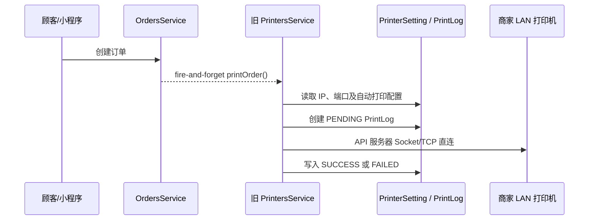
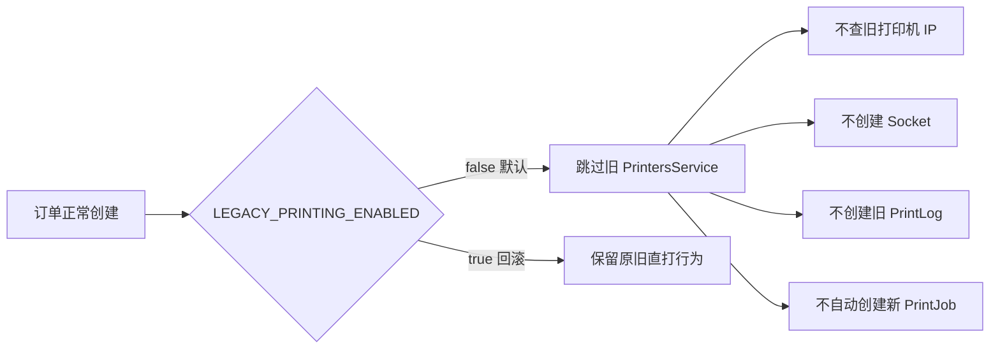

# 旧局域网直打切换 V1

> 文档性质：阶段 C.1 实施契约、回滚边界与验收记录。
> 当前结论：旧服务器 Socket/TCP 局域网直打代码与数据仍保留，但运行开关安全默认关闭；merchant-admin 只公开“打印中心 Beta”。新任务自动创建和执行端同样保持关闭，因此当前没有真实打印能力。
> 使用情况依据：产品负责人已确认当前没有真实商家使用旧本地局域网打印。本结论来自本轮用户确认，不是代码或数据库统计结果；物理删除前仍必须执行生产旧配置数量审计。

## 1. 切换目标与严格边界

本轮只停止旧链路的入口与执行，不开发新的打印执行器：

- 默认禁止订单创建后调用旧 `PrintersService.printOrder()`。
- 默认禁止旧测试打印和旧订单手动打印实际执行。
- merchant-admin 隐藏旧打印配置菜单，以“打印中心 Beta”为唯一可见打印入口。
- 旧页面 URL 安全重定向到 `/printing-center/printers?from=legacy`，不复制或删除旧配置。
- 保留 `PrinterSetting`、`PrintLog`、旧 Controller、Service、DTO、Socket 实现及 Feature Flag 回滚能力。
- `PRINTING_AUTO_CREATE_ENABLED=false`、`PRINTING_EXECUTION_ENABLED=false` 保持不变，不把旧调用自动替换为新 `PrintJob`。

本轮没有连接 LAN、USB、内置或云打印机，没有调用 TCP 9100，没有修改 Android APP、Web 收银台业务、Prisma schema 或 migration，也没有执行数据库写入。

## 2. 旧链路与停用原因

### 2.1 旧链路事实

旧实现由 API 服务器直接尝试连接商家局域网打印机：



仓库证据：

- 订单创建后的旧触发：`apps/api/src/modules/orders/orders.service.ts`。
- 旧测试/订单打印接口：`apps/api/src/modules/printers/printers.controller.ts`、`apps/api/src/modules/merchant-orders/merchant-orders.controller.ts`。
- Socket/TCP、旧票据生成与日志写入：`apps/api/src/modules/printers/printers.service.ts`。
- 旧数据模型：`apps/api/prisma/schema.prisma` 中的 `PrinterSetting`、`PrintLog`。
- 旧 merchant-admin 调用封装与页面：`apps/merchant-admin/src/api/printers.ts`、`apps/merchant-admin/src/pages/MerchantProfilePage.vue`、`apps/merchant-admin/src/pages/PrintersPage.vue`。

### 2.2 停用原因

1. API 服务器通常不在商家局域网，不能把服务器到私网 IP 的可达性当作稳定打印通道。
2. 旧 `PrintLog` 没有可靠队列所需的幂等键、不可变票据快照、领取租约和逐次 Attempt。
3. fire-and-forget 触发无法保证网页关闭、服务重启或网络抖动后的恢复，也无法可靠处理“已出纸但成功回报丢失”。
4. 旧自动直打与新自动 `PrintJob` 若同时开启，会对同一订单产生双打印风险。
5. 已确认没有真实商家依赖旧本地局域网打印，适合先停止入口和执行，再以可回滚方式保留代码和数据。

## 3. Feature Flag 与安全默认值

四个开关由打印配置服务集中、严格解析：

| 环境变量 | 代码安全默认值 | 本轮用途 |
|---|---:|---|
| `PRINTING_TASK_CENTER_ENABLED` | `true` | 允许访问新打印中心的管理能力；不等于可执行打印 |
| `PRINTING_AUTO_CREATE_ENABLED` | `false` | 是否由真实业务事件自动创建新 `PrintJob`；本轮保持关闭 |
| `PRINTING_EXECUTION_ENABLED` | `false` | 是否允许执行端领取/执行新任务；本轮保持关闭 |
| `LEGACY_PRINTING_ENABLED` | `false` | 是否允许旧自动、测试和手动直打链路；本轮默认关闭 |

只有明确支持的布尔文本可被接受；空值使用上述安全默认值，无效值不得静默解释为开启。启动日志只能输出四个开关状态，不能输出打印机 IP、凭据、Token、Cookie 或其他敏感配置。

开发与生产环境模板 `apps/api/.env.example`、`apps/api/.env.production.example` 均显式记录上述安全默认值；真实运行配置不进入 Git。

已认证只读接口 `GET /merchant/printing/feature-state` 返回这四个布尔状态和安全的 `executionState`，是 merchant-admin 控制旧 UI 的唯一状态来源；请求失败时前端 fail-closed 为 `legacy=false`。接口不能返回环境变量原文、打印机连接配置或凭据。

### 3.1 双路径保护

以下组合不允许启动：

```text
LEGACY_PRINTING_ENABLED=true
PRINTING_AUTO_CREATE_ENABLED=true
```

配置校验必须抛出 `PRINTING_DUAL_PATH_NOT_ALLOWED`，避免同一订单事件同时进入旧 Socket 直打和新任务创建。`PRINTING_EXECUTION_ENABLED` 不是放宽该约束的依据；即使执行暂时关闭，也不能为生产留下两个自动触发源。

## 4. 旧自动打印停用行为

默认关闭时的订单链路：



开关关闭只影响旧打印副作用，不得阻断订单事务或改变订单状态。开关开启时保留原行为作为短期回滚能力，但必须继续保持新自动创建关闭。

## 5. 旧 API 停用响应

旧 Controller、Service 和 DTO 仍保留。`/merchant/printers` 全组接口与旧订单打印请求在 `LEGACY_PRINTING_ENABLED=false` 时必须在进入旧 Service/Socket 前统一拒绝：

```text
HTTP 410 Gone
code: LEGACY_PRINTING_DISABLED
message: 旧打印功能已停用，请使用打印中心。当前执行端尚未接入。
```

受保护范围包括：

- `GET /merchant/printers` 旧打印机列表。
- `POST /merchant/printers` 旧打印机新增。
- `PATCH /merchant/printers/:id` 旧打印机修改。
- `DELETE /merchant/printers/:id` 旧打印机删除。
- `POST /merchant/printers/:id/test` 测试打印。
- `POST /merchant/orders/:id/print` 订单手动打印。

关闭时不得读取或修改旧打印配置，不得创建 Socket、发送字节或新增旧 `PrintLog`。旧数据仍保留在原表供受控数据库审计，但默认不经旧商家 API 或 merchant-admin 暴露。开关恢复为 `true` 时旧接口保持原业务行为。

普通订单详情只保留历史日志所需的打印机 ID 与名称，不再随订单响应返回旧 LAN `ipAddress` 或 `port`。订单列表和详情在旧开关关闭时隐藏旧打印状态、失败分类与连接配置；这些历史数据仍留在旧表中，供受控审计和回滚使用。

## 6. merchant-admin 入口切换

### 6.1 唯一可见入口

侧边栏只显示“打印中心 Beta”，入口为：

```text
/printing-center/printers
```

旧“打印机设置/旧打印管理”菜单默认隐藏。组件、API 客户端和历史页面文件不删除。

UI 从已认证的 `GET /merchant/printing/feature-state` 读取服务端 `legacyPrintingEnabled`。值为 `false` 或接口失败时隐藏旧入口；不维护第二个需要人工同步的前端环境开关。即便 UI 状态过期，服务端仍独立拒绝旧写请求。

### 6.2 旧 URL

访问旧打印页面 URL 时安全重定向：

```text
旧 URL
→ /printing-center/printers?from=legacy
```

目标页一次性提示：

> 旧打印配置入口已停用，当前已切换到打印中心 Beta。
>
> 打印执行端尚未接入，当前不会产生真实打印。

重定向不得自动复制旧 `PrinterSetting`、创建新 `Printer`、删除旧记录或触发网络探测。

### 6.3 打印中心状态

Printers、Rules、Jobs、Terminals 等页面统一表达“执行端待接入”，顶部提示为：

> Beta：旧局域网直打已停用。
>
> 当前打印任务中心尚未接入 Android、本地 LAN/USB 或云打印执行端，因此不会产生真实打印。

打印机不得显示为在线。merchant-admin 订单详情中的旧打印操作默认隐藏或禁用，不能调用旧 API，也不能提前创建新 `PrintJob`。

## 7. Web 收银台保持不变

`apps/merchant-cashier` 不存在旧打印 API、Socket/TCP 或新 PrintJob 调用，本轮无需修改业务代码：

- `src/components/shell/CashierHeader.vue` 只显示“打印待接入”。
- `src/components/bills/TableBillDetail.vue` 的“打印桌账”按钮固定禁用，只显示“打印功能待接入”提示，没有点击处理器。
- `scripts/verify-ui.mjs` 会断言按钮禁用、提示存在且没有可用打印导航链接。

因此切换不会改变 Web 收银台的订单和桌台流程，也不得把打印状态改成在线、正常或已连接。

## 8. 旧数据处理

本轮遵循“旧数据保留，仅停止入口与执行”：

- 不删除或修改 `PrinterSetting`、`PrintLog`。
- 不删除旧 migration、Controller、Service、DTO 或 Socket 代码。
- 不迁移、转换、清理或回填旧记录。
- 不把旧 `autoPrintEnabled` 映射为新 `PrintRule.autoPrint`。
- 不把旧连接结果解释为新打印机在线状态。

## 9. 回滚步骤

只有出现经确认的经营阻断且用户授权回滚时，才可恢复旧路径：

1. 确认 `PRINTING_AUTO_CREATE_ENABLED=false`。
2. 确认 `PRINTING_EXECUTION_ENABLED=false`，且不存在新执行器领取任务。
3. 在受控环境将 `LEGACY_PRINTING_ENABLED=true`；不得提交真实环境文件或敏感配置。
4. 按现有配置发布/重启 API，使开关生效；本轮不执行该部署动作。
5. merchant-admin 通过 `GET /merchant/printing/feature-state` 自动读取恢复后的安全布尔状态，不再维护第二个前端环境开关；确认旧入口按服务端状态恢复。
6. 验证双路径保护未触发，再用专用测试商家验证旧测试/手动/自动链路。
7. 记录回滚操作者、原因、时间和验证结果，并保持新自动任务关闭。

紧急回滚不删除新表或新任务历史，也不迁移旧数据。恢复旧链路是临时措施，不代表旧架构重新成为长期方案。

## 10. 物理删除准入

旧代码、表、API 或历史页面只能在独立阶段物理删除。开始删除前必须全部满足：

1. Android 或云打印执行端已经上线并可撤销、诊断和回报结果。
2. 手动真实订单打印完整链路验收通过。
3. 自动打印验收通过，没有旧/新双触发。
4. 重试、租约、幂等、防重复和结果未知处理验收通过。
5. 完成生产旧配置与近期 `PrintLog` 数量审计，确认没有真实商家依赖。
6. 经过约定观察期，具备任务监控、告警和人工止损流程。
7. 删除方案包含数据库备份、数据保留期限、API/UI 兼容期和独立回滚计划。
8. 获得用户对删除旧代码、旧表和历史数据的单独明确授权。

## 11. 验证要求与实际结果边界

本阶段要求验证：

- API：旧自动触发开/关、旧 410 响应、无 Socket/PrintLog 副作用、双路径冲突、新 printing API 与订单创建回归。
- merchant-admin：单一菜单、旧 URL 重定向、切换提示、订单打印禁用、三语言和 1280×800。
- merchant-cashier：打印待接入、桌账打印禁用、订单和桌台流程不变。

脱敏 UI 证据统一保存于 `docs/ui-review/printing-cutover-v1/`：

- `01-new-printing-menu-1280x800.png`
- `02-legacy-menu-hidden-1280x800.png`
- `03-legacy-url-redirect-1280x800.png`
- `04-printing-center-cutover-banner.png`
- `05-order-print-disabled.png`
- `06-vietnamese-1280x800.png`
- `07-english-1280x800.png`
- `08-cashier-print-pending-regression.png`

实际命令、测试数量、截图路径和结果已由本轮主执行线程在完成代码与验证后回填到 `08_PRINTING_TASK_CENTER_V1_IMPLEMENTATION.md`；预期行为与已验证结果保持分开记录。

## 12. 当前安全声明

- 新任务中心 migration 尚未执行生产。
- 新自动创建和新执行端仍关闭。
- Android 连接器未开发。
- LAN、USB、内置与云打印执行端未开发。
- 当前不会产生真实打印。
- 旧代码和旧表尚未物理删除。
- 本轮不部署、不 push。

下一步只能是：在隔离数据库验证新 migration，并到店完成 LAN 硬件验证；随后开发 Android LAN ESC/POS 连接器。

## 13. 后续方向变更附记（2026-07-15）

上一段是本次旧链路切换收口时的原始下一步记录，保留用于追溯；其 LAN-first 顺序已被后续确认的 USB-first 决策取代，不再是当前实施指令。

本轮已完成隔离 migration 验证，以及现有 Android 应用内 USB 诊断/合成 smoke 代码和到店前构建验证。当前唯一下一步是把按最终提交重新构建的验证 APK 安装到门店目标终端，完成设备枚举、系统授权、接口/端点、插拔恢复和单次真实出纸验证，并保存脱敏日志与样张证据。该 smoke 能力位于现有 `apps/merchant-terminal-android`，不连接生产打印 API，也不创建或领取 `PrintJob`。

只有上述实机验证通过后，才在单独阶段把已验证 adapter 接入 Terminal 注册/认证、服务端配置、`PrintJob` 领取/租约/结果回报，形成正式 Android USB ESC/POS connector/executor。当前后端 USB 仍为未实现通道；Android 已有诊断/合成 smoke 代码，但尚无正式 PrintJob USB connector。枚举、代码存在和 APK 构建均不等于硬件已可用。本文不预设设备型号、设备标识、接口、端点或打印能力，也不授权自动开始该正式连接器阶段。

LAN ESC/POS 继续作为后续通道保留，旧局域网直打停用、回滚和物理删除准入结论不因优先级变化而改变。
